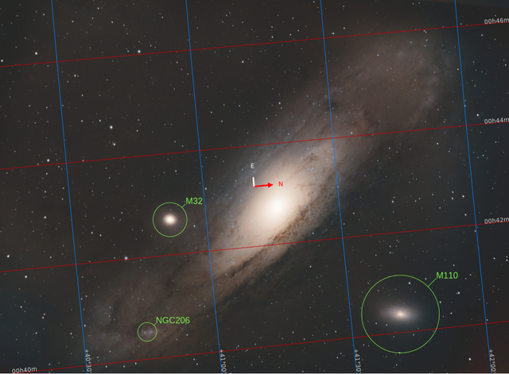
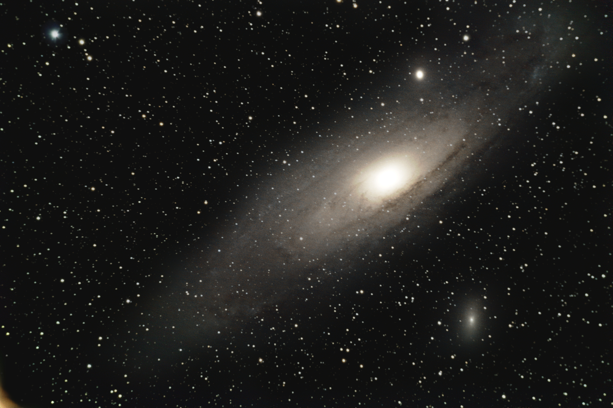

#  Andromeda Galaxy

The Andromeda Galaxy is a barred spiral galaxy and is the nearest major galaxy to the Milky Way. It was originally named the Andromeda Nebula and is cataloged as Messier 31, M31, and NGC 224. Andromeda has a D25 isophotal diameter of about 46.56 kiloparsecs (152,000 light-years)[8] and is approximately 765 kpc (2.5 million light-years) from Earth. The galaxy's name stems from the area of Earth's sky in which it appears, the constellation of Andromeda, which itself is named after the princess who was the wife of Perseus in Greek mythology. 

[ Read more](https://en.wikipedia.org/wiki/Andromeda_Galaxy)
## Plate solving 

| Globe | Close | Very close |
| ----- | ----- | ----- |
| | | |

## Gallery
 

 

 

 

 

 

