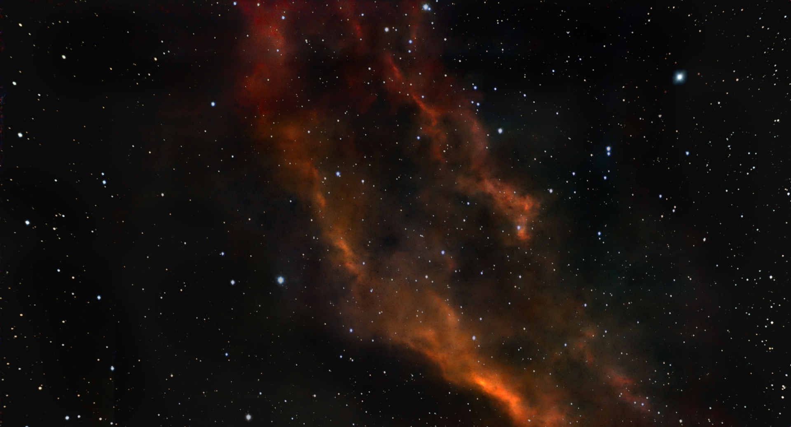

#  California Nebula

The California Nebula (Also known NGC 1499 or Sh2-220) is an emission nebula located in the constellation Perseus. Its name comes from its resemblance to the outline of the US State of California in long exposure photographs. It is almost 2.5° long on the sky and, because of its very low surface brightness, it is extremely difficult to observe visually. It can be observed with a Hα filter (isolates the Hα line at 656 nm) or Hβ filter (isolates the Hβ line at 486 nm) in a rich-field telescope under dark skies.[2] It lies at a distance of about 1,000 light years from Earth. Its fluorescence is due to excitation of the Hβ line in the nebula by the nearby prodigiously energetic O7 star, Xi Persei (also known as Menkib).[3]

[ Read more](https://en.wikipedia.org/wiki/California_Nebula)
