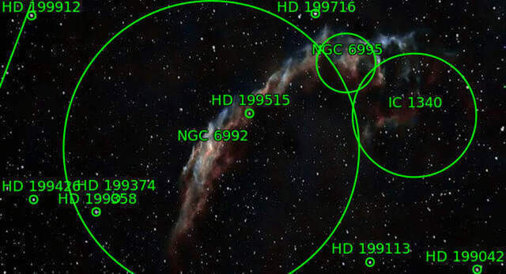
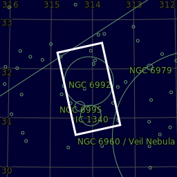
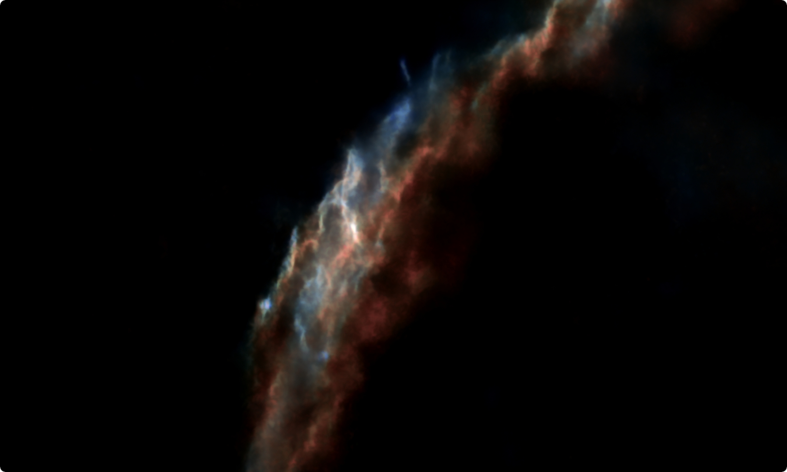
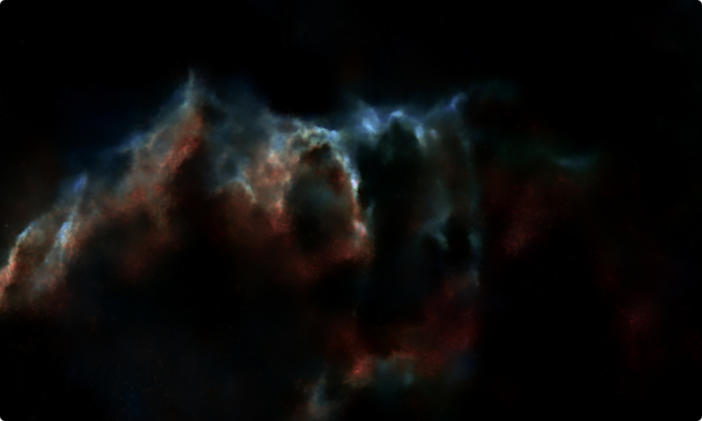

#  Eastern Veil Nebula

The Western Veil (also known as Caldwell 34), consisting of NGC 6960 (the "Witch's Broom",[10] Lacework Nebula,[8] "Filamentary Nebula"[10]) near the foreground star 52 Cygni;

[ Read more](https://en.wikipedia.org/wiki/Veil_Nebula)
## Plate solving 

| Globe | Close | Very close |
| ----- | ----- | ----- |
| | | |

## Gallery
 

 

 

