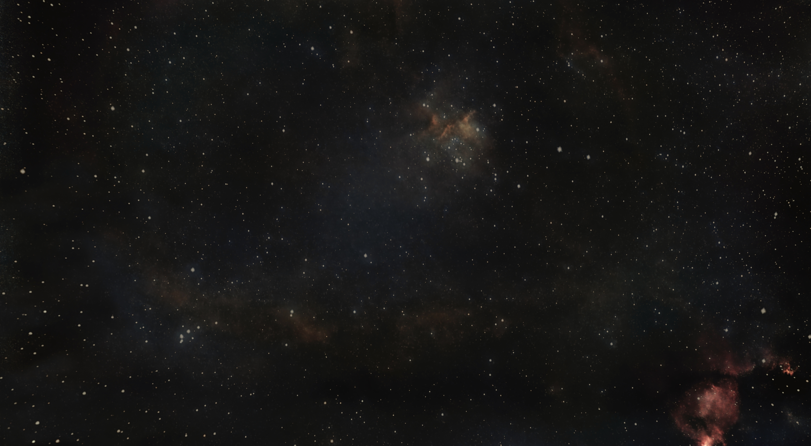
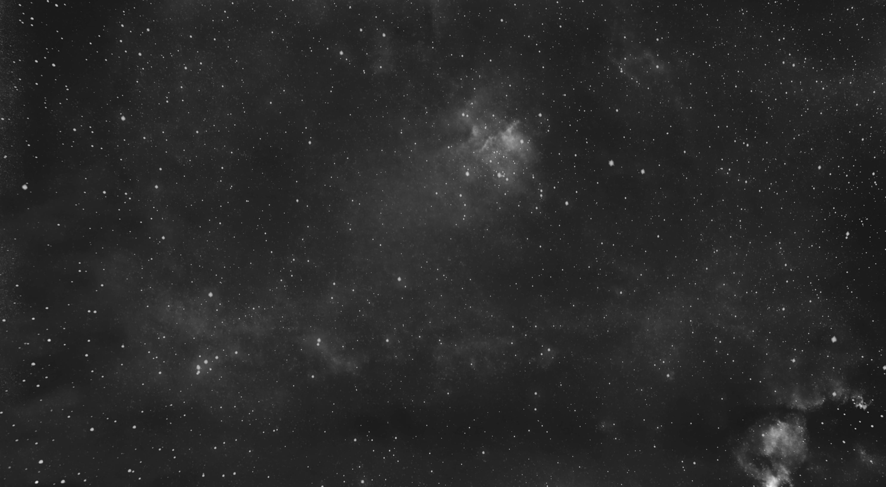
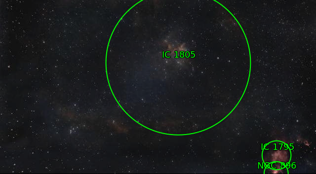
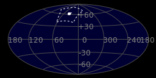
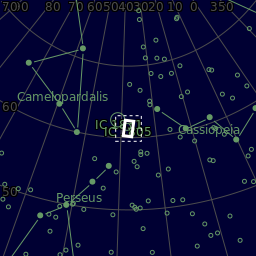
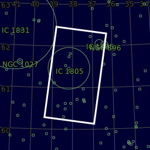

#  Heart Nebula

The Heart Nebula (also known as the Running Dog Nebula, Sharpless 2-190) is an emission nebula, 7500 light years away from Earth and located in the Perseus Arm of the Galaxy in the constellation Cassiopeia. It was discovered by William Herschel on 3 November 1787.[1] It displays glowing ionized hydrogen gas and darker dust lanes.[2]. The brightest part of the nebula (a knot at its western edge) is separately classified as NGC 896, because it was the first part of the nebula to be discovered. The nebula's intense red output and its morphology are driven by the radiation emanating from a small group of stars near the nebula's center. This open cluster of stars, known as Collinder 26, Melotte 15, or IC 1805, contains a few bright stars nearly 50 times the mass of the Sun, and many more dim stars that are only a fraction of the Sun's mass.[1]. The Heart Nebula is also made up of ionised oxygen and sulfur gasses, responsible for the rich blue and orange colours seen in narrowband images. The shape of the nebula is driven by stellar winds from the hot stars in its core. The nebula also spans almost 2 degrees in the sky, covering an area four times that of the diameter of the full moon.[3]

[ Read more](https://en.wikipedia.org/wiki/Heart_Nebula)

## Plate solving

## Location 

| Globe | Close | Very close |
| ----- | ----- | ----- |
| | | |