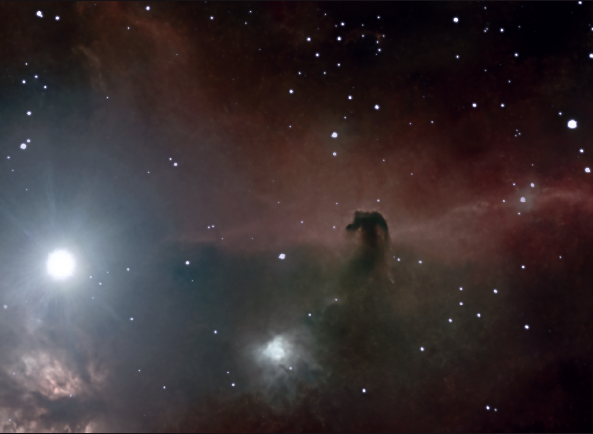
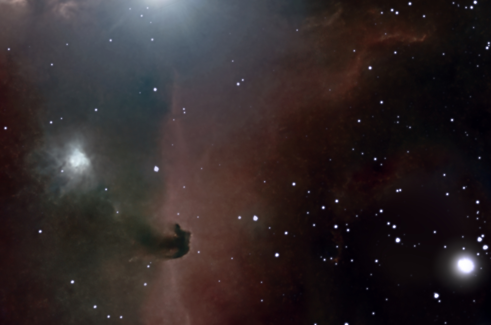
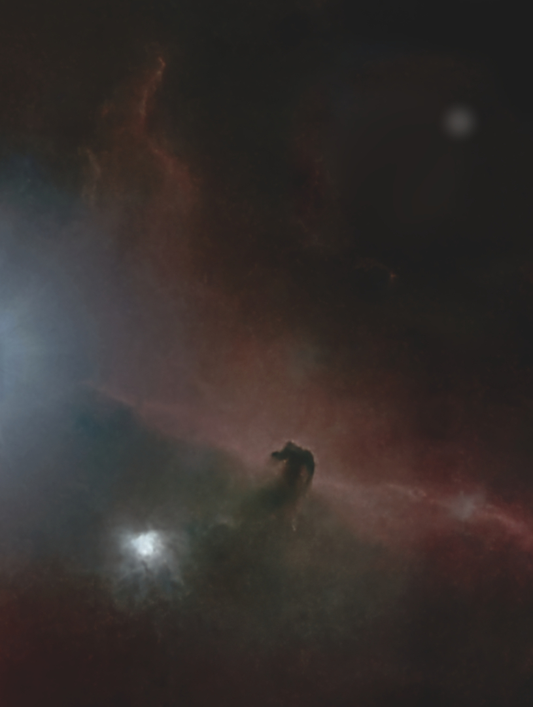

#  Horse Head Nebula

The Horsehead Nebula (also known as Barnard 33 or B33) is a small dark nebula in the constellation Orion.[2] The nebula is located just to the south of Alnitak, the easternmost star of Orion's Belt, and is part of the much larger Orion molecular cloud complex. It appears within the southern region of the dense dust cloud known as Lynds 1630, along the edge of the much larger, active star-forming H II region called IC 434.[3] The Horsehead Nebula is approximately 422 parsecs or 1,375 light-years from Earth.[1][3] It is one of the most identifiable nebulae because of its resemblance to a horse's head.[4] Using NASA's James Webb Space Telescope, astronomers have captured the nebula's "mane" in unprecedented detail, revealing the complexity of the photodissociation region where ultraviolet light interacts with gas and dust.[5][6]

[ Read more](https://en.wikipedia.org/wiki/Horsehead_Nebula)
## Plate solving 

| Globe | Close | Very close |
| ----- | ----- | ----- |
| | | |

## Gallery
 

 

 

 

 

 

