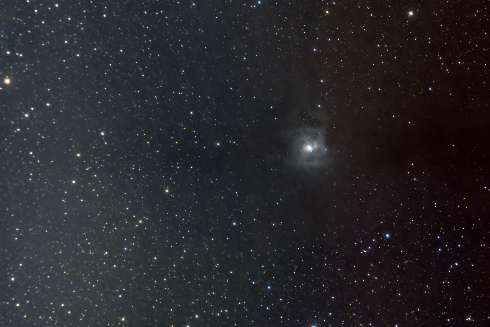
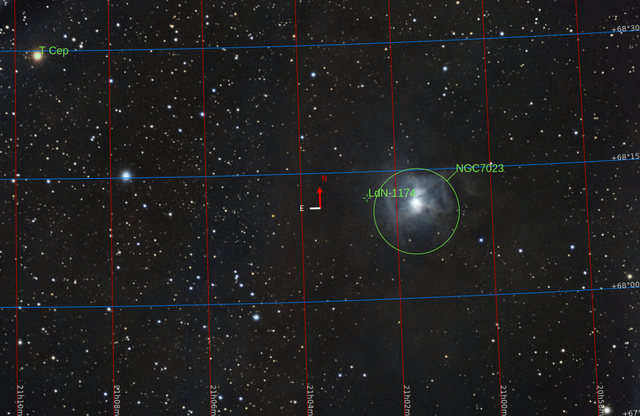
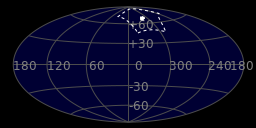
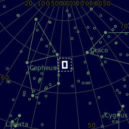
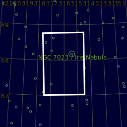
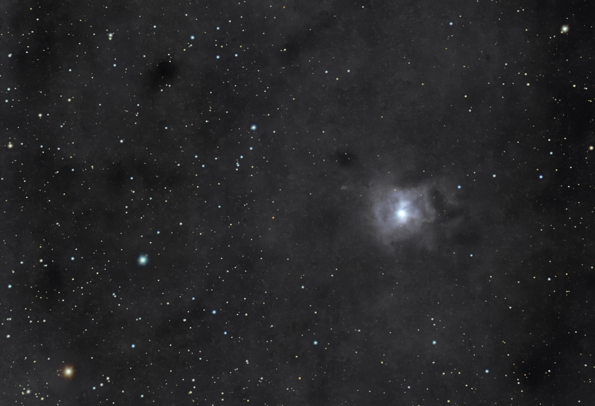
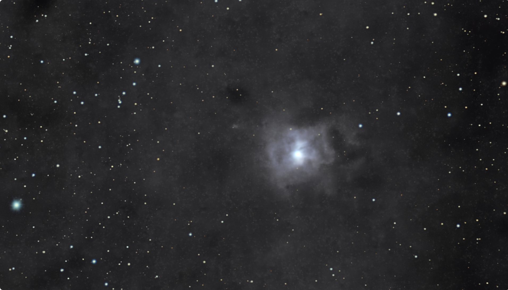
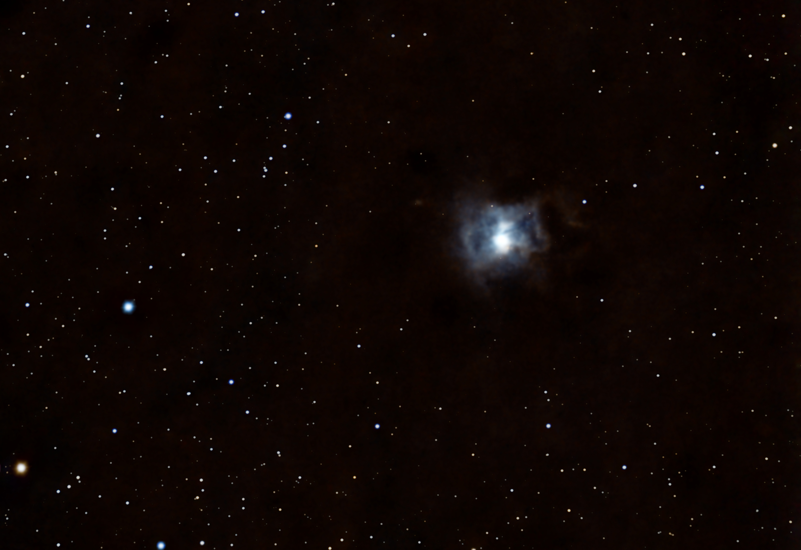

#  Iris Nebula

The Iris Nebula (also known as NGC 7023 and Caldwell 4) is a bright reflection nebula in the constellation Cepheus. The designation NGC 7023 refers to the open cluster within the larger reflection nebula designated LBN 487. The nebula, which shines at magnitude +6.8, is illuminated by a magnitude +7.4 star designated HD 200775.[1] It is located near the Mira-type variable star T Cephei, and near the bright magnitude +3.23 variable star Beta Cephei (Alfirk). It lies 1,300 light-years away and is six light-years across.[2]

[ Read more](https://en.wikipedia.org/wiki/Iris_Nebula)
## Plate solving 

| Globe | Close | Very close |
| ----- | ----- | ----- |
| | | |

## Gallery
 

 

 

 

