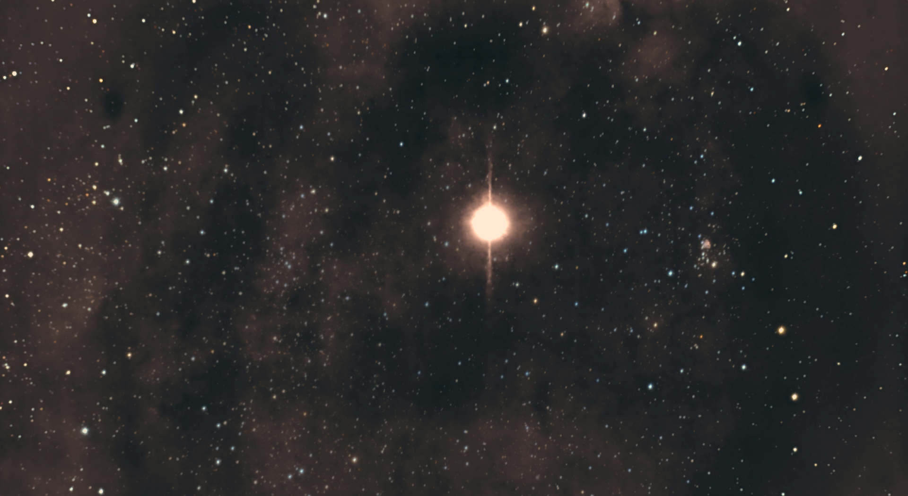

#  Sadr Star

Gamma Cygni (γ Cygni, abbreviated Gamma Cyg, γ Cyg), officially named Sadr /ˈsædər/,[11][12] is a star in the northern constellation of Cygnus, forming the intersection of an asterism of five stars called the Northern Cross. Based upon parallax measurements obtained during the Hipparcos mission, it is approximately 1,800 light-years (560 parsecs) from the Sun.[1] It forms the primary or 'A' component of a multiple star system designated WDS J20222+4015 (the secondary or 'BCD' component is WDS J20222+4015BCD, a close triplet of stars 41" away from γ Cygni[13]).

[ Read more](https://en.wikipedia.org/wiki/Gamma_Cygni)
