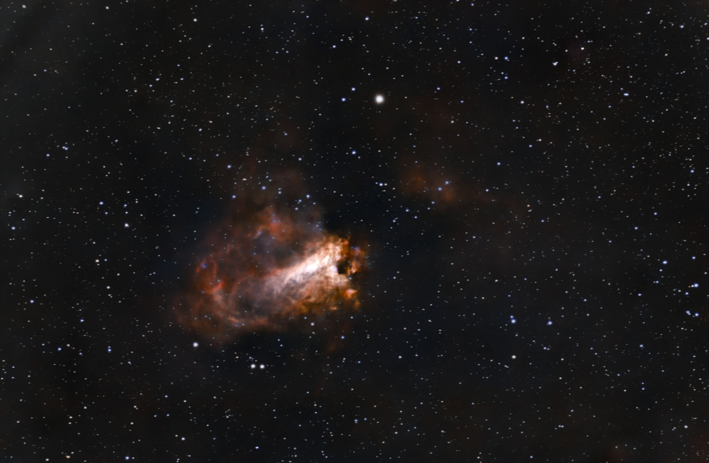
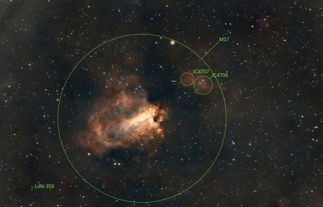
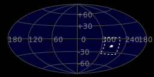
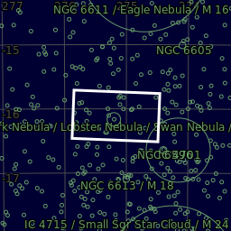

#  Swan Nebula

The Omega Nebula is an H II region in the constellation Sagittarius. It was discovered by Philippe Loys de Chéseaux in 1745. Charles Messier catalogued it in 1764. It is by some of the richest starfields of the Milky Way, figuring in the northern two-thirds of Sagittarius. This feature is also known as the Swan Nebula, Checkmark Nebula, Lobster Nebula, and the Horseshoe Nebula,[1][2] and catalogued as Messier 17 or M17 or NGC 6618.

[ Read more](https://en.wikipedia.org/wiki/Omega_Nebula)
## Plate solving 

| Globe | Close | Very close |
| ----- | ----- | ----- |
| | | |

## Gallery
 

