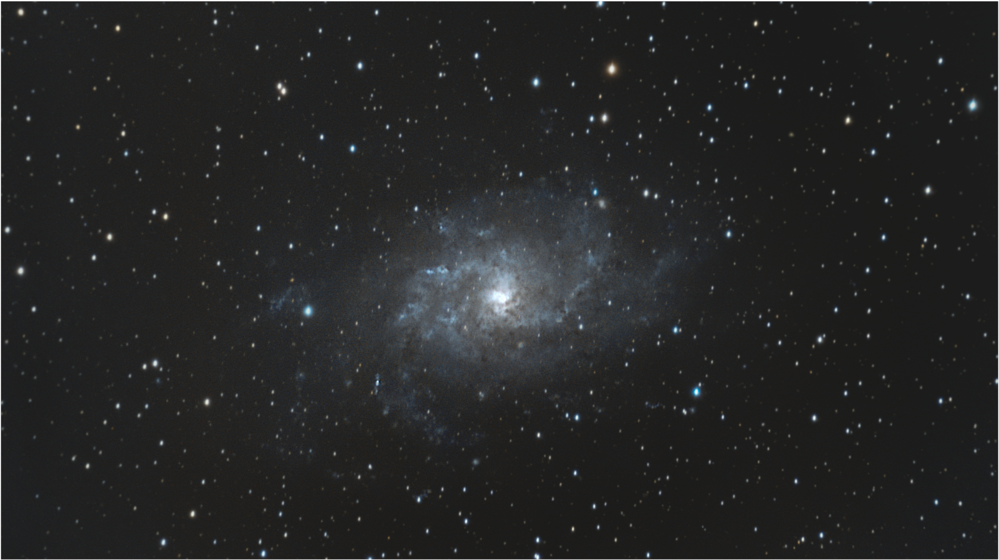
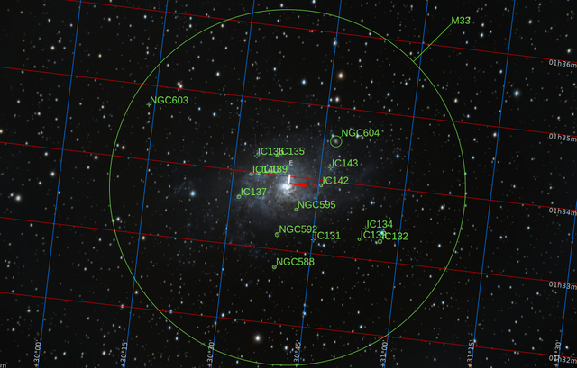

#  Triangulum Galaxy

The Triangulum Galaxy is a spiral galaxy 2.73 million light-years (ly) from Earth in the constellation Triangulum. It is catalogued as Messier 33 or NGC (New General Catalogue) 598. With the D25 isophotal diameter of 18.74 kiloparsecs (61,100 light-years), the Triangulum Galaxy is the third-largest member of the Local Group of galaxies, behind the Andromeda Galaxy and the Milky Way. The galaxy is the second-smallest spiral galaxy in the Local Group after the Large Magellanic Cloud, which is a Magellanic-type spiral galaxy.[7] It is believed to be a satellite of the Andromeda Galaxy or on its rebound into the latter due to their interactions, velocities,[8] and proximity to one another in the night sky. It also has an H II nucleus.[9]

[ Read more](https://en.wikipedia.org/wiki/Triangulum_Galaxy)
## Plate solving 

| Globe | Close | Very close |
| ----- | ----- | ----- |
| | | |

## Gallery
 

 

 

