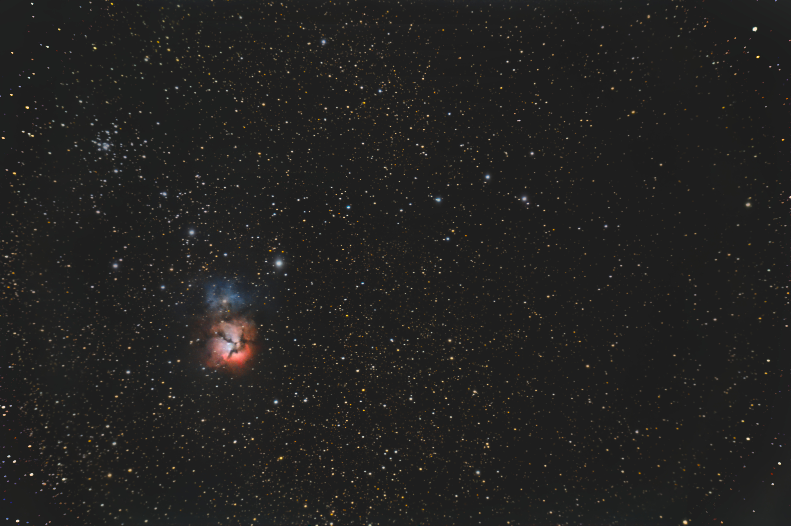
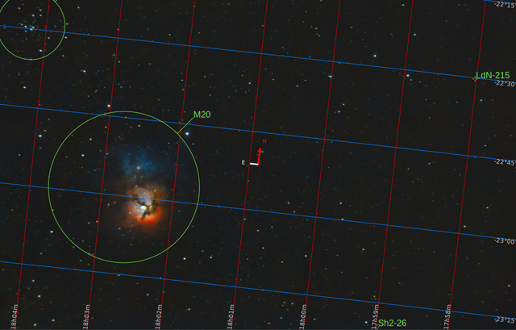
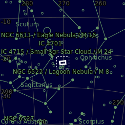

#  Trifid Nebula

The Trifid Nebula (catalogued as Messier 20 or M20 and as NGC 6514) is an H II region in the north-west of Sagittarius in a star-forming region in the Milky Way's Scutum–Centaurus Arm.[3] It was discovered by Charles Messier on June 5, 1764.[4] Its name means 'three-lobe'. The object is an unusual combination of an open cluster of stars, an emission nebula (the relatively dense, reddish-pink portion), a reflection nebula (the mainly NNE blue portion), and a dark nebula (the apparent 'gaps' in the former that cause the trifurcated appearance, also designated Barnard 85). Viewed through a small telescope, the Trifid Nebula is a bright and peculiar object, and is thus a perennial favorite of amateur astronomers.[5] The most massive star that has formed in this region is HD 164492A, an O7.5III star with a mass more than 20 times the mass of the Sun.[6] This star is surrounded by a cluster of approximately 3100 young stars.[7]

[ Read more](https://en.wikipedia.org/wiki/Triangulum_Galaxy)
## Plate solving 

| Globe | Close | Very close |
| ----- | ----- | ----- |
| | | |

## Gallery
 

