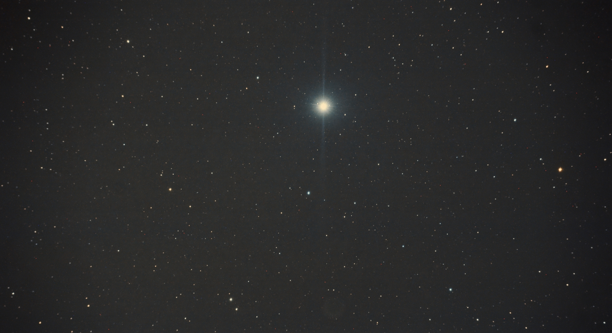
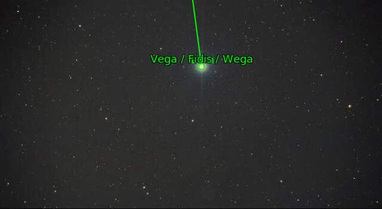
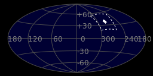
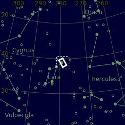
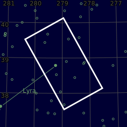

#  Vega Star

Vega is the brightest star in the northern constellation of Lyra. It has the Bayer designation α Lyrae, which is Latinised to Alpha Lyrae and abbreviated Alpha Lyr or α Lyr. This star is relatively close at only 25 light-years (7.7 parsecs) from the Sun, and one of the most luminous stars in the Sun's neighborhood. It is the fifth-brightest star in the night sky, and the second-brightest star in the northern celestial hemisphere, after Arcturus. Vega has been extensively studied by astronomers, leading it to be termed "arguably the next most important star in the sky after the Sun".[18] Vega was the northern pole star around 12,000 BCE and will be so again around the year 13,727, when its declination will be +86° 14′.[19] Vega was the first star other than the Sun to have its image and spectrum photographed.[20][21] It was one of the first stars whose distance was estimated through parallax measurements. Vega has functioned as the baseline for calibrating the photometric brightness scale and was one of the stars used to define the zero point for the UBV photometric system.

[ Read more](https://en.wikipedia.org/wiki/Vega)
## Plate solving 

| Globe | Close | Very close |
| ----- | ----- | ----- |
| | | |

## Gallery
 

