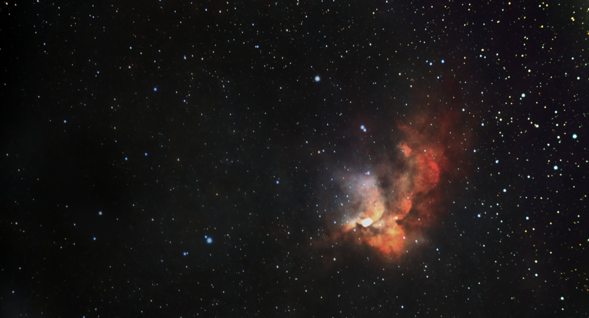

#  Wizard Nebula

NGC 7380 is a young[4] open cluster of stars in the northern circumpolar constellation of Cepheus, discovered by Caroline Herschel in 1787. The surrounding emission nebulosity is known colloquially as the Wizard Nebula, which spans an angle of 25′. German-born astronomer William Herschel included his sister's discovery in his catalog, and labelled it H VIII.77. The nebula is known as S 142 in the 1959 Sharpless catalog (Sh2-142).[2] It is extremely difficult to observe visually, usually requiring very dark skies and an O-III filter. The NGC 7380 complex is located at a distance of approximately 8.5 kilolight-years from the Sun, in the Perseus Arm of the Milky Way.[2] The cluster spans ~20 light-years (6 pc) with an elongated shape and an extended tail.[2] Age estimates range from 4[2] to 11.9[1] million years. At the center of the cluster lies DH Cephei, a close, double-lined spectroscopic binary system consisting of two massive O-type stars. This pair are the primary ionizing source for the surrounding H II region, and are driving out the surrounding gas and dust while triggering star formation in the neighboring region.[4] Of the variable stars that have been identified in the cluster, 14 have been identified as pre-main sequence stars while 17 are main sequence stars that are primarily B-type variables.[4]

[ Read more](https://en.wikipedia.org/wiki/NGC_7380)
