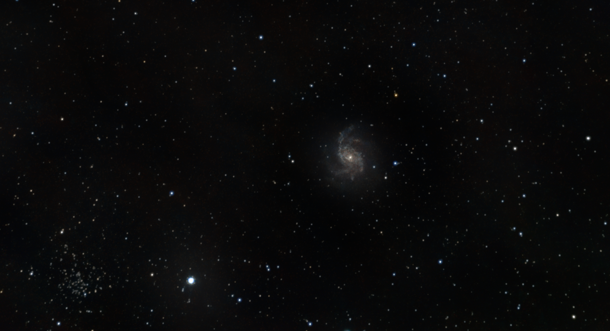
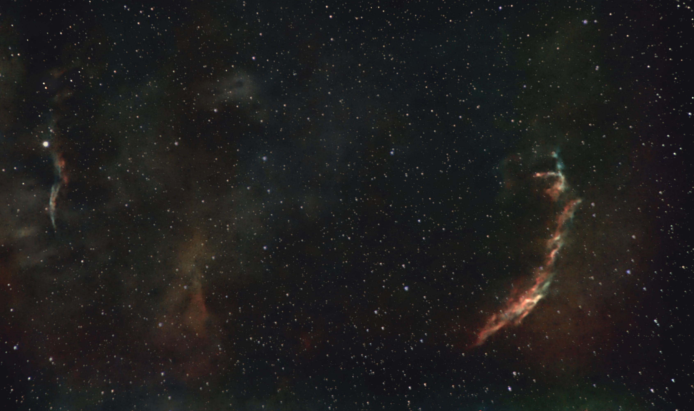
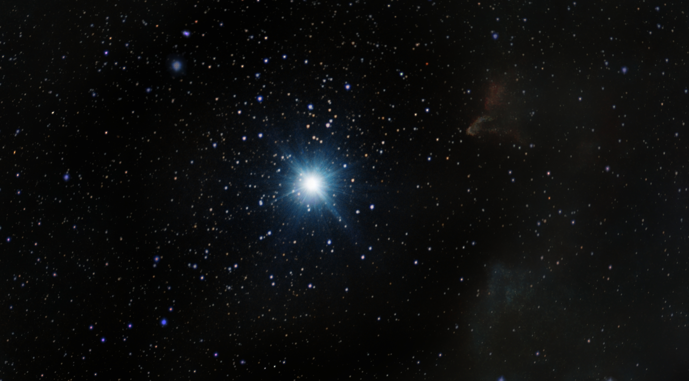
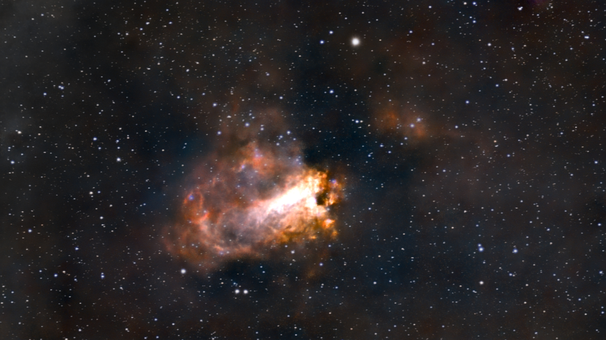
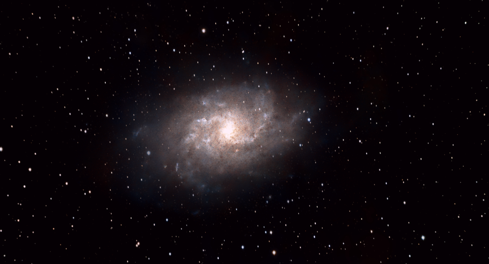
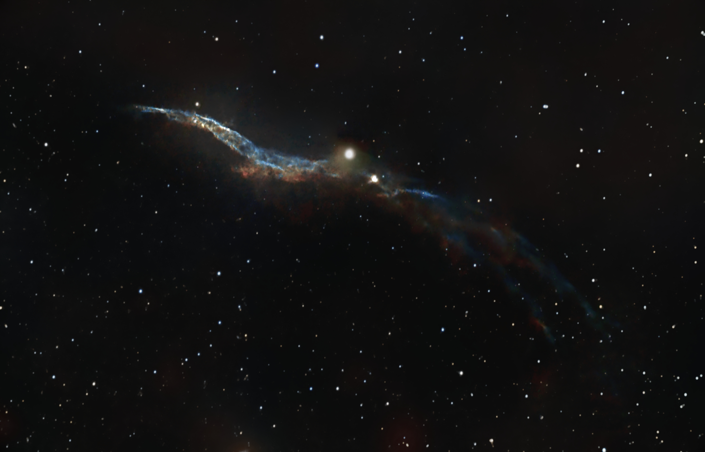

# Targets
* [Andromeda Galaxy](../Markdown//Andromeda_Galaxy.md)

The Andromeda Galaxy is a barred spiral galaxy and is the nearest major galaxy to the Milky Way. It was originally named the Andromeda Nebula and is cataloged as Messier 31, M31, and NGC 224. Andromeda has a D25 isophotal diameter of about 46.56 kiloparsecs (152,000 light-years)[8] and is approximately 765 kpc (2.5 million light-years) from Earth. The galaxy's name stems from the area of Earth's sky in which it appears, the constellation of Andromeda, which itself is named after the princess who was the wife of Perseus in Greek mythology. 

* [Bubble Nebula](../Markdown//Bubble_Nebula.md)

NGC 7635, also known as the Bubble Nebula, Sharpless 162, or Caldwell 11, is an H II region emission nebula in the constellation Cassiopeia. It lies close to the open cluster Messier 52. The "bubble" is created by the stellar wind from a massive hot, 8.7 magnitude young central star, SAO 20575 (BD+60°2522). The nebula is near a giant molecular cloud which contains the expansion of the bubble nebula while itself being excited by the hot central star, causing it to glow. It was discovered in November 1787 by William Herschel. The star BD+60°2522 is thought to have a mass of about 44 M

* [California Nebula](../Markdown//California_Nebula.md)

The California Nebula (Also known NGC 1499 or Sh2-220) is an emission nebula located in the constellation Perseus. Its name comes from its resemblance to the outline of the US State of California in long exposure photographs. It is almost 2.5° long on the sky and, because of its very low surface brightness, it is extremely difficult to observe visually. It can be observed with a Hα filter (isolates the Hα line at 656 nm) or Hβ filter (isolates the Hβ line at 486 nm) in a rich-field telescope under dark skies.[2] It lies at a distance of about 1,000 light years from Earth. Its fluorescence is due to excitation of the Hβ line in the nebula by the nearby prodigiously energetic O7 star, Xi Persei (also known as Menkib).[3]

* [Dumbbell Nebula](../Markdown//Dumbbell_Nebula.md)

* [Eagle Nebula](../Markdown//Eagle_Nebula.md)

* [Eastern Veil Nebula](../Markdown//Eastern_Veil_Nebula.md)

* [Fireworks Galaxy](../Markdown//Fireworks_Galaxy.md)

* [Full Veil Nebula](../Markdown//Full_Veil_Nebula.md)

* [Ghost Of Cassiopeia](../Markdown//Ghost_Of_Cassiopeia.md)

* [HD225526](../Markdown//HD225526.md)

* [Heart Nebula](../Markdown//Heart_Nebula.md)

* [Helix Nebula](../Markdown//Helix_Nebula.md)

* [Horse Head Nebula](../Markdown//Horse_Head_Nebula.md)

* [Iris Nebula](../Markdown//Iris_Nebula.md)

* [Lagoon Nebula](../Markdown//Lagoon_Nebula.md)

* [Pacman Nebula](../Markdown//Pacman_Nebula.md)

* [Pleiades Cluster](../Markdown//Pleiades_Cluster.md)

* [Swann Nebula](../Markdown//Swann_Nebula.md)

* [The Moon](../Markdown//The_Moon.md)

* [Triangulum Galaxy](../Markdown//Triangulum_Galaxy.md)

* [Trifid Nebula](../Markdown//Trifid_Nebula.md)

* [Vega Star](../Markdown//Vega_Star.md)

* [Western Veil Nebula](../Markdown//Western_Veil_Nebula.md)

* [Wizard Nebula](../Markdown//Wizard_Nebula.md)

