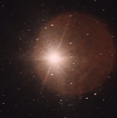
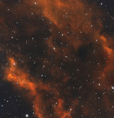

|Targets|
| :----: |
|| 

| Target | Briefing |
| -----: | :----- |
| [Aldebaran Star](../Markdown//Aldebaran_Star.md)  | |
|  |Aldebaran (Arabic: الدَّبَران, lit. 'The Follower') (Proto-Semitic *dVbr- “bee”) is a star located in the zodiac constellation of Taurus. It has the Bayer designation α Tauri, which is Latinized to Alpha Tauri and abbreviated Alpha Tau or α Tau. Aldebaran varies in brightness from an apparent visual magnitude 0.75 down to 0.95, making it the brightest star in the constellation, as well as (typically) the fourteenth-brightest star in the night sky. It is positioned at a distance of approximately 65 light-years from the Sun. The star lies along the line of sight to the nearby Hyades cluster. Aldebaran is a red giant, meaning that it is cooler than the Sun with a surface temperature of 3,900 K, but its radius is about 45 times the Sun's, so it is over 400 times as luminous. As a giant star, it has moved off the main sequence on the Hertzsprung–Russell diagram after depleting its supply of hydrogen in the core. The star spins slowly and takes 520 days to complete a rotation. Aldebaran is believed to host a planet several times the mass of Jupiter, named Aldebaran b. |
| [Andromeda Galaxy](../Markdown//Andromeda_Galaxy.md)  | |
|  |The Andromeda Galaxy is a barred spiral galaxy and is the nearest major galaxy to the Milky Way. It was originally named the Andromeda Nebula and is cataloged as Messier 31, M31, and NGC 224. Andromeda has a D25 isophotal diameter of about 46.56 kiloparsecs (152,000 light-years)[8] and is approximately 765 kpc (2.5 million light-years) from Earth. The galaxy's name stems from the area of Earth's sky in which it appears, the constellation of Andromeda, which itself is named after the princess who was the wife of Perseus in Greek mythology.  |
| [Betelgeuse Star](../Markdown//Betelgeuse_Star.md)  | |
|  |Betelgeuse is a red supergiant star in the constellation of Orion. It is usually the tenth-brightest star in the night sky and, after Rigel, the second-brightest in its constellation. It is a distinctly reddish, semiregular variable star whose apparent magnitude, varying between +0.0 and +1.6, has the widest range displayed by any first-magnitude star. Betelgeuse is the brightest star in the night sky at near-infrared wavelengths. Its Bayer designation is α Orionis, Latinised to Alpha Orionis and abbreviated Alpha Ori or α Ori.[19] |
| [Bubble Nebula](../Markdown//Bubble_Nebula.md)  | |
|  |NGC 7635, also known as the Bubble Nebula, Sharpless 162, or Caldwell 11, is an H II region emission nebula in the constellation Cassiopeia. It lies close to the open cluster Messier 52. The "bubble" is created by the stellar wind from a massive hot, 8.7 magnitude young central star, SAO 20575 (BD+60°2522). The nebula is near a giant molecular cloud which contains the expansion of the bubble nebula while itself being excited by the hot central star, causing it to glow. It was discovered in November 1787 by William Herschel. The star BD+60°2522 is thought to have a mass of about 44 M |
| [California Nebula](../Markdown//California_Nebula.md)  | |
|  |The California Nebula (Also known NGC 1499 or Sh2-220) is an emission nebula located in the constellation Perseus. Its name comes from its resemblance to the outline of the US State of California in long exposure photographs. It is almost 2.5° long on the sky and, because of its very low surface brightness, it is extremely difficult to observe visually. It can be observed with a Hα filter (isolates the Hα line at 656 nm) or Hβ filter (isolates the Hβ line at 486 nm) in a rich-field telescope under dark skies.[2] It lies at a distance of about 1,000 light years from Earth. Its fluorescence is due to excitation of the Hβ line in the nebula by the nearby prodigiously energetic O7 star, Xi Persei (also known as Menkib).[3] |
| [Dumbbell Nebula](../Markdown//Dumbbell_Nebula.md)  | |
|  |The Dumbbell Nebula (also known as the Apple Core Nebula, Messier 27, and NGC 6853) is a planetary nebula (nebulosity surrounding a white dwarf) in the constellation Vulpecula, at a distance of about 1360 light-years.[1] It was the first such nebula to be discovered, by Charles Messier in 1764. At its brightness of visual magnitude 7.5 and diameter of about 8 arcminutes, it is easily visible in binoculars[4] and is a popular observing target in amateur telescopes. The Dumbbell Nebula appears shaped like a prolate spheroid and is viewed from our perspective along the plane of its equator. In 1992, Moreno-Corral et al. computed that its rate of expansion angularly was, viewed from our distance, no more than 2.3 arcseconds (″) per century. From this, an upper limit to the age of 14,600 years may be determined. In 1970, Bohuski, Smith, and Weedman found an expansion velocity of 31 km/s. Given its semi-minor axis radius of 1.01 ly, this implies that the kinematic age of the nebula is 9,800 years.[3][5] |
| [Eagle Nebula](../Markdown//Eagle_Nebula.md)  | |
|  |The Eagle Nebula (catalogued as Messier 16 or M16, and as NGC 6611, and also known as the Star Queen Nebula) is a young open cluster of stars in the constellation Serpens, discovered by Jean-Philippe de Cheseaux in 1745–46. Both the "Eagle" and the "Star Queen" refer to visual impressions of the dark silhouette near the center of the nebula,[4][5] an area made famous as the "Pillars of Creation" imaged by the Hubble Space Telescope. The nebula contains several active star-forming gas and dust regions, including the aforementioned Pillars of Creation. The Eagle Nebula lies in the Sagittarius Arm of the Milky Way. |
| [Fireworks Galaxy](../Markdown//Fireworks_Galaxy.md)  | |
|  |NGC 6946, sometimes referred to as the Fireworks Galaxy, is a face-on intermediate spiral galaxy with a small bright nucleus, whose location in the sky straddles the boundary between the northern constellations of Cepheus and Cygnus. Its distance from Earth is about 25.2 million light-years or 7.72 megaparsecs,[2] similar to the distance of M101 (NGC 5457) in the constellation Ursa Major.[5] Both were once considered to be part of the Local Group,[6] but are now known to be among the dozen bright spiral galaxies near the Milky Way but beyond the confines of the Local Group.[7] NGC 6946 lies within the Virgo Supercluster.[8] |
| [Ghost Of Cassiopeia](../Markdown//Ghost_Of_Cassiopeia.md)  | |
|  |Sh 2-185 is an H II region centered on the massive star system Gamma Cassiopeiae (γ Cas) in the northern constellation of Cassiopeia. It was included in the second Catalogue of H II Regions, published in 1959 by Stewart Sharpless.[3] Sh 2-185 is located at a distance of approximately 10,500 ly (3.23 kpc) from the Sun.[2] The region is surrounded by a dust shell,[4] and displays several infrared point sources that are a characteristics of young stellar objects.[5] This H II region includes the reflection and emission nebulae IC 59 and IC 63.[4] Both nebulae have a cometary shape, with IC 63 being the brighter of the two.[6] The difference in appearance between the two nebulae is a consequence of their physical distance from γ Cas. IC 63 displays a well-defined ionization front, while this is lacking in IC 59.[5] The nebulae are the closest photodissociation regions to the Sun.[6] |
| [Heart Nebula](../Markdown//Heart_Nebula.md)  | |
|  |The Heart Nebula (also known as the Running Dog Nebula, Sharpless 2-190) is an emission nebula, 7500 light years away from Earth and located in the Perseus Arm of the Galaxy in the constellation Cassiopeia. It was discovered by William Herschel on 3 November 1787.[1] It displays glowing ionized hydrogen gas and darker dust lanes.[2]. The brightest part of the nebula (a knot at its western edge) is separately classified as NGC 896, because it was the first part of the nebula to be discovered. The nebula's intense red output and its morphology are driven by the radiation emanating from a small group of stars near the nebula's center. This open cluster of stars, known as Collinder 26, Melotte 15, or IC 1805, contains a few bright stars nearly 50 times the mass of the Sun, and many more dim stars that are only a fraction of the Sun's mass.[1]. The Heart Nebula is also made up of ionised oxygen and sulfur gasses, responsible for the rich blue and orange colours seen in narrowband images. The shape of the nebula is driven by stellar winds from the hot stars in its core. The nebula also spans almost 2 degrees in the sky, covering an area four times that of the diameter of the full moon.[3] |
| [Pacman Nebula](../Markdown//Pacman_Nebula.md)  | |
|  |NGC 281, IC 11 or Sh2-184 is a bright emission nebula and part of an H II region in the northern constellation of Cassiopeia and is part of the Milky Way's Perseus Spiral Arm. This 20×30 arcmin sized nebulosity is also associated with open cluster IC 1590, several Bok globules and the multiple star, B 1. It collectively forms Sh2-184,[3] spanning over a larger area of 40 arcmin.[4] A recent distance from radio parallaxes of water masers at 22 GHz made during 2014 is estimated it lies 2.82±0.20 kpc. (9200 ly.) from us.[5] Colloquially, NGC 281 is also known as the Pacman Nebula for its resemblance to the video game character. Edward Emerson Barnard discovered the nebula in August 1883, describing it as "a large faint nebula, very diffuse". Multiple star 'B 1' or β 1 was later discovered by S. W. Burnham, whose bright component is identified as the highly luminous O6 spectral class star, HD 5005 or HIP 4121. It consists of an 8th-magnitude primary with four companions at distances between 1.4 and 15.7 arcsec. There has been no appreciable change in this quintuple system since the first measures were made in 1875. |
| [Veil Nebula](../Markdown//Veil_Nebula.md)  | |
|  ||

## Textures of the Universe
 

 

 

 

 

 

 

 

 

 

 

 

 

 

 

 

 

 

 

 

 

 

 

 

 

 

 

 

 

 

 

 

