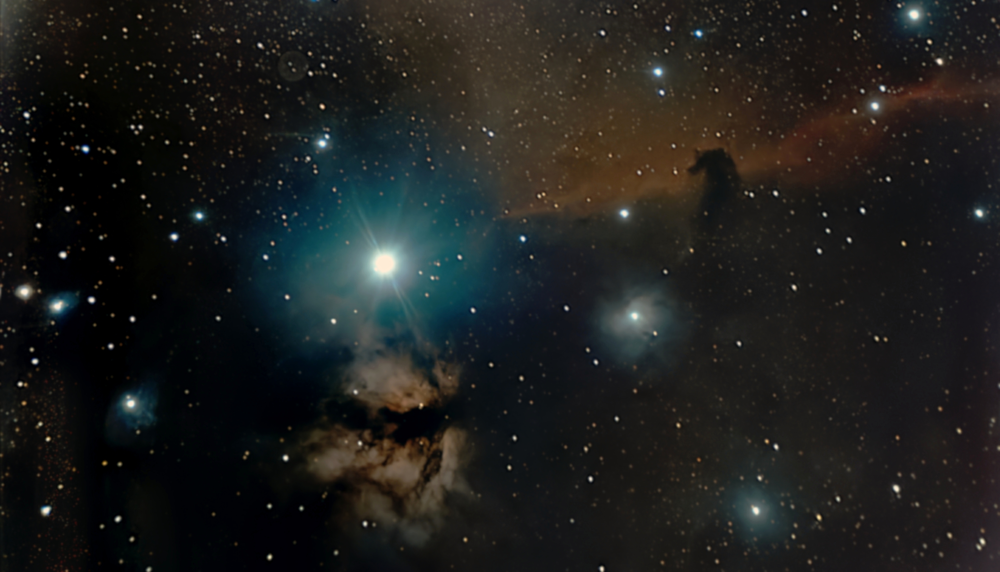

|Targets|
| :----: |
|| 

| [Andromeda Galaxy](../Markdown//Andromeda_Galaxy.md)  |   |
| -----: | :-----   |
|  | *The Andromeda Galaxy is a barred spiral galaxy and is the nearest major galaxy to the Milky Way. It was originally named the Andromeda Nebula and is cataloged as Messier 31, M31, and NGC 224. Andromeda has a D25 isophotal diameter of about 46.56 kiloparsecs (152,000 light-years)[8] and is approximately 765 kpc (2.5 million light-years) from Earth. The galaxy's name stems from the area of Earth's sky in which it appears, the constellation of Andromeda, which itself is named after the princess who was the wife of Perseus in Greek mythology. * |
|

| [Bubble Nebula](../Markdown//Bubble_Nebula.md)  |   |
| -----: | :-----   |
|  | *NGC 7635, also known as the Bubble Nebula, Sharpless 162, or Caldwell 11, is an H II region emission nebula in the constellation Cassiopeia. It lies close to the open cluster Messier 52. The "bubble" is created by the stellar wind from a massive hot, 8.7 magnitude young central star, SAO 20575 (BD+60°2522). The nebula is near a giant molecular cloud which contains the expansion of the bubble nebula while itself being excited by the hot central star, causing it to glow. It was discovered in November 1787 by William Herschel. The star BD+60°2522 is thought to have a mass of about 44 M* |
|

| [California Nebula](../Markdown//California_Nebula.md)  |   |
| -----: | :-----   |
|  | *The California Nebula (Also known NGC 1499 or Sh2-220) is an emission nebula located in the constellation Perseus. Its name comes from its resemblance to the outline of the US State of California in long exposure photographs. It is almost 2.5° long on the sky and, because of its very low surface brightness, it is extremely difficult to observe visually. It can be observed with a Hα filter (isolates the Hα line at 656 nm) or Hβ filter (isolates the Hβ line at 486 nm) in a rich-field telescope under dark skies.[2] It lies at a distance of about 1,000 light years from Earth. Its fluorescence is due to excitation of the Hβ line in the nebula by the nearby prodigiously energetic O7 star, Xi Persei (also known as Menkib).[3]* |
|

| [Dumbbell Nebula](../Markdown//Dumbbell_Nebula.md)  |   |
| -----: | :-----   |
|  | *The Dumbbell Nebula (also known as the Apple Core Nebula, Messier 27, and NGC 6853) is a planetary nebula (nebulosity surrounding a white dwarf) in the constellation Vulpecula, at a distance of about 1360 light-years.[1] It was the first such nebula to be discovered, by Charles Messier in 1764. At its brightness of visual magnitude 7.5 and diameter of about 8 arcminutes, it is easily visible in binoculars[4] and is a popular observing target in amateur telescopes. The Dumbbell Nebula appears shaped like a prolate spheroid and is viewed from our perspective along the plane of its equator. In 1992, Moreno-Corral et al. computed that its rate of expansion angularly was, viewed from our distance, no more than 2.3 arcseconds (″) per century. From this, an upper limit to the age of 14,600 years may be determined. In 1970, Bohuski, Smith, and Weedman found an expansion velocity of 31 km/s. Given its semi-minor axis radius of 1.01 ly, this implies that the kinematic age of the nebula is 9,800 years.[3][5]* |
|

| [Eagle Nebula](../Markdown//Eagle_Nebula.md)  |   |
| -----: | :-----   |
|  | *The Eagle Nebula (catalogued as Messier 16 or M16, and as NGC 6611, and also known as the Star Queen Nebula) is a young open cluster of stars in the constellation Serpens, discovered by Jean-Philippe de Cheseaux in 1745–46. Both the "Eagle" and the "Star Queen" refer to visual impressions of the dark silhouette near the center of the nebula,[4][5] an area made famous as the "Pillars of Creation" imaged by the Hubble Space Telescope. The nebula contains several active star-forming gas and dust regions, including the aforementioned Pillars of Creation. The Eagle Nebula lies in the Sagittarius Arm of the Milky Way.* |
|

| [Eastern Veil Nebula](../Markdown//Eastern_Veil_Nebula.md)  |   |
| -----: | :-----   |
|  | *The Western Veil (also known as Caldwell 34), consisting of NGC 6960 (the "Witch's Broom",[10] Lacework Nebula,[8] "Filamentary Nebula"[10]) near the foreground star 52 Cygni;* |
|

| [Fireworks Galaxy](../Markdown//Fireworks_Galaxy.md)  |   |
| -----: | :-----   |
|  | *NGC 6946, sometimes referred to as the Fireworks Galaxy, is a face-on intermediate spiral galaxy with a small bright nucleus, whose location in the sky straddles the boundary between the northern constellations of Cepheus and Cygnus. Its distance from Earth is about 25.2 million light-years or 7.72 megaparsecs,[2] similar to the distance of M101 (NGC 5457) in the constellation Ursa Major.[5] Both were once considered to be part of the Local Group,[6] but are now known to be among the dozen bright spiral galaxies near the Milky Way but beyond the confines of the Local Group.[7] NGC 6946 lies within the Virgo Supercluster.[8]* |
|

| [Full Veil Nebula](../Markdown//Full_Veil_Nebula.md)  |   |
| -----: | :-----   |
|  | *The Cygnus Loop (radio source W78, or Sharpless 103) is a large supernova remnant (SNR) in the constellation Cygnus, an emission nebula measuring nearly 3° across.[1] Some arcs of the loop, known collectively as the Veil Nebula or Cirrus Nebula, emit in the visible electromagnetic range.[1] Radio, infrared, and X-ray images reveal the complete loop.* |
|

| [Ghost Of Cassiopeia](../Markdown//Ghost_Of_Cassiopeia.md)  |   |
| -----: | :-----   |
|  | *Sh 2-185 is an H II region centered on the massive star system Gamma Cassiopeiae (γ Cas) in the northern constellation of Cassiopeia. It was included in the second Catalogue of H II Regions, published in 1959 by Stewart Sharpless.[3] Sh 2-185 is located at a distance of approximately 10,500 ly (3.23 kpc) from the Sun.[2] The region is surrounded by a dust shell,[4] and displays several infrared point sources that are a characteristics of young stellar objects.[5] This H II region includes the reflection and emission nebulae IC 59 and IC 63.[4] Both nebulae have a cometary shape, with IC 63 being the brighter of the two.[6] The difference in appearance between the two nebulae is a consequence of their physical distance from γ Cas. IC 63 displays a well-defined ionization front, while this is lacking in IC 59.[5] The nebulae are the closest photodissociation regions to the Sun.[6]* |
|

| [HD225526](../Markdown//HD225526.md)  |   |
| -----: | :-----   |
|  | |

| [Heart Nebula](../Markdown//Heart_Nebula.md)  |   |
| -----: | :-----   |
|  | |

| [Helix Nebula](../Markdown//Helix_Nebula.md)  |   |
| -----: | :-----   |
|  | |

| [Horse Head Nebula](../Markdown//Horse_Head_Nebula.md)  |   |
| -----: | :-----   |
|  | |

| [Iris Nebula](../Markdown//Iris_Nebula.md)  |   |
| -----: | :-----   |
|  | |

| [Lagoon Nebula](../Markdown//Lagoon_Nebula.md)  |   |
| -----: | :-----   |
|  | |

| [Pacman Nebula](../Markdown//Pacman_Nebula.md)  |   |
| -----: | :-----   |
|  | |

| [Pleiades Cluster](../Markdown//Pleiades_Cluster.md)  |   |
| -----: | :-----   |
|  | |

| [Swann Nebula](../Markdown//Swann_Nebula.md)  |   |
| -----: | :-----   |
|  | |

| [The Moon](../Markdown//The_Moon.md)  |   |
| -----: | :-----   |
|  | |

| [Triangulum Galaxy](../Markdown//Triangulum_Galaxy.md)  |   |
| -----: | :-----   |
|  | |

| [Trifid Nebula](../Markdown//Trifid_Nebula.md)  |   |
| -----: | :-----   |
|  | |

| [Vega Star](../Markdown//Vega_Star.md)  |   |
| -----: | :-----   |
|  | |

| [Western Veil Nebula](../Markdown//Western_Veil_Nebula.md)  |   |
| -----: | :-----   |
|  | *The Eastern Veil (also known as Caldwell 33), whose brightest area is NGC 6992, trailing off farther south into NGC 6995 (together with NGC 6992 also known as "Network Nebula"[11]) and IC 1340; and* |
|

| [Wizard Nebula](../Markdown//Wizard_Nebula.md)  |   |
| -----: | :-----   |
|  | |

