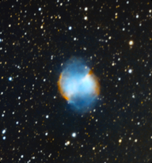
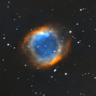
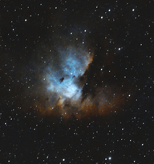
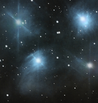
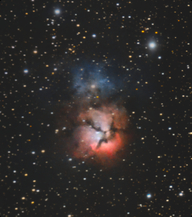
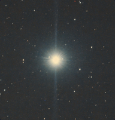
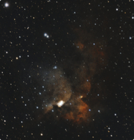

|Targets|
| :----: |
|| 

| Target | Briefing |
| -----: | :----- |
| [Aldebaran Star](../Markdown//Aldebaran_Star.md)  | |
|  |Aldebaran (Arabic: الدَّبَران, lit. 'The Follower') (Proto-Semitic *dVbr- “bee”) is a star located in the zodiac constellation of Taurus. It has the Bayer designation α Tauri, which is Latinized to Alpha Tauri and abbreviated Alpha Tau or α Tau. Aldebaran varies in brightness from an apparent visual magnitude 0.75 down to 0.95, making it the brightest star in the constellation, as well as (typically) the fourteenth-brightest star in the night sky. It is positioned at a distance of approximately 65 light-years from the Sun. The star lies along the line of sight to the nearby Hyades cluster. Aldebaran is a red giant, meaning that it is cooler than the Sun with a surface temperature of 3,900 K, but its radius is about 45 times the Sun's, so it is over 400 times as luminous. As a giant star, it has moved off the main sequence on the Hertzsprung–Russell diagram after depleting its supply of hydrogen in the core. The star spins slowly and takes 520 days to complete a rotation. Aldebaran is believed to host a planet several times the mass of Jupiter, named Aldebaran b. |
| [Andromeda Galaxy](../Markdown//Andromeda_Galaxy.md)  | |
|  |The Andromeda Galaxy is a barred spiral galaxy and is the nearest major galaxy to the Milky Way. It was originally named the Andromeda Nebula and is cataloged as Messier 31, M31, and NGC 224. Andromeda has a D25 isophotal diameter of about 46.56 kiloparsecs (152,000 light-years)[8] and is approximately 765 kpc (2.5 million light-years) from Earth. The galaxy's name stems from the area of Earth's sky in which it appears, the constellation of Andromeda, which itself is named after the princess who was the wife of Perseus in Greek mythology.  |
| [Betelgeuse Star](../Markdown//Betelgeuse_Star.md)  | |
|  ||
| [Bubble Nebula](../Markdown//Bubble_Nebula.md)  | |
|  |NGC 7635, also known as the Bubble Nebula, Sharpless 162, or Caldwell 11, is an H II region emission nebula in the constellation Cassiopeia. It lies close to the open cluster Messier 52. The "bubble" is created by the stellar wind from a massive hot, 8.7 magnitude young central star, SAO 20575 (BD+60°2522). The nebula is near a giant molecular cloud which contains the expansion of the bubble nebula while itself being excited by the hot central star, causing it to glow. It was discovered in November 1787 by William Herschel. The star BD+60°2522 is thought to have a mass of about 44 M |
| [California Nebula](../Markdown//California_Nebula.md)  | |
|  |The California Nebula (Also known NGC 1499 or Sh2-220) is an emission nebula located in the constellation Perseus. Its name comes from its resemblance to the outline of the US State of California in long exposure photographs. It is almost 2.5° long on the sky and, because of its very low surface brightness, it is extremely difficult to observe visually. It can be observed with a Hα filter (isolates the Hα line at 656 nm) or Hβ filter (isolates the Hβ line at 486 nm) in a rich-field telescope under dark skies.[2] It lies at a distance of about 1,000 light years from Earth. Its fluorescence is due to excitation of the Hβ line in the nebula by the nearby prodigiously energetic O7 star, Xi Persei (also known as Menkib).[3] |
| [Dumbbell Nebula](../Markdown//Dumbbell_Nebula.md)  | |
|  |The Dumbbell Nebula (also known as the Apple Core Nebula, Messier 27, and NGC 6853) is a planetary nebula (nebulosity surrounding a white dwarf) in the constellation Vulpecula, at a distance of about 1360 light-years.[1] It was the first such nebula to be discovered, by Charles Messier in 1764. At its brightness of visual magnitude 7.5 and diameter of about 8 arcminutes, it is easily visible in binoculars[4] and is a popular observing target in amateur telescopes. The Dumbbell Nebula appears shaped like a prolate spheroid and is viewed from our perspective along the plane of its equator. In 1992, Moreno-Corral et al. computed that its rate of expansion angularly was, viewed from our distance, no more than 2.3 arcseconds (″) per century. From this, an upper limit to the age of 14,600 years may be determined. In 1970, Bohuski, Smith, and Weedman found an expansion velocity of 31 km/s. Given its semi-minor axis radius of 1.01 ly, this implies that the kinematic age of the nebula is 9,800 years.[3][5] |
| [Eagle Nebula](../Markdown//Eagle_Nebula.md)  | |
|  |The Eagle Nebula (catalogued as Messier 16 or M16, and as NGC 6611, and also known as the Star Queen Nebula) is a young open cluster of stars in the constellation Serpens, discovered by Jean-Philippe de Cheseaux in 1745–46. Both the "Eagle" and the "Star Queen" refer to visual impressions of the dark silhouette near the center of the nebula,[4][5] an area made famous as the "Pillars of Creation" imaged by the Hubble Space Telescope. The nebula contains several active star-forming gas and dust regions, including the aforementioned Pillars of Creation. The Eagle Nebula lies in the Sagittarius Arm of the Milky Way. |
| [Eastern Veil Nebula](../Markdown//Eastern_Veil_Nebula.md)  | |
|  |The Western Veil (also known as Caldwell 34), consisting of NGC 6960 (the "Witch's Broom",[10] Lacework Nebula,[8] "Filamentary Nebula"[10]) near the foreground star 52 Cygni; |
| [Fireworks Galaxy](../Markdown//Fireworks_Galaxy.md)  | |
|  |NGC 6946, sometimes referred to as the Fireworks Galaxy, is a face-on intermediate spiral galaxy with a small bright nucleus, whose location in the sky straddles the boundary between the northern constellations of Cepheus and Cygnus. Its distance from Earth is about 25.2 million light-years or 7.72 megaparsecs,[2] similar to the distance of M101 (NGC 5457) in the constellation Ursa Major.[5] Both were once considered to be part of the Local Group,[6] but are now known to be among the dozen bright spiral galaxies near the Milky Way but beyond the confines of the Local Group.[7] NGC 6946 lies within the Virgo Supercluster.[8] |
| [Ghost Of Cassiopeia](../Markdown//Ghost_Of_Cassiopeia.md)  | |
|  |Sh 2-185 is an H II region centered on the massive star system Gamma Cassiopeiae (γ Cas) in the northern constellation of Cassiopeia. It was included in the second Catalogue of H II Regions, published in 1959 by Stewart Sharpless.[3] Sh 2-185 is located at a distance of approximately 10,500 ly (3.23 kpc) from the Sun.[2] The region is surrounded by a dust shell,[4] and displays several infrared point sources that are a characteristics of young stellar objects.[5] This H II region includes the reflection and emission nebulae IC 59 and IC 63.[4] Both nebulae have a cometary shape, with IC 63 being the brighter of the two.[6] The difference in appearance between the two nebulae is a consequence of their physical distance from γ Cas. IC 63 displays a well-defined ionization front, while this is lacking in IC 59.[5] The nebulae are the closest photodissociation regions to the Sun.[6] |
| [HD225526](../Markdown//HD225526.md)  | |
|  ||
| [Heart Nebula](../Markdown//Heart_Nebula.md)  | |
|  |The Heart Nebula (also known as the Running Dog Nebula, Sharpless 2-190) is an emission nebula, 7500 light years away from Earth and located in the Perseus Arm of the Galaxy in the constellation Cassiopeia. It was discovered by William Herschel on 3 November 1787.[1] It displays glowing ionized hydrogen gas and darker dust lanes.[2]. The brightest part of the nebula (a knot at its western edge) is separately classified as NGC 896, because it was the first part of the nebula to be discovered. The nebula's intense red output and its morphology are driven by the radiation emanating from a small group of stars near the nebula's center. This open cluster of stars, known as Collinder 26, Melotte 15, or IC 1805, contains a few bright stars nearly 50 times the mass of the Sun, and many more dim stars that are only a fraction of the Sun's mass.[1]. The Heart Nebula is also made up of ionised oxygen and sulfur gasses, responsible for the rich blue and orange colours seen in narrowband images. The shape of the nebula is driven by stellar winds from the hot stars in its core. The nebula also spans almost 2 degrees in the sky, covering an area four times that of the diameter of the full moon.[3] |
| [Helix Nebula](../Markdown//Helix_Nebula.md)  | |
|  |The Helix Nebula (also known as NGC 7293 or Caldwell 63) is a planetary nebula (PN) located in the constellation Aquarius. Discovered by Karl Ludwig Harding, most likely before 1824, this object is one of the closest of all the bright planetary nebulae to Earth.[3] The distance, measured by the Gaia mission, is 655±13 light-years.[4] It is similar in appearance to the Cat's Eye Nebula and the Ring Nebula, whose size, age, and physical characteristics are similar to the Dumbbell Nebula, varying only in its relative proximity and the appearance from the equatorial viewing angle.[5] The Helix Nebula has sometimes been referred to as the "Eye of God" in pop culture,[6] as well as the "Eye of Sauron".[7][8] |
| [Horse Head Nebula](../Markdown//Horse_Head_Nebula.md)  | |
|  |The Horsehead Nebula (also known as Barnard 33 or B33) is a small dark nebula in the constellation Orion.[2] The nebula is located just to the south of Alnitak, the easternmost star of Orion's Belt, and is part of the much larger Orion molecular cloud complex. It appears within the southern region of the dense dust cloud known as Lynds 1630, along the edge of the much larger, active star-forming H II region called IC 434.[3] The Horsehead Nebula is approximately 422 parsecs or 1,375 light-years from Earth.[1][3] It is one of the most identifiable nebulae because of its resemblance to a horse's head.[4] Using NASA's James Webb Space Telescope, astronomers have captured the nebula's "mane" in unprecedented detail, revealing the complexity of the photodissociation region where ultraviolet light interacts with gas and dust.[5][6] |
| [Iris Nebula](../Markdown//Iris_Nebula.md)  | |
|  |The Iris Nebula (also known as NGC 7023 and Caldwell 4) is a bright reflection nebula in the constellation Cepheus. The designation NGC 7023 refers to the open cluster within the larger reflection nebula designated LBN 487. The nebula, which shines at magnitude +6.8, is illuminated by a magnitude +7.4 star designated HD 200775.[1] It is located near the Mira-type variable star T Cephei, and near the bright magnitude +3.23 variable star Beta Cephei (Alfirk). It lies 1,300 light-years away and is six light-years across.[2] |
| [Lagoon Nebula](../Markdown//Lagoon_Nebula.md)  | |
|  |The Lagoon Nebula (catalogued as Messier 8 or M8, NGC 6523, Sharpless 25, RCW 146, and Gum 72) is a giant interstellar cloud in the constellation Sagittarius. It is classified as an emission nebula and has an H II region. The Lagoon Nebula was discovered by Giovanni Hodierna before 1654[5] and is one of only two star-forming nebulae faintly visible to the eye from mid-northern latitudes. Seen with binoculars, it appears as a distinct cloud-like patch with a definite core. Within the nebula is the open cluster NGC 6530.[6] |
| [Northamerica Nebula](../Markdown//Northamerica_Nebula.md)  | |
|  |The Heart Nebula (also known as the Running Dog Nebula, Sharpless 2-190) is an emission nebula, 7500 light years away from Earth and located in the Perseus Arm of the Galaxy in the constellation Cassiopeia. It was discovered by William Herschel on 3 November 1787.[1] It displays glowing ionized hydrogen gas and darker dust lanes.[2]. The brightest part of the nebula (a knot at its western edge) is separately classified as NGC 896, because it was the first part of the nebula to be discovered. The nebula's intense red output and its morphology are driven by the radiation emanating from a small group of stars near the nebula's center. This open cluster of stars, known as Collinder 26, Melotte 15, or IC 1805, contains a few bright stars nearly 50 times the mass of the Sun, and many more dim stars that are only a fraction of the Sun's mass.[1]. The Heart Nebula is also made up of ionised oxygen and sulfur gasses, responsible for the rich blue and orange colours seen in narrowband images. The shape of the nebula is driven by stellar winds from the hot stars in its core. The nebula also spans almost 2 degrees in the sky, covering an area four times that of the diameter of the full moon.[3] |
| [Orion Nebula](../Markdown//Orion_Nebula.md)  | |
|  ||
| [Pacman Nebula](../Markdown//Pacman_Nebula.md)  | |
|  |NGC 281, IC 11 or Sh2-184 is a bright emission nebula and part of an H II region in the northern constellation of Cassiopeia and is part of the Milky Way's Perseus Spiral Arm. This 20×30 arcmin sized nebulosity is also associated with open cluster IC 1590, several Bok globules and the multiple star, B 1. It collectively forms Sh2-184,[3] spanning over a larger area of 40 arcmin.[4] A recent distance from radio parallaxes of water masers at 22 GHz made during 2014 is estimated it lies 2.82±0.20 kpc. (9200 ly.) from us.[5] Colloquially, NGC 281 is also known as the Pacman Nebula for its resemblance to the video game character. Edward Emerson Barnard discovered the nebula in August 1883, describing it as "a large faint nebula, very diffuse". Multiple star 'B 1' or β 1 was later discovered by S. W. Burnham, whose bright component is identified as the highly luminous O6 spectral class star, HD 5005 or HIP 4121. It consists of an 8th-magnitude primary with four companions at distances between 1.4 and 15.7 arcsec. There has been no appreciable change in this quintuple system since the first measures were made in 1875. |
| [Pleiades Cluster](../Markdown//Pleiades_Cluster.md)  | |
|  |The Pleiades (/ˈpliː.ədiːz, ˈpleɪ-, ˈplaɪ-/),[8][9] also known as Seven Sisters and Messier 45, is an asterism of an open star cluster containing young B-type stars in the northwest of the constellation Taurus. At a distance of about 444 light-years, it is among the nearest star clusters to Earth and the nearest Messier object to Earth, being the most obvious star cluster to the naked eye in the night sky. It is also observed to house the reflection nebula NGC 1432, an HII region.[10] The cluster is dominated by hot blue luminous stars that have formed within the last 100 million years. Reflection nebulae around the brightest stars were once thought to be leftover material from their formation, but are now considered likely to be an unrelated dust cloud in the interstellar medium through which the stars are currently passing.[11] This dust cloud is estimated to be moving at a speed of approximately 18 km/s relative to the stars in the cluster.[12] |
| [Sadr Star](../Markdown//Sadr_Star.md)  | |
|  |Gamma Cygni (γ Cygni, abbreviated Gamma Cyg, γ Cyg), officially named Sadr /ˈsædər/,[11][12] is a star in the northern constellation of Cygnus, forming the intersection of an asterism of five stars called the Northern Cross. Based upon parallax measurements obtained during the Hipparcos mission, it is approximately 1,800 light-years (560 parsecs) from the Sun.[1] It forms the primary or 'A' component of a multiple star system designated WDS J20222+4015 (the secondary or 'BCD' component is WDS J20222+4015BCD, a close triplet of stars 41" away from γ Cygni[13]). |
| [Swan Nebula](../Markdown//Swan_Nebula.md)  | |
|  ||
| [The Moon](../Markdown//The_Moon.md)  | |
|  |The Moon is Earth's only natural satellite. It orbits at an average distance of 384,400 km (238,900 mi), about 30 times the diameter of Earth. Tidal forces between Earth and the Moon have synchronized the Moon's orbital period (lunar month) with its rotation period (lunar day) at 29.5 Earth days, causing the same side of the Moon to always face Earth. The Moon's gravitational pull—and, to a lesser extent, the Sun's—are the main drivers of Earth's tides. |
| [Triangulum Galaxy](../Markdown//Triangulum_Galaxy.md)  | |
|  |The Triangulum Galaxy is a spiral galaxy 2.73 million light-years (ly) from Earth in the constellation Triangulum. It is catalogued as Messier 33 or NGC (New General Catalogue) 598. With the D25 isophotal diameter of 18.74 kiloparsecs (61,100 light-years), the Triangulum Galaxy is the third-largest member of the Local Group of galaxies, behind the Andromeda Galaxy and the Milky Way. The galaxy is the second-smallest spiral galaxy in the Local Group after the Large Magellanic Cloud, which is a Magellanic-type spiral galaxy.[7] It is believed to be a satellite of the Andromeda Galaxy or on its rebound into the latter due to their interactions, velocities,[8] and proximity to one another in the night sky. It also has an H II nucleus.[9] |
| [Trifid Nebula](../Markdown//Trifid_Nebula.md)  | |
|  |The Trifid Nebula (catalogued as Messier 20 or M20 and as NGC 6514) is an H II region in the north-west of Sagittarius in a star-forming region in the Milky Way's Scutum–Centaurus Arm.[3] It was discovered by Charles Messier on June 5, 1764.[4] Its name means 'three-lobe'. The object is an unusual combination of an open cluster of stars, an emission nebula (the relatively dense, reddish-pink portion), a reflection nebula (the mainly NNE blue portion), and a dark nebula (the apparent 'gaps' in the former that cause the trifurcated appearance, also designated Barnard 85). Viewed through a small telescope, the Trifid Nebula is a bright and peculiar object, and is thus a perennial favorite of amateur astronomers.[5] The most massive star that has formed in this region is HD 164492A, an O7.5III star with a mass more than 20 times the mass of the Sun.[6] This star is surrounded by a cluster of approximately 3100 young stars.[7] |
| [Vega Star](../Markdown//Vega_Star.md)  | |
|  |Vega is the brightest star in the northern constellation of Lyra. It has the Bayer designation α Lyrae, which is Latinised to Alpha Lyrae and abbreviated Alpha Lyr or α Lyr. This star is relatively close at only 25 light-years (7.7 parsecs) from the Sun, and one of the most luminous stars in the Sun's neighborhood. It is the fifth-brightest star in the night sky, and the second-brightest star in the northern celestial hemisphere, after Arcturus. Vega has been extensively studied by astronomers, leading it to be termed "arguably the next most important star in the sky after the Sun".[18] Vega was the northern pole star around 12,000 BCE and will be so again around the year 13,727, when its declination will be +86° 14′.[19] Vega was the first star other than the Sun to have its image and spectrum photographed.[20][21] It was one of the first stars whose distance was estimated through parallax measurements. Vega has functioned as the baseline for calibrating the photometric brightness scale and was one of the stars used to define the zero point for the UBV photometric system. |
| [Veil Nebula](../Markdown//Veil_Nebula.md)  | |
|  ||
| [Western Veil Nebula](../Markdown//Western_Veil_Nebula.md)  | |
|  |The Eastern Veil (also known as Caldwell 33), whose brightest area is NGC 6992, trailing off farther south into NGC 6995 (together with NGC 6992 also known as "Network Nebula"[11]) and IC 1340; and |
| [Wizard Nebula](../Markdown//Wizard_Nebula.md)  | |
|  |NGC 7380 is a young[4] open cluster of stars in the northern circumpolar constellation of Cepheus, discovered by Caroline Herschel in 1787. The surrounding emission nebulosity is known colloquially as the Wizard Nebula, which spans an angle of 25′. German-born astronomer William Herschel included his sister's discovery in his catalog, and labelled it H VIII.77. The nebula is known as S 142 in the 1959 Sharpless catalog (Sh2-142).[2] It is extremely difficult to observe visually, usually requiring very dark skies and an O-III filter. The NGC 7380 complex is located at a distance of approximately 8.5 kilolight-years from the Sun, in the Perseus Arm of the Milky Way.[2] The cluster spans ~20 light-years (6 pc) with an elongated shape and an extended tail.[2] Age estimates range from 4[2] to 11.9[1] million years. At the center of the cluster lies DH Cephei, a close, double-lined spectroscopic binary system consisting of two massive O-type stars. This pair are the primary ionizing source for the surrounding H II region, and are driving out the surrounding gas and dust while triggering star formation in the neighboring region.[4] Of the variable stars that have been identified in the cluster, 14 have been identified as pre-main sequence stars while 17 are main sequence stars that are primarily B-type variables.[4] |
