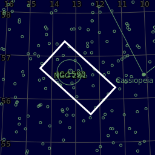

#  Pacman Nebula

NGC 281, IC 11 or Sh2-184 is a bright emission nebula and part of an H II region in the northern constellation of Cassiopeia and is part of the Milky Way's Perseus Spiral Arm. This 20×30 arcmin sized nebulosity is also associated with open cluster IC 1590, several Bok globules and the multiple star, B 1. It collectively forms Sh2-184,[3] spanning over a larger area of 40 arcmin.[4] A recent distance from radio parallaxes of water masers at 22 GHz made during 2014 is estimated it lies 2.82±0.20 kpc. (9200 ly.) from us.[5] Colloquially, NGC 281 is also known as the Pacman Nebula for its resemblance to the video game character. Edward Emerson Barnard discovered the nebula in August 1883, describing it as "a large faint nebula, very diffuse". Multiple star 'B 1' or β 1 was later discovered by S. W. Burnham, whose bright component is identified as the highly luminous O6 spectral class star, HD 5005 or HIP 4121. It consists of an 8th-magnitude primary with four companions at distances between 1.4 and 15.7 arcsec. There has been no appreciable change in this quintuple system since the first measures were made in 1875.

[ Read more](https://en.wikipedia.org/wiki/NGC_281)
## Plate solving 

| Globe | Close | Very close |
| ----- | ----- | ----- |
| | | |

## Gallery
 

 

