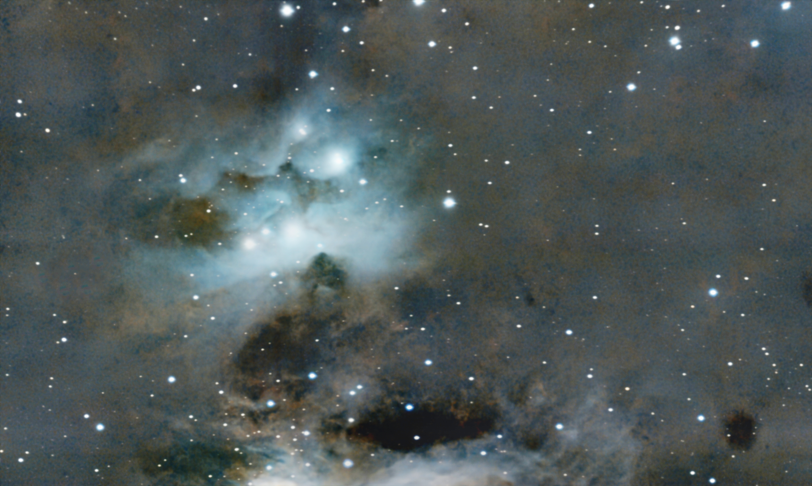
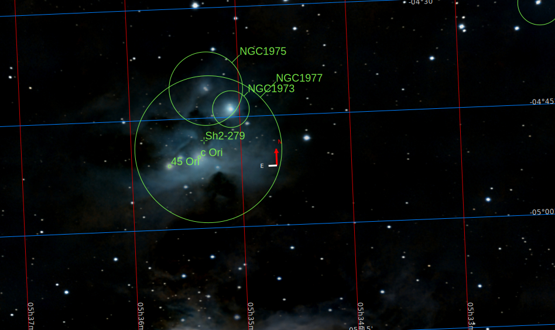

[Leer en español](./Sobre_el_Caos.md)

(To my dearest friend, Antonio Sánchez Millán, a "practical philosopher", in his own words, whose friendship is not bound neither by time nor by space)

# About chaos

First of all, before going into the details of chaos, let us enjoy this picture

There, like in a soft cloud of cotton gently blown by a quiet breeze, a set of six beautiful stars shine gracefully, lingering among curls of cream and coffee, while a choir of smaller stars dance all around, ruled by the invisible, deterministic, but harmonic, mandate of the Laws of Physics.

Indeed, this is what I feel when I behold this picture, taken from my backyard last November, almost visible to the naked eye. So close! I know this could be a sort of cheessy thought, but, undoubtedly it transmits this kind of "softness".

## How things are

Well, indeed, this is very common target of amateur astrophotographers known as the "[Running Man Nebula](./Running_Man_Nebula.md)", or in its nude, cold technical reference of "Sh 2-279", and it can be found in these astronomy coordinates

It gracefully rests in a very close corner of our dear Milky Way, located just 1.500 lightyears away, next door we could say, since our mother galaxy is 2.000.000 light years in diameter. It is funny, because though it seems so close, if we could travel with the fastest civil transport created by humans, the Concorde, at more than 2.170 km/h, it will take more than 740.000.000 years to get there. That is, if we were to be there *as of today* we should have boarded the Concorde, with our expensive Louis Vuiton hand-baggage, 740.000.000 years ago, during the Criogenic Period, right in the middle of a glaciation, where only cianobacteries survived. Well, not that close, is it?

Furthermore, if we, humans, would take a closer look to this spot, we will find that formerly it was a huge cold cloud of hydrogen atoms and  due to some cosmological catastrophe (see [Relativity II](./Relativity_II.md)) these atoms of hydrogen started to collapse, smashing between them at high speed and high temperature (like 10.000.000 Celsius degrees) grouping to each other due to gravity, forming a fusion reaction and the creation of each one and every single star in the picture. In particular, the most powerful star in the picture, at the top right of the white nebulosity, known as 42-Orionis (and labelled as NGC-1973), is a young blue star, just 5-10 million years old, literally, a baby star, 20.000 times brighter than our sun and 5 times hotter, which generates, every single second, an equivalent amount of (approx) of 122x10^12 Hiroshima bombs, that is,

122.000.000.000.000 

Hiroshima bombs every second

every second.

This massive young star also produces a strong stellar wind and particles that is visible in the deformation of the white and brown clouds that surround the six sister stars. A mindblowing amount of energy that, if the Earth were located at the same distance than our Sun, it will produce a dramatic chaos. The temperature in the surface of Earth will exceed, by far, 3.000 Celsius degrees, and in a matter of a few minutes, all the oceans will evaporate and all the crust will melt, and the life, in any of the forms known so far, would be completely imposible. A true hell. A true chaos for the human kind. A life extermination scenario.

And that leads me to the true point of this story. Now, that I am struggling to walk through the most devastating, suffering, heartbreaking moment of my entire life, it is important to know that, even in these moments, there is still room for beauty and calm. It is like that old zen tale of a man and a tiger:

"*A man traveling across a field encountered a tiger. He fled, the tiger after him. Coming to a precipice, he caught hold of the root of a wild vine and swung himself down over the edge. The tiger sniffed at him from above. Trembling, the man looked down to where, far below, another tiger was waiting to eat him. Only the vine sustained him. Two mice, one white and one black, little by little started to gnaw away at the vine. The man saw a luscious strawberry near him. Grasping the vine with one hand, he plucked the strawberry with the other. How sweet it tasted!*"

With love,

Luis.

