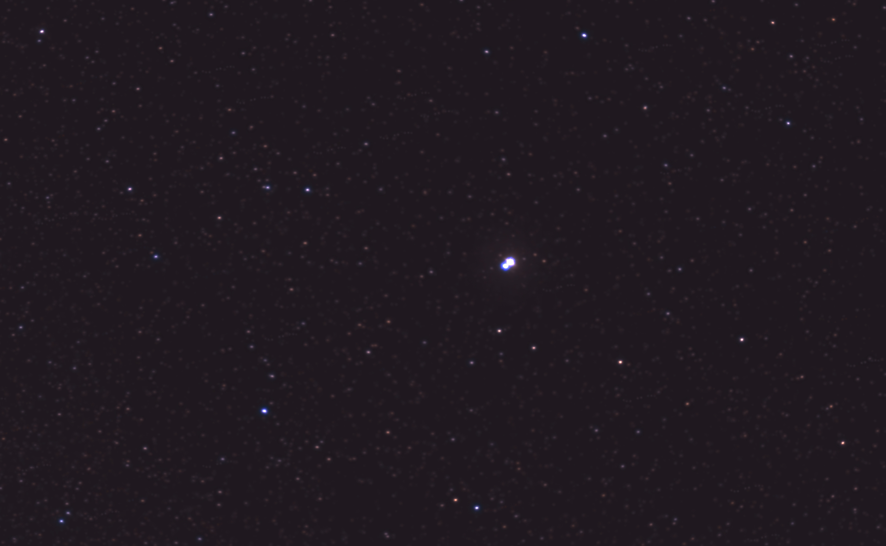
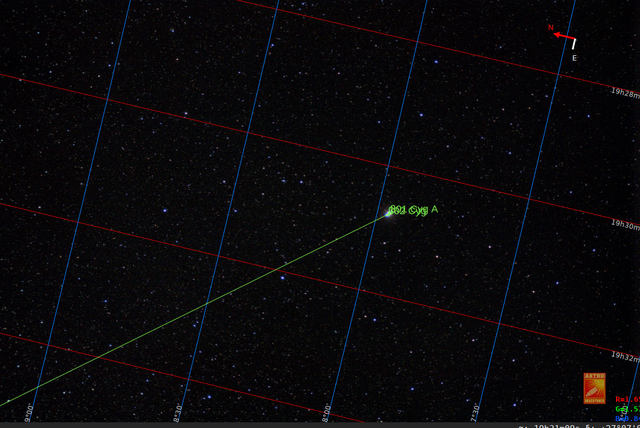
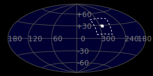
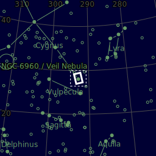
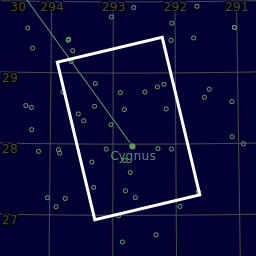

#  Albireo Double Star

-  MAIN CAMERA: Canon EOS 450D astromod, uncooled, ISO=1600, Exp=30.0 s, 7 subs
-  Mount/Tracker: SkyWatcher StarAdventurer
-   Main tube: SVBony SV503 80mm F7 (no field flattener)
-   AUTOGUIDING: NONE

Albireo /ælˈbɪrioʊ/[23] is a binary star designated Beta Cygni (β Cygni, abbreviated Beta Cyg, β Cyg). The International Astronomical Union uses the name "Albireo" specifically for the brightest star in the system.[24] Although designated 'beta', it is fainter than Gamma Cygni, Delta Cygni, and Epsilon Cygni and is the fifth-brightest point of light in the constellation of Cygnus. Appearing to the naked eye to be a single star of magnitude 3, viewing through even a low-magnification telescope resolves it into its two components. The brighter yellow star, itself a very close trinary system, makes a striking colour contrast with its fainter blue companion.[25]

[ Read more](https://en.wikipedia.org/wiki/Albireo)
## Plate solving 

| Globe | Close | Very close |
| ----- | ----- | ----- |
| | | |

## Details

## Gallery
 

