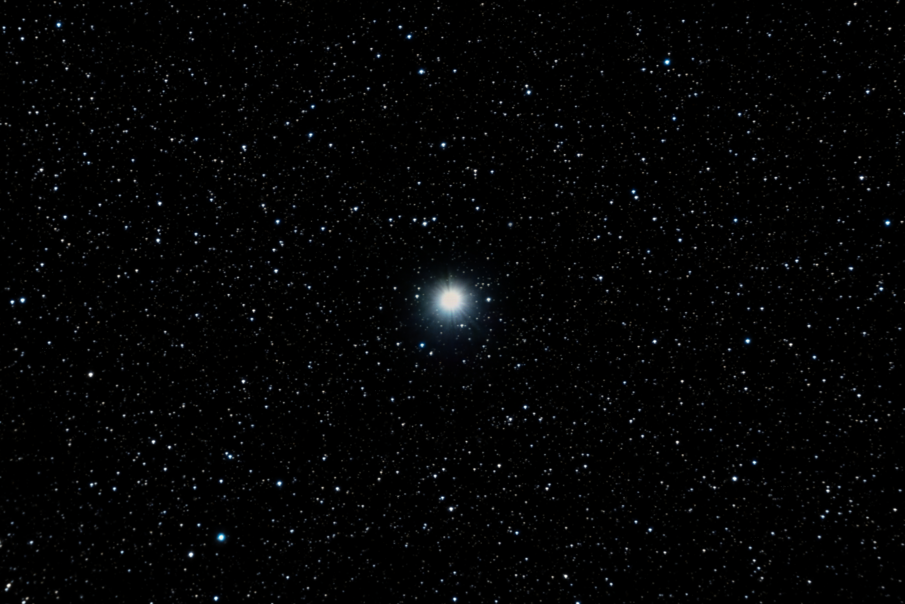
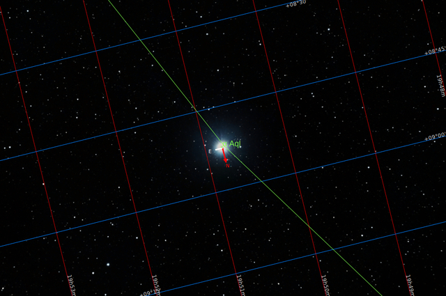
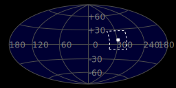
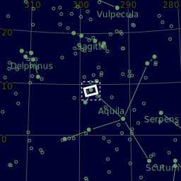
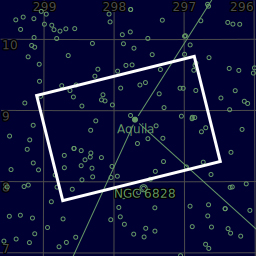

#  Altair Star

Altair is the brightest star in the constellation of Aquila and the twelfth-brightest star in the night sky. It has the Bayer designation Alpha Aquilae, which is Latinised from α Aquilae and abbreviated Alpha Aql or α Aql. Altair is an A-type main-sequence star with an apparent visual magnitude of 0.77 and is one of the vertices of the Summer Triangle asterism; the other two vertices are marked by Deneb and Vega.[7][15][16] It is located at a distance of 16.7 light-years (5.1 parsecs) from the Sun.[17]: 194  Altair is currently in the G-cloud—a nearby interstellar cloud formed from an accumulation of gas and dust.[18][19] Altair rotates rapidly, with a velocity at the equator of approximately 286 km/s.[nb 1][11] This is a significant fraction of the star's estimated breakup speed of 400 km/s.[20] A study with the Palomar Testbed Interferometer revealed that Altair is not spherical, but is flattened at the poles due to its high rate of rotation.[21] Other interferometric studies with multiple telescopes, operating in the infrared, have imaged and confirmed this phenomenon.[11]

[ Read more](https://en.wikipedia.org/wiki/Altair)
## Plate solving 

| Globe | Close | Very close |
| ----- | ----- | ----- |
| | | |

## Gallery
 

