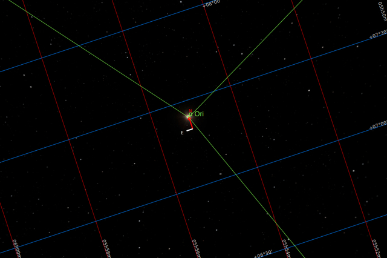

#  Antares Star

Antares is the brightest star in the constellation of Scorpius. It has the Bayer designation α Scorpii, which is Latinised to Alpha Scorpii. Often referred to as "the heart of the scorpion", Antares is flanked by σ Scorpii and τ Scorpii near the center of the constellation. Distinctly reddish when viewed with the naked eye, Antares is a slow irregular variable star that ranges in brightness from an apparent visual magnitude of +0.6 down to +1.6. It is on average the fifteenth-brightest star in the night sky. Antares is the brightest and most evolved stellar member of the Scorpius–Centaurus association, the nearest OB association to the Sun. It is located about 170 parsecs (550 ly) from Earth at the rim of the Upper Scorpius subgroup, and is illuminating the Rho Ophiuchi cloud complex in its foreground.

[ Read more](https://en.wikipedia.org/wiki/Antares)
## Plate solving 

| Globe | Close | Very close |
| ----- | ----- | ----- |

## Gallery
 

