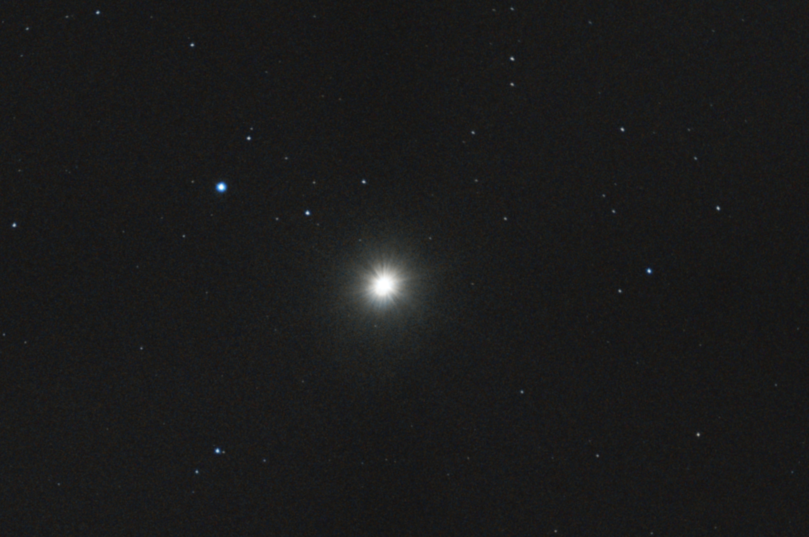
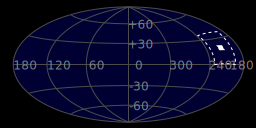
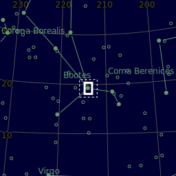
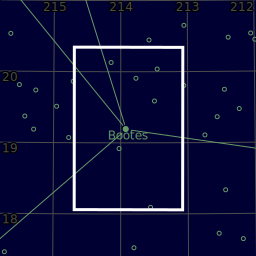

#  Arcturus Star

Arcturus is the brightest star in the northern constellation of Boötes. With an apparent visual magnitude of −0.05,[2] it is the fourth-brightest star in the night sky, and the brightest in the northern celestial hemisphere. The name Arcturus originated from ancient Greece; it was then cataloged as α Boötis by Johann Bayer in 1603, which is Latinized to Alpha Boötis. Arcturus forms one corner of the Spring Triangle asterism. Located relatively close at 36.7 light-years from the Sun, Arcturus is a red giant of spectral type K1.5III—an aging star around 7.1 billion years old that has used up its core hydrogen and evolved off the main sequence. It is about the same mass as the Sun, but has expanded to 25 times its size (around 35 million kilometers) and is around 170 times as luminous.

[ Read more](https://en.wikipedia.org/wiki/Arcturus)
## Plate solving 

| Globe | Close | Very close |
| ----- | ----- | ----- |
| | | |

## Gallery
 

 

