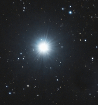
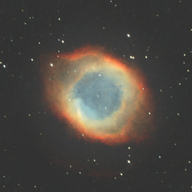
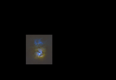

|Targets|
| :----: |
|| 

| Target | Briefing |
| -----: | :----- |
| [Albireo Double Star](..//Stories//Albireo_Double_Star.md)  | |
|  |Albireo /ælˈbɪrioʊ/[23] is a binary star designated Beta Cygni (β Cygni, abbreviated Beta Cyg, β Cyg). The International Astronomical Union uses the name "Albireo" specifically for the brightest star in the system.[24] Although designated 'beta', it is fainter than Gamma Cygni, Delta Cygni, and Epsilon Cygni and is the fifth-brightest point of light in the constellation of Cygnus. Appearing to the naked eye to be a single star of magnitude 3, viewing through even a low-magnification telescope resolves it into its two components. The brighter yellow star, itself a very close trinary system, makes a striking colour contrast with its fainter blue companion.[25] |
| [Aldebaran Star](..//Stories//Aldebaran_Star.md)  | |
|  |Aldebaran (Arabic: الدَّبَران, lit. 'The Follower') (Proto-Semitic *dVbr- “bee”) is a star located in the zodiac constellation of Taurus. It has the Bayer designation α Tauri, which is Latinized to Alpha Tauri and abbreviated Alpha Tau or α Tau. Aldebaran varies in brightness from an apparent visual magnitude 0.75 down to 0.95, making it the brightest star in the constellation, as well as (typically) the fourteenth-brightest star in the night sky. It is positioned at a distance of approximately 65 light-years from the Sun. The star lies along the line of sight to the nearby Hyades cluster. Aldebaran is a red giant, meaning that it is cooler than the Sun with a surface temperature of 3,900 K, but its radius is about 45 times the Sun's, so it is over 400 times as luminous. As a giant star, it has moved off the main sequence on the Hertzsprung–Russell diagram after depleting its supply of hydrogen in the core. The star spins slowly and takes 520 days to complete a rotation. Aldebaran is believed to host a planet several times the mass of Jupiter, named Aldebaran b. |
| [Altair Star](..//Stories//Altair_Star.md)  | |
|  |Altair is the brightest star in the constellation of Aquila and the twelfth-brightest star in the night sky. It has the Bayer designation Alpha Aquilae, which is Latinised from α Aquilae and abbreviated Alpha Aql or α Aql. Altair is an A-type main-sequence star with an apparent visual magnitude of 0.77 and is one of the vertices of the Summer Triangle asterism; the other two vertices are marked by Deneb and Vega.[7][15][16] It is located at a distance of 16.7 light-years (5.1 parsecs) from the Sun.[17]: 194  Altair is currently in the G-cloud—a nearby interstellar cloud formed from an accumulation of gas and dust.[18][19] Altair rotates rapidly, with a velocity at the equator of approximately 286 km/s.[nb 1][11] This is a significant fraction of the star's estimated breakup speed of 400 km/s.[20] A study with the Palomar Testbed Interferometer revealed that Altair is not spherical, but is flattened at the poles due to its high rate of rotation.[21] Other interferometric studies with multiple telescopes, operating in the infrared, have imaged and confirmed this phenomenon.[11] |
| [Andromeda Galaxy](..//Stories//Andromeda_Galaxy.md)  | |
|  |The Andromeda Galaxy is a barred spiral galaxy and is the nearest major galaxy to the Milky Way. It was originally named the Andromeda Nebula and is cataloged as Messier 31, M31, and NGC 224. Andromeda has a D25 isophotal diameter of about 46.56 kiloparsecs (152,000 light-years)[8] and is approximately 765 kpc (2.5 million light-years) from Earth. The galaxy's name stems from the area of Earth's sky in which it appears, the constellation of Andromeda, which itself is named after the princess who was the wife of Perseus in Greek mythology.  |
| [Antares Star](..//Stories//Antares_Star.md)  | |
|  |Antares is the brightest star in the constellation of Scorpius. It has the Bayer designation α Scorpii, which is Latinised to Alpha Scorpii. Often referred to as "the heart of the scorpion", Antares is flanked by σ Scorpii and τ Scorpii near the center of the constellation. Distinctly reddish when viewed with the naked eye, Antares is a slow irregular variable star that ranges in brightness from an apparent visual magnitude of +0.6 down to +1.6. It is on average the fifteenth-brightest star in the night sky. Antares is the brightest and most evolved stellar member of the Scorpius–Centaurus association, the nearest OB association to the Sun. It is located about 170 parsecs (550 ly) from Earth at the rim of the Upper Scorpius subgroup, and is illuminating the Rho Ophiuchi cloud complex in its foreground. |
| [Arcturus Star](..//Stories//Arcturus_Star.md)  | |
|  |Arcturus is the brightest star in the northern constellation of Boötes. With an apparent visual magnitude of −0.05,[2] it is the fourth-brightest star in the night sky, and the brightest in the northern celestial hemisphere. The name Arcturus originated from ancient Greece; it was then cataloged as α Boötis by Johann Bayer in 1603, which is Latinized to Alpha Boötis. Arcturus forms one corner of the Spring Triangle asterism. Located relatively close at 36.7 light-years from the Sun, Arcturus is a red giant of spectral type K1.5III—an aging star around 7.1 billion years old that has used up its core hydrogen and evolved off the main sequence. It is about the same mass as the Sun, but has expanded to 25 times its size (around 35 million kilometers) and is around 170 times as luminous. |
| [Betelgeuse Star](..//Stories//Betelgeuse_Star.md)  | |
|  |Betelgeuse is a red supergiant star in the constellation of Orion. It is usually the tenth-brightest star in the night sky and, after Rigel, the second-brightest in its constellation. It is a distinctly reddish, semiregular variable star whose apparent magnitude, varying between +0.0 and +1.6, has the widest range displayed by any first-magnitude star. Betelgeuse is the brightest star in the night sky at near-infrared wavelengths. Its Bayer designation is α Orionis, Latinised to Alpha Orionis and abbreviated Alpha Ori or α Ori.[19] |
| [Bode Galaxy](..//Stories//Bode_Galaxy.md)  | |
|  |Messier 81 (also known as NGC 3031 or Bode's Galaxy) is a grand design spiral galaxy about 12 million light-years away in the constellation Ursa Major. It has a D25 isophotal diameter of 29.44 kiloparsecs (96,000 light-years).[2][5] Because of its relative proximity to the Milky Way galaxy, large size, and active galactic nucleus (which harbors a 70 million M☉[6] supermassive black hole), Messier 81 has been studied extensively by professional astronomers. The galaxy's large size and relatively high brightness also makes it a popular target for amateur astronomers.[7] In late February 2022, astronomers reported that M81 may be the source of FRB 20200120E, a repeating fast radio burst.[8][9] |
| [Bubble Nebula](..//Stories//Bubble_Nebula.md)  | |
|  |NGC 7635, also known as the Bubble Nebula, Sharpless 162, or Caldwell 11, is an H II region emission nebula in the constellation Cassiopeia. It lies close to the open cluster Messier 52. The "bubble" is created by the stellar wind from a massive hot, 8.7 magnitude young central star, SAO 20575 (BD+60°2522). The nebula is near a giant molecular cloud which contains the expansion of the bubble nebula while itself being excited by the hot central star, causing it to glow. It was discovered in November 1787 by William Herschel. The star BD+60°2522 is thought to have a mass of about 44 M |
| [Butterfly Galaxies](..//Stories//Butterfly_Galaxies.md)  | |
|  |NGC 4567 and NGC 4568 (nicknamed the Butterfly Galaxies[4] or Siamese Twins[NB 1][5]) are a set of unbarred spiral galaxies about 60 million light-years away[1] in the constellation Virgo. They were both discovered by William Herschel in 1784. They are part of the Virgo Cluster of galaxies. These galaxies are in the process of colliding and merging with each other, as studies of their distributions of neutral and molecular hydrogen show, with the highest star-formation activity in the part where they overlap. However, the system is still in an early phase of interaction.[6] In about 500 million years the galaxies will coalesce into a single elliptical galaxy.[7] |
| [California Nebula](..//Stories//California_Nebula.md)  | |
|  |The California Nebula (Also known NGC 1499 or Sh2-220) is an emission nebula located in the constellation Perseus. Its name comes from its resemblance to the outline of the US State of California in long exposure photographs. It is almost 2.5° long on the sky and, because of its very low surface brightness, it is extremely difficult to observe visually. It can be observed with a Hα filter (isolates the Hα line at 656 nm) or Hβ filter (isolates the Hβ line at 486 nm) in a rich-field telescope under dark skies.[2] It lies at a distance of about 1,000 light years from Earth. Its fluorescence is due to excitation of the Hβ line in the nebula by the nearby prodigiously energetic O7 star, Xi Persei (also known as Menkib).[3] |
| [Capella Star](..//Stories//Capella_Star.md)  | |
|  |Capella is the brightest star in the northern constellation of Auriga. It has the Bayer designation α Aurigae, which is Latinised to Alpha Aurigae and abbreviated Alpha Aur or α Aur. Capella is the sixth-brightest star in the night sky, and the third-brightest in the northern celestial hemisphere after Arcturus and Vega. A prominent object in the northern sky, it is circumpolar to observers north of 44°N. Its name meaning "little goat" in Latin, Capella depicted the goat Amalthea that suckled Zeus in classical mythology. Capella is relatively close, at 42.9 light-years (13.2 parsecs). It is one of the brightest X-ray sources in the sky, thought to come primarily from the corona of Capella Aa. |
| [Chi Persei Cluster](..//Stories//Chi_Persei_Cluster.md)  | |
|  |The Double Cluster (also known as Caldwell 14) consists of the open clusters NGC 869 and NGC 884 (often designated h Persei and χ (chi) Persei, respectively), which are close together in the constellation Perseus. Both visible with the naked eye, NGC 869 and NGC 884 lie at a distance of about 7,500 light years in the Perseus Arm of the Milky Way galaxy.[2] |
| [Crescent Nebula](..//Stories//Crescent_Nebula.md)  | |
|  |The Crescent Nebula (also known as NGC 6888, Caldwell 27, Sharpless 105) is an emission nebula in the constellation Cygnus, about 5000 light-years away from Earth. It was discovered by William Herschel in 1792.[2] It is formed by the fast stellar wind from the Wolf-Rayet star WR 136 (HD 192163) colliding with and energizing the slower moving wind ejected by the star when it became a red giant around 250,000[3] to 400,000[citation needed] years ago. The result of the collision is a shell and two shock waves, one moving outward and one moving inward. The inward moving shock wave heats the stellar wind to X-ray-emitting temperatures. |
| [Deneb Star](..//Stories//Deneb_Star.md)  | |
|  |Deneb (/ˈdɛnɛb/) is a blue supergiant star in the constellation of Cygnus. It is the brightest star in the constellation and the 19th brightest in the night sky, with an apparent magnitude slightly varying between +1.21 and +1.29. Deneb is one of the vertices of the asterism known as the Summer Triangle and the "head" of the Northern Cross. Its Bayer designation is α Cygni, which is Latinised to Alpha Cygni, abbreviated to Alpha Cyg or α Cyg. Deneb rivals Rigel, a closer blue supergiant, as the most luminous first-magnitude star. However, its distance, and hence luminosity, is poorly known; its luminosity is estimated to be between 55,000 and 196,000 times that of the Sun. Distance estimates range from 1,400 to 2,600 light-years; assuming its highest value, it is the farthest star with an apparent magnitude brighter than 2.50. |
| [Dumbbell Nebula](..//Stories//Dumbbell_Nebula.md)  | |
|  |The Dumbbell Nebula (also known as the Apple Core Nebula, Messier 27, and NGC 6853) is a planetary nebula (nebulosity surrounding a white dwarf) in the constellation Vulpecula, at a distance of about 1360 light-years.[1] It was the first such nebula to be discovered, by Charles Messier in 1764. At its brightness of visual magnitude 7.5 and diameter of about 8 arcminutes, it is easily visible in binoculars[4] and is a popular observing target in amateur telescopes. The Dumbbell Nebula appears shaped like a prolate spheroid and is viewed from our perspective along the plane of its equator. In 1992, Moreno-Corral et al. computed that its rate of expansion angularly was, viewed from our distance, no more than 2.3 arcseconds (″) per century. From this, an upper limit to the age of 14,600 years may be determined. In 1970, Bohuski, Smith, and Weedman found an expansion velocity of 31 km/s. Given its semi-minor axis radius of 1.01 ly, this implies that the kinematic age of the nebula is 9,800 years.[3][5] |
| [Eagle Nebula](..//Stories//Eagle_Nebula.md)  | |
|  |The Eagle Nebula (catalogued as Messier 16 or M16, and as NGC 6611, and also known as the Star Queen Nebula) is a young open cluster of stars in the constellation Serpens, discovered by Jean-Philippe de Cheseaux in 1745–46. Both the "Eagle" and the "Star Queen" refer to visual impressions of the dark silhouette near the center of the nebula,[4][5] an area made famous as the "Pillars of Creation" imaged by the Hubble Space Telescope. The nebula contains several active star-forming gas and dust regions, including the aforementioned Pillars of Creation. The Eagle Nebula lies in the Sagittarius Arm of the Milky Way. |
| [Eta Auriga Star](..//Stories//Eta_Auriga_Star.md)  | |
|  |Eta Aurigae (η Aurigae, abbreviated Eta Aur, η Aur), officially named Haedus /ˈhiːdəs/,[10][11] is a star in the northern constellation of Auriga. With an apparent visual magnitude of 3.18,[2] it is visible to the naked eye. Based upon parallax measurements made during the Hipparcos mission, this star is approximately 243 light-years (75 parsecs) distant from the Sun. Along with Zeta Aurigae it represents one of the kids of the she-goat Capella, from which it derived its Latin traditional name Haedus II or Hoedus II, from the Latin haedus "kid" (Zeta Aurigae was Haedus I). It also had the less common traditional name Mahasim, from the Arabic المِعْصَم al-miʽşam "the wrist" (of the charioteer), which it shared with Theta Aurigae. In 2016, the IAU organized a Working Group on Star Names (WGSN)[12] to catalog and standardize proper names for stars. The WGSN approved the names Haedus for Eta Aurigae and Saclateni for Zeta Aurigae A on 30 June 2017 and they are both now so included in the List of IAU-approved Star Names. |
| [Fireworks Galaxy](..//Stories//Fireworks_Galaxy.md)  | |
|  |NGC 6946, sometimes referred to as the Fireworks Galaxy, is a face-on intermediate spiral galaxy with a small bright nucleus, whose location in the sky straddles the boundary between the northern constellations of Cepheus and Cygnus. Its distance from Earth is about 25.2 million light-years or 7.72 megaparsecs,[2] similar to the distance of M101 (NGC 5457) in the constellation Ursa Major.[5] Both were once considered to be part of the Local Group,[6] but are now known to be among the dozen bright spiral galaxies near the Milky Way but beyond the confines of the Local Group.[7] NGC 6946 lies within the Virgo Supercluster.[8] |
| [Fish Head Nebula](..//Stories//Fish_Head_Nebula.md)  | |
|  |The Fish Head Nebula, or the Northern Bear Nebula, is part of a large star forming system of gas and dust located along the Perseus spiral arm of the Milky Way.[1] The nebula is located in the Constellation Cassiopeia, approximately 6,000 light-years from Earth and is adjacent to the much larger Heart Nebula.[2] The brighter region of the nebula is designated NGC 896 and is the home to many young and large stars. These stars radiate high amounts of ultraviolet light. This UV radiation excites the surrounding gas and causes it to shine at a high brightness. This mapping is known as false color and is common with many of the Hubble Space Images.[3] |
| [Flame Nebula](..//Stories//Flame_Nebula.md)  | |
|  |The Flame Nebula, designated as NGC 2024 and Sh2-277, is an emission nebula in the constellation Orion. It is about 1350 light-years away.[1] At that distance, the Flame Nebula lies within the Orion B cloud of the larger Orion Molecular Cloud Complex. The bright star Alnitak (ζ Ori), the easternmost star in the Belt of Orion, appears very close to the Flame Nebula in the sky. But the star and nebula are not physically associated with one another. The Flame Nebula contains a young cluster of stars which includes at least one hot, luminous O-type star labeled IRS 2b.[2] The dense gas and dust in the foreground of the nebula heavily obscures the star cluster inside the nebula, making studies at infrared wavelengths most useful. |
| [Fomalhaut Star](..//Stories//Fomalhaut_Star.md)  | |
|  |Fomalhaut (UK: /ˈfɒməloʊt/, US: /ˈfoʊməlhɔːt/[11]) is the brightest star in the southern constellation of Piscis Austrinus, the Southern Fish, and one of the brightest stars in the night sky. It has the Bayer designation Alpha Piscis Austrini, which is an alternative form of α Piscis Austrini, and is abbreviated Alpha PsA or α PsA. This is a class A star on the main sequence approximately 25 light-years (7.7 pc) from the Sun as measured by the Hipparcos astrometry satellite.[12] Since 1943, the spectrum of this star has served as one of the stable anchor points by which other stars are classified.[13]  It is classified as a Vega-like star that emits excess infrared radiation,[14][15] indicating it is surrounded by a circumstellar disk.[16] Together with the K-type main-sequence star TW Piscis Austrini, and the red dwarf star LP 876-10, Fomalhaut constitute a triple star system, even though the companions are separated by approximately 8 degrees.[17][18] |
| [Ghost Of Cassiopeia](..//Stories//Ghost_Of_Cassiopeia.md)  | |
|  |Sh 2-185 is an H II region centered on the massive star system Gamma Cassiopeiae (γ Cas) in the northern constellation of Cassiopeia. It was included in the second Catalogue of H II Regions, published in 1959 by Stewart Sharpless.[3] Sh 2-185 is located at a distance of approximately 10,500 ly (3.23 kpc) from the Sun.[2] The region is surrounded by a dust shell,[4] and displays several infrared point sources that are a characteristics of young stellar objects.[5] This H II region includes the reflection and emission nebulae IC 59 and IC 63.[4] Both nebulae have a cometary shape, with IC 63 being the brighter of the two.[6] The difference in appearance between the two nebulae is a consequence of their physical distance from γ Cas. IC 63 displays a well-defined ionization front, while this is lacking in IC 59.[5] The nebulae are the closest photodissociation regions to the Sun.[6] |
| [HD225526](..//Stories//HD225526.md)  | |
|  |This is the list of notable stars in the constellation Cepheus, sorted by decreasing brightness. |
| [Heart Nebula](..//Stories//Heart_Nebula.md)  | |
|  |The Heart Nebula (also known as the Running Dog Nebula, Sharpless 2-190) is an emission nebula, 7500 light years away from Earth and located in the Perseus Arm of the Galaxy in the constellation Cassiopeia. It was discovered by William Herschel on 3 November 1787.[1] It displays glowing ionized hydrogen gas and darker dust lanes.[2]. The brightest part of the nebula (a knot at its western edge) is separately classified as NGC 896, because it was the first part of the nebula to be discovered. The nebula's intense red output and its morphology are driven by the radiation emanating from a small group of stars near the nebula's center. This open cluster of stars, known as Collinder 26, Melotte 15, or IC 1805, contains a few bright stars nearly 50 times the mass of the Sun, and many more dim stars that are only a fraction of the Sun's mass.[1]. The Heart Nebula is also made up of ionised oxygen and sulfur gasses, responsible for the rich blue and orange colours seen in narrowband images. The shape of the nebula is driven by stellar winds from the hot stars in its core. The nebula also spans almost 2 degrees in the sky, covering an area four times that of the diameter of the full moon.[3] |
| [Helix Nebula](..//Stories//Helix_Nebula.md)  | |
|  |The Helix Nebula (also known as NGC 7293 or Caldwell 63) is a planetary nebula (PN) located in the constellation Aquarius. Discovered by Karl Ludwig Harding, most likely before 1824, this object is one of the closest of all the bright planetary nebulae to Earth.[3] The distance, measured by the Gaia mission, is 655±13 light-years.[4] It is similar in appearance to the Cat's Eye Nebula and the Ring Nebula, whose size, age, and physical characteristics are similar to the Dumbbell Nebula, varying only in its relative proximity and the appearance from the equatorial viewing angle.[5] The Helix Nebula has sometimes been referred to as the "Eye of God" in pop culture,[6] as well as the "Eye of Sauron".[7][8] |
| [Horse Head Nebula](..//Stories//Horse_Head_Nebula.md)  | |
|  |The Horsehead Nebula (also known as Barnard 33 or B33) is a small dark nebula in the constellation Orion.[2] The nebula is located just to the south of Alnitak, the easternmost star of Orion's Belt, and is part of the much larger Orion molecular cloud complex. It appears within the southern region of the dense dust cloud known as Lynds 1630, along the edge of the much larger, active star-forming H II region called IC 434.[3] The Horsehead Nebula is approximately 422 parsecs or 1,375 light-years from Earth.[1][3] It is one of the most identifiable nebulae because of its resemblance to a horse's head.[4] Using NASA's James Webb Space Telescope, astronomers have captured the nebula's "mane" in unprecedented detail, revealing the complexity of the photodissociation region where ultraviolet light interacts with gas and dust.[5][6] |
| [Iris Nebula](..//Stories//Iris_Nebula.md)  | |
|  |The Iris Nebula (also known as NGC 7023 and Caldwell 4) is a bright reflection nebula in the constellation Cepheus. The designation NGC 7023 refers to the open cluster within the larger reflection nebula designated LBN 487. The nebula, which shines at magnitude +6.8, is illuminated by a magnitude +7.4 star designated HD 200775.[1] It is located near the Mira-type variable star T Cephei, and near the bright magnitude +3.23 variable star Beta Cephei (Alfirk). It lies 1,300 light-years away and is six light-years across.[2] |
| [Jellyfish Nebula](..//Stories//Jellyfish_Nebula.md)  | |
|  |IC 443 (also known as the Jellyfish Nebula and Sharpless 248 (Sh2-248)) is a galactic supernova remnant (SNR) in the constellation Gemini. On the plane of the sky, it is located near the star Eta Geminorum. Its distance is roughly 5,000 light years from Earth. IC 443 may be the remains of a supernova that occurred 30,000 - 35,000 years ago. The same supernova event likely created the neutron star CXOU J061705.3+222127, the collapsed remnant of the stellar core. IC 443 is one of the best-studied cases of supernova remnants interacting with surrounding molecular clouds. |
| [Lagoon Nebula](..//Stories//Lagoon_Nebula.md)  | |
|  |The Lagoon Nebula (catalogued as Messier 8 or M8, NGC 6523, Sharpless 25, RCW 146, and Gum 72) is a giant interstellar cloud in the constellation Sagittarius. It is classified as an emission nebula and has an H II region. The Lagoon Nebula was discovered by Giovanni Hodierna before 1654[5] and is one of only two star-forming nebulae faintly visible to the eye from mid-northern latitudes. Seen with binoculars, it appears as a distinct cloud-like patch with a definite core. Within the nebula is the open cluster NGC 6530.[6] |
| [Leo Triplet Galaxy](..//Stories//Leo_Triplet_Galaxy.md)  | |
|  |The Leo Triplet (also known as the M66 Group) is a small group of galaxies about 35 million light-years away[5] in the constellation Leo. This galaxy group consists of the spiral galaxies M65, M66, and NGC 3628. |
| [M13 Hercules Globular Cluster](..//Stories//M13_Hercules_Globular_Cluster.md)  | |
|  |Messier 13, or M13 (also designated NGC 6205 and sometimes called the Great Globular Cluster in Hercules, the Hercules Globular Cluster, or the Great Hercules Cluster), is a globular cluster of several hundred thousand stars in the constellation of Hercules. |
| [M3 Globular Cluster](..//Stories//M3_Globular_Cluster.md)  | |
|  |It was discovered on May 3, 1764,[10] and was the first Messier object to be discovered by Charles Messier himself. Messier originally mistook the object for a nebula without stars. This mistake was corrected after the stars were resolved by William Herschel around 1784.[11] Since then, it has become one of the best-studied globular clusters. Identification of the cluster's unusually large variable star population was begun in 1913 by American astronomer Solon Irving Bailey and new variable members continue to be identified up through 2004.[12] |
| [M90 Galaxy](..//Stories//M90_Galaxy.md)  | |
|  |Messier 90 (also known as M90 and NGC 4569) is an intermediate spiral galaxy exhibiting a weak inner ring structure about 60 million light-years away[a] in the constellation Virgo. It was discovered by Charles Messier in 1781.[4] Messier 90 is a member of the Virgo Cluster,[5] being one of its largest and brightest spiral galaxies, with an absolute magnitude of around −22 (brighter than the Andromeda Galaxy).[6] The galaxy is found about 1.5° from the central subgroup of Messier 87.[7] Due to the galaxy's interaction with the intracluster medium in its cluster, the galaxy has lost much of its interstellar medium. As a result of this process, which is referred to as ram-pressure stripping, the medium and star formation regions appear severely truncated compared to similar galaxies outside the Virgo Cluster[8] and there are even H II regions outside the galactic plane,[8] as well as long (up to 80,000-parsec—that is, 260,000-light-year) tails of ionized gas that has been stripped away.[9] |
| [Markarian Chain](..//Stories//Markarian_Chain.md)  | |
|  |Markarian's Chain is a stretch of galaxies that forms part of the Virgo Cluster. When viewed from Earth, the galaxies lie along a smoothly curved line. Charles Messier first discovered two of the galaxies, M84 and M86, in 1781. The other galaxies seen in the chain were discovered by William Herschel[1] and are now known primarily by their catalog numbers in John Louis Emil Dreyer's New General Catalogue, published in 1888.[2] It was ultimately named after the Armenian astrophysicist, Benjamin Markarian, who discovered their common motion in the early 1960s.[3] Member galaxies include M84 (NGC 4374), M86 (NGC 4406), NGC 4477, NGC 4473, NGC 4461, NGC 4458, NGC 4438 and NGC 4435. It is located at RA 12h 27m and Dec +13° 10′. The bright members of the chain are visible through small telescopes. Larger telescopes can be used to view the fainter galaxies .[2] Near the center there appear the pair of interacting galaxies NGC 4438 and NGC 4435, about 50 million light-years away, known to some as Markarian's Eyes. At least seven galaxies in the chain appear to move coherently, although others appear to be superposed by chance.[4] Six of the points on the chain can be marked by galaxies. The other two points are pairs of galaxies |
| [Milky Way](..//Stories//Milky_Way.md)  | |
|  |The Milky Way or Milky Way Galaxy[c] is the galaxy that includes the Solar System, with the name describing the galaxy's appearance from Earth: a hazy band of light seen in the night sky formed from stars in other arms of the galaxy, which are so far away that they cannot be individually distinguished by the naked eye. The Milky Way is a barred spiral galaxy with a D25 isophotal diameter estimated at 26.8 ± 1.1 kiloparsecs (87,400 ± 3,600 light-years),[10] but only about 1,000 light-years thick at the spiral arms (more at the bulge). Recent simulations suggest that a dark matter area, also containing some visible stars, may extend up to a diameter of almost 2 million light-years (613 kpc).[28][29] The Milky Way has several satellite galaxies and is part of the Local Group of galaxies, forming part of the Virgo Supercluster which is itself a component of the Laniakea Supercluster.[30][31] |
| [Monkey Head Nebula](..//Stories//Monkey_Head_Nebula.md)  | |
|  |NGC 2174 (also known as Monkey Head Nebula) is an H II[1] emission nebula located in the constellation Orion and is associated with the open star cluster NGC 2175.[1] It was discovered on 6 February 1877 by French astronomer Édouard Stephan.[2] It is thought to be located about 6,400 light-years away from Earth. The nebula may have formed through hierarchical collapse.[3] There is some equivocation in the use of the identifiers NGC 2174 and NGC 2175. These may apply to the entire nebula, to its brightest knot, or to the star cluster it includes. Burnham's Celestial Handbook lists the entire nebula as 2174/2175 and does not mention the star cluster.[4] The NGC Project (working from the original descriptive notes) assigns NGC 2174 to the prominent knot at J2000 06h 09m 23.7s, +20° 39′ 34″ and NGC 2175 to the entire nebula, and by extension to the star cluster.[5] SIMBAD uses NGC 2174 for the nebula and NGC 2175 for the star cluster.[1] [6] Glowing gas and dark dust do not survive well in the Monkey Head Nebula. Young stars near the center of the nebula generate stellar winds and high energy radiation that causes the nebula's material to shift into complex shapes.[7] The nebula is primarily composed of hydrogen which glows at infrared wavelengths due to the radiation.[8] |
| [Northamerica Nebula](..//Stories//Northamerica_Nebula.md)  | |
|  |The Heart Nebula (also known as the Running Dog Nebula, Sharpless 2-190) is an emission nebula, 7500 light years away from Earth and located in the Perseus Arm of the Galaxy in the constellation Cassiopeia. It was discovered by William Herschel on 3 November 1787.[1] It displays glowing ionized hydrogen gas and darker dust lanes.[2]. The brightest part of the nebula (a knot at its western edge) is separately classified as NGC 896, because it was the first part of the nebula to be discovered. The nebula's intense red output and its morphology are driven by the radiation emanating from a small group of stars near the nebula's center. This open cluster of stars, known as Collinder 26, Melotte 15, or IC 1805, contains a few bright stars nearly 50 times the mass of the Sun, and many more dim stars that are only a fraction of the Sun's mass.[1]. The Heart Nebula is also made up of ionised oxygen and sulfur gasses, responsible for the rich blue and orange colours seen in narrowband images. The shape of the nebula is driven by stellar winds from the hot stars in its core. The nebula also spans almost 2 degrees in the sky, covering an area four times that of the diameter of the full moon.[3] |
| [Orion Nebula](..//Stories//Orion_Nebula.md)  | |
|  |The Orion Nebula (also known as Messier 42, M42, or NGC 1976) is a diffuse nebula situated in the Milky Way, being south of Orion's Belt in the constellation of Orion,[b] and is known as the middle "star" in the "sword" of Orion. It is one of the brightest nebulae and is visible to the naked eye in the night sky with an apparent magnitude of 4.0. It is 1,344 ± 20 light-years (412.1 ± 6.1 pc) away[3][6] and is the closest region of massive star formation to Earth. The M42 nebula is estimated to be 24 light-years across (so its apparent size from Earth is approximately 1 degree). It has a mass of about 2,000 times that of the Sun. Older texts frequently refer to the Orion Nebula as the Great Nebula in Orion or the Great Orion Nebula.[7] The Orion Nebula is one of the most scrutinized and photographed objects in the night sky and is among the most intensely studied celestial features.[8] The nebula has revealed much about the process of how stars and planetary systems are formed from collapsing clouds of gas and dust. Astronomers have directly observed protoplanetary disks and brown dwarfs within the nebula, intense and turbulent motions of the gas, and the photo-ionizing effects of massive nearby stars in the nebula. |
| [Pacman Nebula](..//Stories//Pacman_Nebula.md)  | |
|  |NGC 281, IC 11 or Sh2-184 is a bright emission nebula and part of an H II region in the northern constellation of Cassiopeia and is part of the Milky Way's Perseus Spiral Arm. This 20×30 arcmin sized nebulosity is also associated with open cluster IC 1590, several Bok globules and the multiple star, B 1. It collectively forms Sh2-184,[3] spanning over a larger area of 40 arcmin.[4] A recent distance from radio parallaxes of water masers at 22 GHz made during 2014 is estimated it lies 2.82±0.20 kpc. (9200 ly.) from us.[5] Colloquially, NGC 281 is also known as the Pacman Nebula for its resemblance to the video game character. Edward Emerson Barnard discovered the nebula in August 1883, describing it as "a large faint nebula, very diffuse". Multiple star 'B 1' or β 1 was later discovered by S. W. Burnham, whose bright component is identified as the highly luminous O6 spectral class star, HD 5005 or HIP 4121. It consists of an 8th-magnitude primary with four companions at distances between 1.4 and 15.7 arcsec. There has been no appreciable change in this quintuple system since the first measures were made in 1875. |
| [Pelikan Nebula](..//Stories//Pelikan_Nebula.md)  | |
|  |The Pelican Nebula (also known as IC 5070[1]) is an H II region associated with the North America Nebula in the constellation of Cygnus. The gaseous contortions of this emission nebula bear a resemblance to a pelican, giving rise to its name.[1] The Pelican Nebula is located nearby first magnitude star Deneb, and is divided from its more prominent neighbour, the North America Nebula, by a foreground molecular cloud filled with dark dust.[2] Both are part of the larger H II region of Westerhout 40.[2] The Pelican is much studied because it has a particularly active mix of star formation and evolving gas clouds. The light from young energetic stars is slowly transforming cold gas to hot and causing an ionization front gradually to advance outward. Particularly dense filaments of cold gas are seen to still remain, and among these are found two jets emitted from the Herbig–Haro object 555.[1] Millions of years from now this nebula might no longer be known as the Pelican, as the balance and placement of stars and gas will leave something that appears completely different. |
| [Pinwheel Galaxy](..//Stories//Pinwheel_Galaxy.md)  | |
|  |The Pinwheel Galaxy (also known as Messier 101, M101 or NGC 5457) is a face-on, unbarred, and counterclockwise spiral galaxy located 21 million light-years (6.4 megaparsecs)[5] from Earth in the constellation Ursa Major. It was discovered by Pierre Méchain in 1781[a] and was communicated that year to Charles Messier, who verified its position for inclusion in the Messier Catalogue as one of its final entries. On February 28, 2006, NASA and the European Space Agency released a very detailed image of the Pinwheel Galaxy, which was the largest and most detailed image of a galaxy by Hubble Space Telescope at the time.[10] The image was composed of 51 individual exposures, plus some extra ground-based photos. |
| [Pleiades Cluster](..//Stories//Pleiades_Cluster.md)  | |
|  |The Pleiades (/ˈpliː.ədiːz, ˈpleɪ-, ˈplaɪ-/),[8][9] also known as Seven Sisters and Messier 45, is an asterism of an open star cluster containing young B-type stars in the northwest of the constellation Taurus. At a distance of about 444 light-years, it is among the nearest star clusters to Earth and the nearest Messier object to Earth, being the most obvious star cluster to the naked eye in the night sky. It is also observed to house the reflection nebula NGC 1432, an HII region.[10] The cluster is dominated by hot blue luminous stars that have formed within the last 100 million years. Reflection nebulae around the brightest stars were once thought to be leftover material from their formation, but are now considered likely to be an unrelated dust cloud in the interstellar medium through which the stars are currently passing.[11] This dust cloud is estimated to be moving at a speed of approximately 18 km/s relative to the stars in the cluster.[12] |
| [Procyon Star](..//Stories//Procyon_Star.md)  | |
|  |Procyon (/ˈproʊsi.ɒn/)[17] is the brightest star in the constellation of Canis Minor and usually the eighth-brightest star in the night sky, with an apparent visual magnitude of 0.34.[3] It has the Bayer designation α Canis Minoris, which is Latinized to Alpha Canis Minoris, and abbreviated α CMi or Alpha CMi, respectively. As determined by the European Space Agency Hipparcos astrometry satellite,[18] this system lies at a distance of just 11.46 light-years (3.51 parsecs),[2] and is therefore one of Earth's nearest stellar neighbors. |
| [Question Mark Nebula](..//Stories//Question_Mark_Nebula.md)  | |
|  |NGC 7822 is a young star forming complex in the constellation of Cepheus. The complex encompasses the emission region designated Sharpless 171, and the young cluster of stars named Berkeley 59. The complex is believed to be some 800–1000 pc distant,[5][6] with the younger components aged no more than a few million years.[5][6] The complex also includes one of the hottest stars discovered within 1 kpc of the Sun, namely BD+66 1673, which is an eclipsing binary system consisting of an O5V that exhibits a surface temperature of nearly 45,000 K and a luminosity about 100,000 times that of the Sun.[5] The star is one of the primary sources illuminating the nebula and shaping the complex's famed pillars of creation-type formations, the elephant trunks.[5][7][8] Also known as the Question Mark Nebula |
| [Regulus Star](..//Stories//Regulus_Star.md)  | |
|  |Regulus is the brightest object in the constellation Leo and one of the brightest stars in the night sky. It has the Bayer designation designated α Leonis, which is Latinized to Alpha Leonis, and abbreviated Alpha Leo or α Leo. Regulus appears singular, but is actually a quadruple star system composed of four stars that are organized into two pairs. The spectroscopic binary Regulus A consists of a blue-white main-sequence star and its companion, a pre-white dwarf. The system lies approximately 79 light years from the Solar System. HD 87884 is separated from Regulus by 176″ and is itself a close pair. Regulus, along with five slightly dimmer stars (Zeta Leonis, Mu Leonis, Gamma Leonis, Epsilon Leonis, and Eta Leonis) have collectively been called 'the Sickle', which is an asterism that marks the head of Leo. |
| [Rigel Star](..//Stories//Rigel_Star.md)  | |
|  |Rigel is a blue supergiant star in the constellation of Orion. It has the Bayer designation β Orionis, which is Latinized to Beta Orionis and abbreviated Beta Ori or β Ori. Rigel is the brightest and most massive component – and the eponym – of a star system of at least four stars that appear as a single blue-white point of light to the naked eye. This system is located at a distance of approximately 850 light-years (260 pc). A star of spectral type B8Ia, Rigel is calculated to be anywhere from 61,500 to 363,000 times as luminous as the Sun, and 18 to 24 times as massive, depending on the method and assumptions used. Its radius is more than seventy times that of the Sun, and its surface temperature is 12,100 K. Due to its stellar wind, Rigel's mass-loss is estimated to be ten million times that of the Sun. With an estimated age of seven to nine million years, Rigel has exhausted its core hydrogen fuel, expanded, and cooled to become a supergiant. It is expected to end its life as a type II supernova, leaving a neutron star or a black hole as a final remnant, depending on the initial mass of the star. |
| [Rosette Nebula](..//Stories//Rosette_Nebula.md)  | |
|  |The Rosette Nebula (also known as Caldwell 49) is an H II region located near one end of a giant molecular cloud in the Monoceros region of the Milky Way Galaxy. The open cluster NGC 2244 (Caldwell 50) is closely associated with the nebulosity, the stars of the cluster having been formed from the nebula's matter. The nebula has been noted to be having a shape reminiscent of a human skull, and is sometimes referred to as the "Skull Nebula". It is not to be confused with NGC 246, which is also nicknamed the "Skull Nebula".[3][4] |
| [Running Man Nebula](..//Stories//Running_Man_Nebula.md)  | |
|  |Sh 2-279 (alternatively designated S279 or Sharpless 279) is an HII region and bright nebulae that includes a reflection nebula located in the constellation Orion. It is the northernmost part of the asterism known as Orion's Sword, lying 0.6° north of the Orion Nebula. The reflection nebula embedded in Sh 2-279 is popularly known as the Running Man Nebula.[1][3] Sh 2-279[2] comprises three NGC nebulae, NGC 1973, NGC 1975, and NGC 1977[4] that are divided by darker nebulous regions. It also includes the open cluster NGC 1981. The brightest nebulosity, later listed as NGC 1977, was discovered by William Herschel in 1786. He catalogued it as "H V 30" and described "!! 42 Orionis and neb[ula]". The two smaller reflection nebulae were first noted by German astronomer Heinrich Louis d'Arrest, NGC 1973 in 1862 and NGC 1975 in 1864.[5] All three were included in the New General Catalogue in 1888.[6] The designation NGC 1977 is used in various sources for the reflection area around 42 Orionis (the south-east portion of the reflection nebula), for the entire reflection nebula (including NGC 1973 and NGC 1975), or for the whole nebula complex.[5] |
| [Sadr Star](..//Stories//Sadr_Star.md)  | |
|  |Gamma Cygni is a star in the northern constellation of Cygnus, forming the intersection of an asterism of five stars called the Northern Cross. It is officially named Sadr /ˈsædər/,[11][12] gamma Cygni is its Bayer designation, which that is Latinized from γ Cygni, and abbreviated Gamma Cyg or γ Cyg. Based upon parallax measurements obtained during the Hipparcos mission, it is approximately 1,800 light-years (560 parsecs) from the Sun.[1] It forms the primary or 'A' component of a multiple star system designated WDS J20222+4015 (the secondary or 'BCD' component is WDS J20222+4015BCD, a close triplet of stars 41" away from γ Cygni[13]). |
| [Sirius Star](..//Stories//Sirius_Star.md)  | |
|  |Sirius is the brightest star in the night sky. Its name is derived from the Greek word Σείριος (Latin script: Seirios), meaning lit. 'glowing' or 'scorching'. The star is designated α Canis Majoris, Latinized to Alpha Canis Majoris, and abbreviated α CMa or Alpha CMa. With a visual apparent magnitude of −1.46, Sirius is almost twice as bright as Canopus, the next brightest star. Sirius is a binary star consisting of a main-sequence star of spectral type A0 or A1, termed Sirius A, and a faint white dwarf companion of spectral type DA2, termed Sirius B. The distance between the two varies between 8.2 and 31.5 astronomical units as they orbit every 50 years.[25] |
| [Soul Nebula](..//Stories//Soul_Nebula.md)  | |
|  |Westerhout 5 (Sharpless 2-199, LBN 667, Soul Nebula) is an emission nebula located in Cassiopeia. Several small open clusters are embedded in the nebula: CR 34, 632, and 634[citation needed] (in the head) and IC 1848 (in the body). The object is more commonly called by the cluster designation IC 1848. |
| [Spica Star](..//Stories//Spica_Star.md)  | |
|  |Spica is the brightest object in the constellation of Virgo and one of the 20 brightest stars in the night sky. It has the Bayer designation α Virginis, which is Latinised to Alpha Virginis and abbreviated Alpha Vir or α Vir. Analysis of its parallax shows that it is located 250±10 light-years from the Sun.[3] It is a spectroscopic binary star and rotating ellipsoidal variable; a system whose two stars are so close together they are egg-shaped rather than spherical, and can only be separated by their spectra. The primary is a blue giant and a variable star of the Beta Cephei type. Spica, along with Arcturus and Denebola—or Regulus, depending on the source—forms the Spring Triangle asterism, and, by extension, is also part of the Great Diamond together with the star Cor Caroli. |
| [Swan Nebula](..//Stories//Swan_Nebula.md)  | |
|  |The Omega Nebula is an H II region in the constellation Sagittarius. It was discovered by Philippe Loys de Chéseaux in 1745. Charles Messier catalogued it in 1764. It is by some of the richest starfields of the Milky Way, figuring in the northern two-thirds of Sagittarius. This feature is also known as the Swan Nebula, Checkmark Nebula, Lobster Nebula, and the Horseshoe Nebula,[1][2] and catalogued as Messier 17 or M17 or NGC 6618. |
| [The Moon](..//Stories//The_Moon.md)  | |
|  |The Moon is Earth's only natural satellite. It orbits at an average distance of 384,400 km (238,900 mi), about 30 times the diameter of Earth. Tidal forces between Earth and the Moon have synchronized the Moon's orbital period (lunar month) with its rotation period (lunar day) at 29.5 Earth days, causing the same side of the Moon to always face Earth. The Moon's gravitational pull—and, to a lesser extent, the Sun's—are the main drivers of Earth's tides. |
| [Triangulum Galaxy](..//Stories//Triangulum_Galaxy.md)  | |
|  |The Triangulum Galaxy is a spiral galaxy 2.73 million light-years (ly) from Earth in the constellation Triangulum. It is catalogued as Messier 33 or NGC (New General Catalogue) 598. With the D25 isophotal diameter of 18.74 kiloparsecs (61,100 light-years), the Triangulum Galaxy is the third-largest member of the Local Group of galaxies, behind the Andromeda Galaxy and the Milky Way. The galaxy is the second-smallest spiral galaxy in the Local Group after the Large Magellanic Cloud, which is a Magellanic-type spiral galaxy.[7] It is believed to be a satellite of the Andromeda Galaxy or on its rebound into the latter due to their interactions, velocities,[8] and proximity to one another in the night sky. It also has an H II nucleus.[9] |
| [Trifid Nebula](..//Stories//Trifid_Nebula.md)  | |
|  |The Trifid Nebula (catalogued as Messier 20 or M20 and as NGC 6514) is an H II region in the north-west of Sagittarius in a star-forming region in the Milky Way's Scutum–Centaurus Arm.[3] It was discovered by Charles Messier on June 5, 1764.[4] Its name means 'three-lobe'. The object is an unusual combination of an open cluster of stars, an emission nebula (the relatively dense, reddish-pink portion), a reflection nebula (the mainly NNE blue portion), and a dark nebula (the apparent 'gaps' in the former that cause the trifurcated appearance, also designated Barnard 85). Viewed through a small telescope, the Trifid Nebula is a bright and peculiar object, and is thus a perennial favorite of amateur astronomers.[5] The most massive star that has formed in this region is HD 164492A, an O7.5III star with a mass more than 20 times the mass of the Sun.[6] This star is surrounded by a cluster of approximately 3100 young stars.[7] |
| [Trunk Nebula](..//Stories//Trunk_Nebula.md)  | |
|  |The Elephant's Trunk Nebula (IC 1396A) is a concentration of interstellar gas and dust within the much larger ionized gas region IC 1396 located in the constellation Cepheus about 2,400 light years away from Earth.[1] The nebula is a dark, dense globule that gets its name from its appearance at visible light wavelengths, where there is a dark patch with a bright, sinuous rim. The bright rim is the surface of the dense cloud that is being illuminated and ionized by a very bright, massive multiple star (HD 206267) that is just to the east of the Elephant's Trunk Nebula . The entire IC 1396 region is ionized by the massive star, except for dense globules that can protect themselves from the star's harsh ultraviolet rays. |
| [Vega Star](..//Stories//Vega_Star.md)  | |
|  |Vega is the brightest star in the northern constellation of Lyra. It has the Bayer designation α Lyrae, which is Latinised to Alpha Lyrae and abbreviated Alpha Lyr or α Lyr. This star is relatively close at only 25 light-years (7.7 parsecs) from the Sun, and one of the most luminous stars in the Sun's neighborhood. It is the fifth-brightest star in the night sky, and the second-brightest star in the northern celestial hemisphere, after Arcturus. Vega has been extensively studied by astronomers, leading it to be termed "arguably the next most important star in the sky after the Sun".[18] Vega was the northern pole star around 12,000 BCE and will be so again around the year 13,727, when its declination will be +86° 14′.[19] Vega was the first star other than the Sun to have its image and spectrum photographed.[20][21] It was one of the first stars whose distance was estimated through parallax measurements. Vega has functioned as the baseline for calibrating the photometric brightness scale and was one of the stars used to define the zero point for the UBV photometric system. |
| [Veil Nebula](..//Stories//Veil_Nebula.md)  | |
|  |The Veil Nebula is a cloud of heated and ionized gas and dust in the constellation Cygnus.[4] It constitutes the visible portions of the Cygnus Loop,[5] a supernova remnant, many portions of which have acquired their own individual names and catalogue identifiers. The source supernova was a star 20 times more massive than the Sun which exploded between 10,000 and 20,000 years ago.[2] At the time of the explosion, the supernova would have appeared brighter than Venus in the sky, and visible in the daytime.[6] The remnants have since expanded to cover an area of the sky roughly 3 degrees in diameter (about 6 times the diameter, and 36 times the area, of the full Moon).[4] While previous distance estimates have ranged from 1200 to 5800 light-years, a recent determination of 2400 light-years is based on direct astrometric measurements.[2] (The distance estimates affect also the estimates of size and age.) The Hubble Space Telescope captured several images of the nebula. The analysis of the emissions from the nebula indicates the presence of oxygen, sulfur, and hydrogen.[7] The Cygnus Loop is also a strong emitter of radio waves and x-rays.[8] |
| [Whirlpool Galaxy](..//Stories//Whirlpool_Galaxy.md)  | |
|  |The Whirlpool Galaxy, also known as Messier 51a (M51a) or NGC 5194, is an interacting grand-design spiral galaxy with a Seyfert 2 active galactic nucleus.[6][7][8] It lies in the constellation Canes Venatici, and was the first galaxy to be classified as a spiral galaxy.[9] It is 31 million lightyears (9.5 megaparsecs/Mpc) away and 23.58 kiloparsecs (76,900 ly) in diameter.[2][10] The galaxy and its companion, NGC 5195,[11] are easily observed by amateur astronomers, and the two galaxies may be seen with binoculars.[12] The Whirlpool Galaxy has been extensively observed by professional astronomers, who study it and its pair with dwarf galaxy NGC 5195 to understand galaxy structure (particularly structure associated with the spiral arms) and galaxy interactions. Its pair with NGC 5195 is among the most famous and relatively close interacting systems, and thus is a favorite subject of galaxy interaction models. |
| [Witch Head Nebula](..//Stories//Witch_Head_Nebula.md)  | |
|  |IC 2118 (also known as Witch Head Nebula due to its shape) is an extremely faint reflection nebula believed to be an ancient supernova remnant or gas cloud illuminated by nearby supergiant star Rigel in the constellation of Orion. The nebula lies in the Eridanus Constellation,[1] about 900 light-years from Earth. The nature of the dust particles, reflecting blue light better than red, is a factor in giving the Witch Head its blue color. Radio observations show substantial carbon monoxide emission throughout parts of IC 2118, an indicator of the presence of molecular clouds and star formation in the nebula. In fact candidates for pre-main sequence stars and some classic T Tauri stars have been found deep within the nebula |
| [Wizard Nebula](..//Stories//Wizard_Nebula.md)  | |
|  |NGC 7380 is a young[4] open cluster of stars in the northern circumpolar constellation of Cepheus, discovered by Caroline Herschel in 1787. The surrounding emission nebulosity is known colloquially as the Wizard Nebula, which spans an angle of 25′. German-born astronomer William Herschel included his sister's discovery in his catalog, and labelled it H VIII.77. The nebula is known as S 142 in the 1959 Sharpless catalog (Sh2-142).[2] It is extremely difficult to observe visually, usually requiring very dark skies and an O-III filter. The NGC 7380 complex is located at a distance of approximately 8.5 kilolight-years from the Sun, in the Perseus Arm of the Milky Way.[2] The cluster spans ~20 light-years (6 pc) with an elongated shape and an extended tail.[2] Age estimates range from 4[2] to 11.9[1] million years. At the center of the cluster lies DH Cephei, a close, double-lined spectroscopic binary system consisting of two massive O-type stars. This pair are the primary ionizing source for the surrounding H II region, and are driving out the surrounding gas and dust while triggering star formation in the neighboring region.[4] Of the variable stars that have been identified in the cluster, 14 have been identified as pre-main sequence stars while 17 are main sequence stars that are primarily B-type variables.[4] |
| [XTMAS Tree Nebula](..//Stories//XTMAS_Tree_Nebula.md)  | |
|  |The Cone Nebula is an H II region in the constellation of Monoceros. It was discovered by William Herschel on December 26, 1785, at which time he designated it H V.27. The nebula is located about 830 parsecs or 2,700 light-years from Earth. The Cone Nebula forms part of the nebulosity surrounding the Christmas Tree Cluster. The designation of NGC 2264 in the New General Catalogue refers to both objects and not the nebula alone. |
