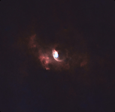

|Targets|
| :----: |
|| 

| Target | Briefing |
| -----: | :----- |
| [Andromeda Galaxy](..//Stories//Andromeda_Galaxy.md)  | |
|  |The Andromeda Galaxy is a barred spiral galaxy and is the nearest major galaxy to the Milky Way. It was originally named the Andromeda Nebula and is cataloged as Messier 31, M31, and NGC 224. Andromeda has a D25 isophotal diameter of about 46.56 kiloparsecs (152,000 light-years)[8] and is approximately 765 kpc (2.5 million light-years) from Earth. The galaxy's name stems from the area of Earth's sky in which it appears, the constellation of Andromeda, which itself is named after the princess who was the wife of Perseus in Greek mythology.  |
| [Bode Galaxy](..//Stories//Bode_Galaxy.md)  | |
|  |Messier 81 (also known as NGC 3031 or Bode's Galaxy) is a grand design spiral galaxy about 12 million light-years away in the constellation Ursa Major. It has a D25 isophotal diameter of 29.44 kiloparsecs (96,000 light-years).[2][5] Because of its relative proximity to the Milky Way galaxy, large size, and active galactic nucleus (which harbors a 70 million M☉[6] supermassive black hole), Messier 81 has been studied extensively by professional astronomers. The galaxy's large size and relatively high brightness also makes it a popular target for amateur astronomers.[7] In late February 2022, astronomers reported that M81 may be the source of FRB 20200120E, a repeating fast radio burst.[8][9] |
| [Bubble Nebula](..//Stories//Bubble_Nebula.md)  | |
|  |NGC 7635, also known as the Bubble Nebula, Sharpless 162, or Caldwell 11, is an H II region emission nebula in the constellation Cassiopeia. It lies close to the open cluster Messier 52. The "bubble" is created by the stellar wind from a massive hot, 8.7 magnitude young central star, SAO 20575 (BD+60°2522). The nebula is near a giant molecular cloud which contains the expansion of the bubble nebula while itself being excited by the hot central star, causing it to glow. It was discovered in November 1787 by William Herschel. The star BD+60°2522 is thought to have a mass of about 44 M |
| [California Nebula](..//Stories//California_Nebula.md)  | |
|  |The California Nebula (Also known NGC 1499 or Sh2-220) is an emission nebula located in the constellation Perseus. Its name comes from its resemblance to the outline of the US State of California in long exposure photographs. It is almost 2.5° long on the sky and, because of its very low surface brightness, it is extremely difficult to observe visually. It can be observed with a Hα filter (isolates the Hα line at 656 nm) or Hβ filter (isolates the Hβ line at 486 nm) in a rich-field telescope under dark skies.[2] It lies at a distance of about 1,000 light years from Earth. Its fluorescence is due to excitation of the Hβ line in the nebula by the nearby prodigiously energetic O7 star, Xi Persei (also known as Menkib).[3] |
| [Dumbbell Nebula](..//Stories//Dumbbell_Nebula.md)  | |
|  |The Dumbbell Nebula (also known as the Apple Core Nebula, Messier 27, and NGC 6853) is a planetary nebula (nebulosity surrounding a white dwarf) in the constellation Vulpecula, at a distance of about 1360 light-years.[1] It was the first such nebula to be discovered, by Charles Messier in 1764. At its brightness of visual magnitude 7.5 and diameter of about 8 arcminutes, it is easily visible in binoculars[4] and is a popular observing target in amateur telescopes. The Dumbbell Nebula appears shaped like a prolate spheroid and is viewed from our perspective along the plane of its equator. In 1992, Moreno-Corral et al. computed that its rate of expansion angularly was, viewed from our distance, no more than 2.3 arcseconds (″) per century. From this, an upper limit to the age of 14,600 years may be determined. In 1970, Bohuski, Smith, and Weedman found an expansion velocity of 31 km/s. Given its semi-minor axis radius of 1.01 ly, this implies that the kinematic age of the nebula is 9,800 years.[3][5] |
| [Eagle Nebula](..//Stories//Eagle_Nebula.md)  | |
|  |The Eagle Nebula (catalogued as Messier 16 or M16, and as NGC 6611, and also known as the Star Queen Nebula) is a young open cluster of stars in the constellation Serpens, discovered by Jean-Philippe de Cheseaux in 1745–46. Both the "Eagle" and the "Star Queen" refer to visual impressions of the dark silhouette near the center of the nebula,[4][5] an area made famous as the "Pillars of Creation" imaged by the Hubble Space Telescope. The nebula contains several active star-forming gas and dust regions, including the aforementioned Pillars of Creation. The Eagle Nebula lies in the Sagittarius Arm of the Milky Way. |
