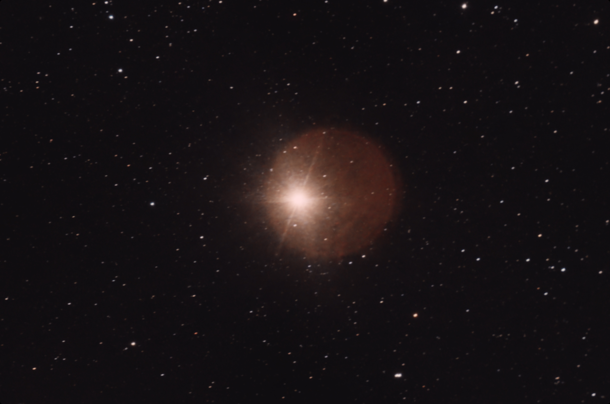
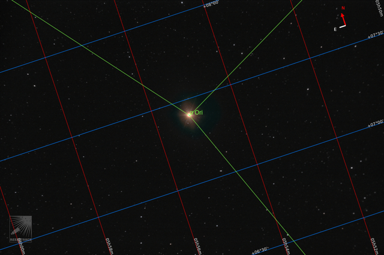
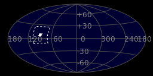
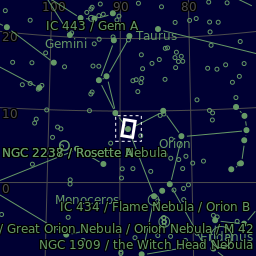
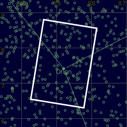

#  Betelgeuse Star

-  MAIN CAMERA: Canon EOS 2000D, uncooled, ISO=800, Exp. 29s, 12 subs
-  Mount/Tracker: Skywatcher StarAdventurer
-   Main tube: SVBony SV503 80mm F7 (no field flattener)
-   AUTOGUIDING: none

Betelgeuse is a red supergiant star in the constellation of Orion. It is usually the tenth-brightest star in the night sky and, after Rigel, the second-brightest in its constellation. It is a distinctly reddish, semiregular variable star whose apparent magnitude, varying between +0.0 and +1.6, has the widest range displayed by any first-magnitude star. Betelgeuse is the brightest star in the night sky at near-infrared wavelengths. Its Bayer designation is α Orionis, Latinised to Alpha Orionis and abbreviated Alpha Ori or α Ori.[19]

[ Read more](https://en.wikipedia.org/wiki/Betelgeusepwd)
## Plate solving 

| Globe | Close | Very close |
| ----- | ----- | ----- |
| | | |

## Details

## Gallery
 

