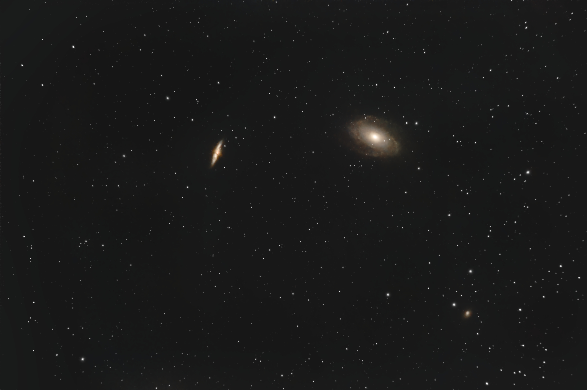
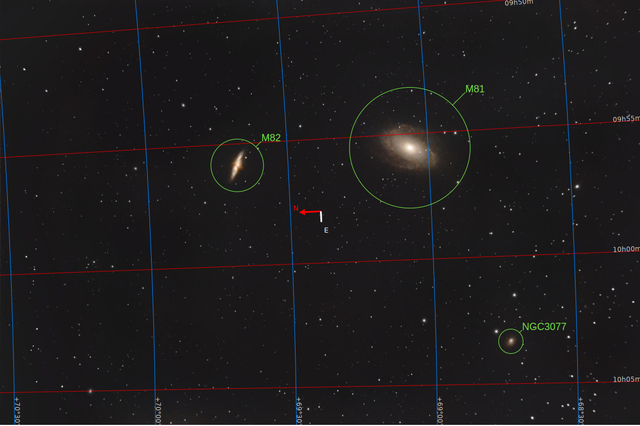
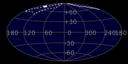

#  Bode Galaxy

Messier 81 (also known as NGC 3031 or Bode's Galaxy) is a grand design spiral galaxy about 12 million light-years away in the constellation Ursa Major. It has a D25 isophotal diameter of 29.44 kiloparsecs (96,000 light-years).[2][5] Because of its relative proximity to the Milky Way galaxy, large size, and active galactic nucleus (which harbors a 70 million M☉[6] supermassive black hole), Messier 81 has been studied extensively by professional astronomers. The galaxy's large size and relatively high brightness also makes it a popular target for amateur astronomers.[7] In late February 2022, astronomers reported that M81 may be the source of FRB 20200120E, a repeating fast radio burst.[8][9]

[ Read more](https://en.wikipedia.org/wiki/Messier_81)
## Plate solving 

| Globe | Close | Very close |
| ----- | ----- | ----- |
| | | |

## Gallery
 

 

 

 

 

 

