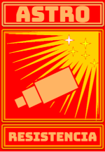
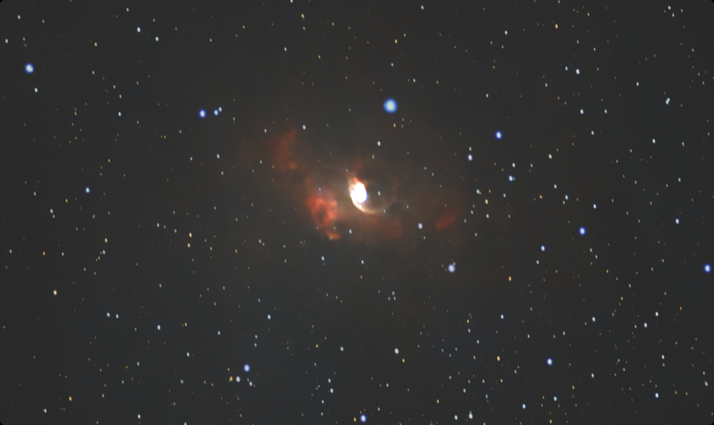
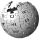
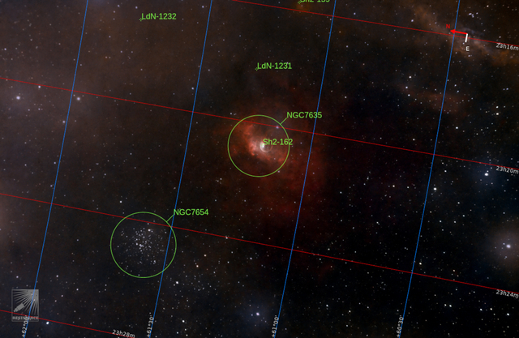
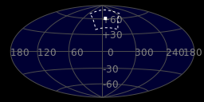
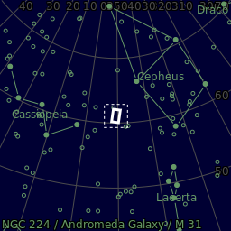
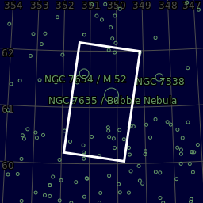
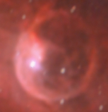
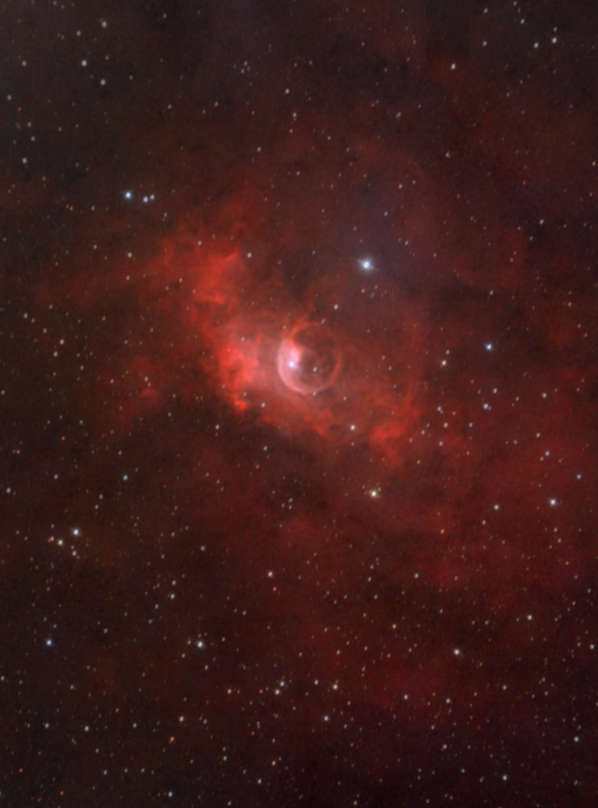
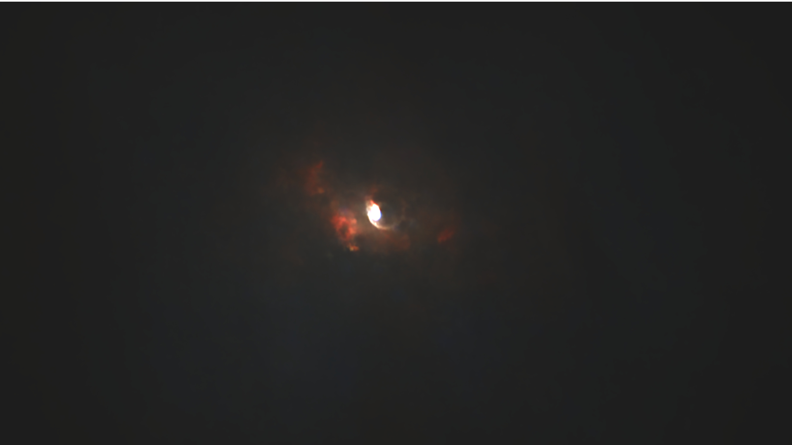

#  Bubble Nebula

-  MAIN CAMERA: Canon EOS 600D astromod, cooled, ISO=1600, Exp. 180s, 32 subs
-  Mount/Tracker: EQ3+OnStep
-   Main tube: SVBony SV503 80mm F7 (no field flattener)
-   AUTOGUIDING: SV165+IMX335

NGC 7635, also known as the Bubble Nebula, Sharpless 162, or Caldwell 11, is an H II region emission nebula in the constellation Cassiopeia. It lies close to the open cluster Messier 52. The "bubble" is created by the stellar wind from a massive hot, 8.7 magnitude young central star, SAO 20575 (BD+60°2522). The nebula is near a giant molecular cloud which contains the expansion of the bubble nebula while itself being excited by the hot central star, causing it to glow. It was discovered in November 1787 by William Herschel. The star BD+60°2522 is thought to have a mass of about 44 M

[ Read more](https://en.wikipedia.org/wiki/Bubble_Nebula)
## Plate solving 

| Globe | Close | Very close |
| ----- | ----- | ----- |
| | | |

## Details

| | | |
| :---: | :---: | :---:|
| | | 12 ly |
| |12 ly | |

| | | |
| :---: | :---: | :---:|
| | | 122 ly |
| |107 ly | |

## Gallery
 

