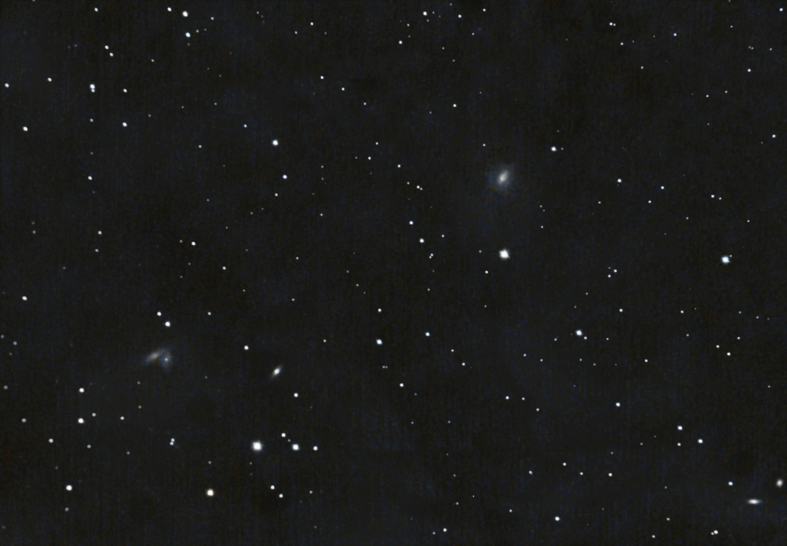
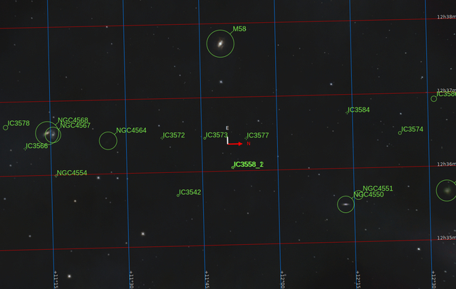
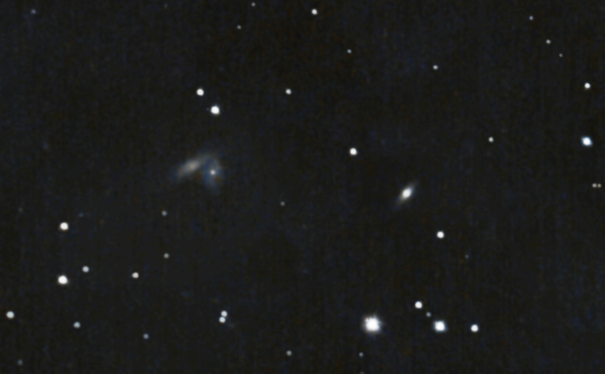

#  Butterfly Galaxies

NGC 4567 and NGC 4568 (nicknamed the Butterfly Galaxies[4] or Siamese Twins[NB 1][5]) are a set of unbarred spiral galaxies about 60 million light-years away[1] in the constellation Virgo. They were both discovered by William Herschel in 1784. They are part of the Virgo Cluster of galaxies. These galaxies are in the process of colliding and merging with each other, as studies of their distributions of neutral and molecular hydrogen show, with the highest star-formation activity in the part where they overlap. However, the system is still in an early phase of interaction.[6] In about 500 million years the galaxies will coalesce into a single elliptical galaxy.[7]

[ Read more](https://en.wikipedia.org/wiki/NGC_4567_and_NGC_4568)
## Plate solving 

| Globe | Close | Very close |
| ----- | ----- | ----- |

## Gallery
 

 

