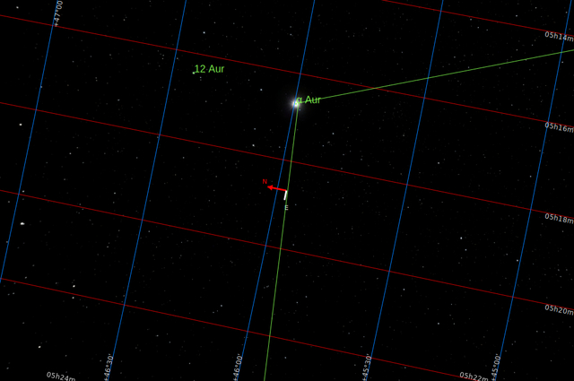
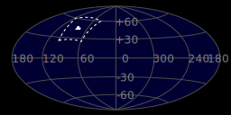
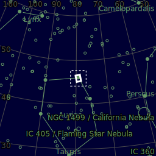
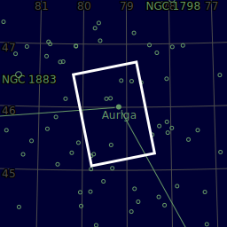

#  Capella Star

Capella is the brightest star in the northern constellation of Auriga. It has the Bayer designation α Aurigae, which is Latinised to Alpha Aurigae and abbreviated Alpha Aur or α Aur. Capella is the sixth-brightest star in the night sky, and the third-brightest in the northern celestial hemisphere after Arcturus and Vega. A prominent object in the northern sky, it is circumpolar to observers north of 44°N. Its name meaning "little goat" in Latin, Capella depicted the goat Amalthea that suckled Zeus in classical mythology. Capella is relatively close, at 42.9 light-years (13.2 parsecs). It is one of the brightest X-ray sources in the sky, thought to come primarily from the corona of Capella Aa.

[ Read more](https://en.wikipedia.org/wiki/Capella)
## Plate solving 

| Globe | Close | Very close |
| ----- | ----- | ----- |
| | | |

## Gallery
 

