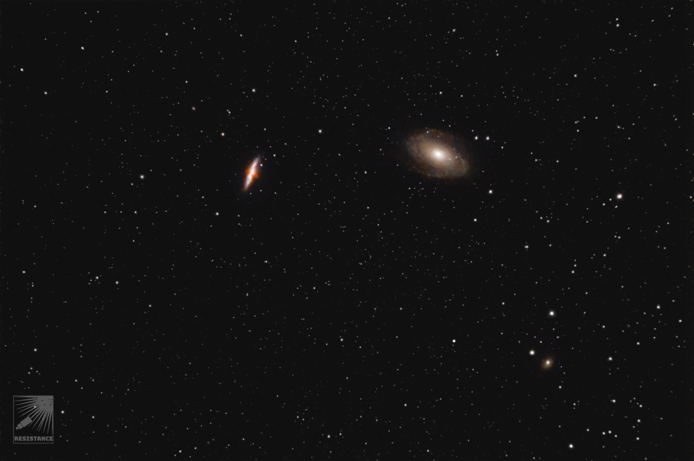
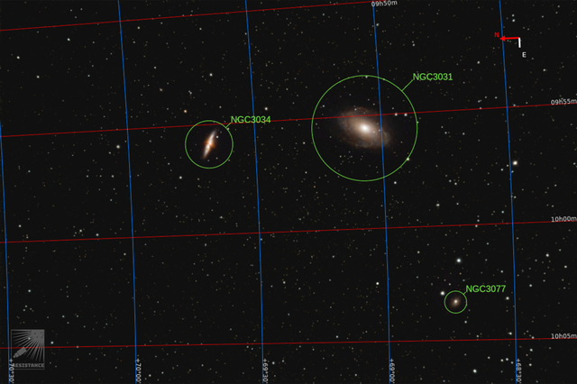
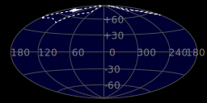
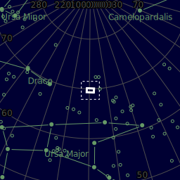
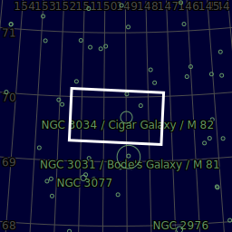
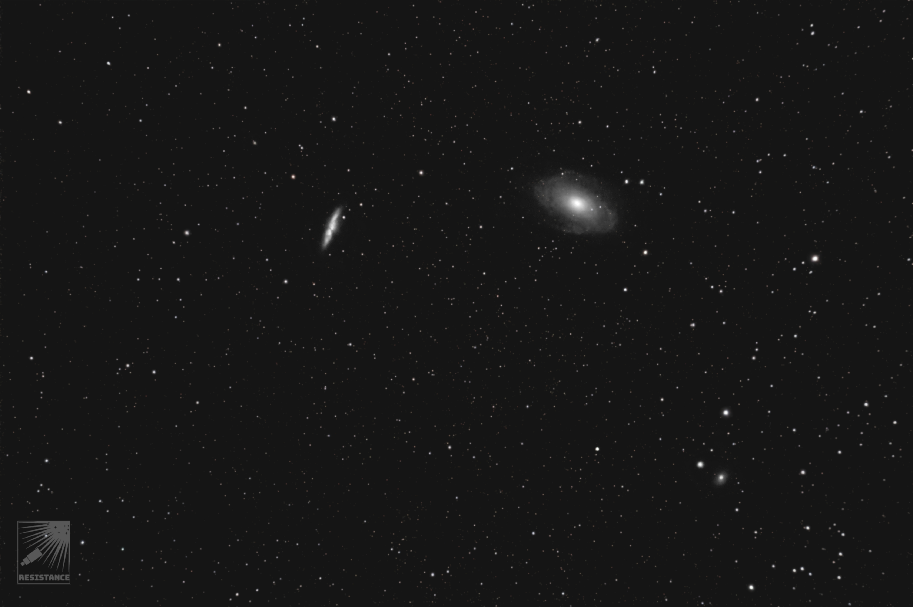

#  Cigar Galaxy

-  MAIN CAMERA: Canon EOS 2000D, uncooled, ISO=800, Exp. 29s, 5 subs
-  Mount/Tracker: EQ3+OnStep
-   Main tube: SVBony SV503 80mm F7 (no field flattener)
-   AUTOGUIDING: none

Messier 82 (also known as NGC 3034, Cigar Galaxy or M82) is a starburst galaxy approximately 12 million light-years away in the constellation Ursa Major. It is the second-largest member of the M81 Group, with the D25 isophotal diameter of 12.52 kiloparsecs (40,800 light-years).[1][5] It is about five times more luminous than the Milky Way and its central region is about one hundred times more luminous.[7] The starburst activity is thought to have been triggered by interaction with neighboring galaxy M81(NGC 3031). As one of the closest starburst galaxies to Earth, M82 is the prototypical example of this galaxy type.[7][a] SN 2014J, a Type Ia supernova, was discovered in the galaxy on 21 January 2014.[8][9][10] In 2014, in studying M82, scientists discovered the brightest pulsar yet known, designated M82 X-2

[ Read more](https://en.wikipedia.org/wiki/Messier_82)
## Plate solving 

| Globe | Close | Very close |
| ----- | ----- | ----- |
| | | |

## Details

## Gallery
 

