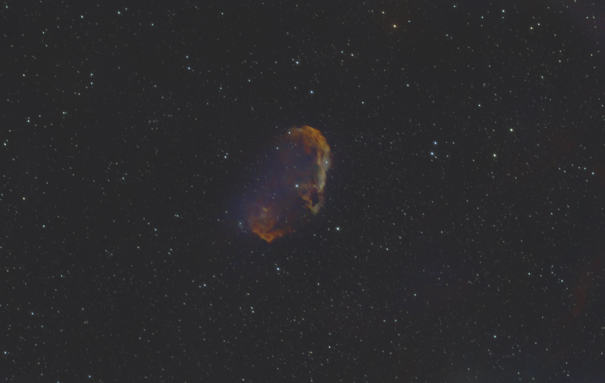

#  Crescent Nebula

The Crescent Nebula (also known as NGC 6888, Caldwell 27, Sharpless 105) is an emission nebula in the constellation Cygnus, about 5000 light-years away from Earth. It was discovered by William Herschel in 1792.[2] It is formed by the fast stellar wind from the Wolf-Rayet star WR 136 (HD 192163) colliding with and energizing the slower moving wind ejected by the star when it became a red giant around 250,000[3] to 400,000[citation needed] years ago. The result of the collision is a shell and two shock waves, one moving outward and one moving inward. The inward moving shock wave heats the stellar wind to X-ray-emitting temperatures.

[ Read more](https://en.wikipedia.org/wiki/Crescent_Nebula)
## Plate solving 

| Globe | Close | Very close |
| ----- | ----- | ----- |
| | | |

## Gallery
 

