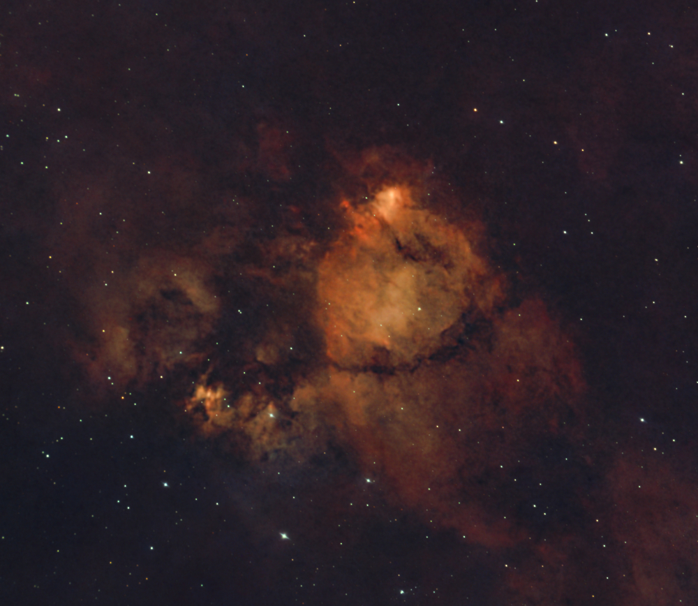
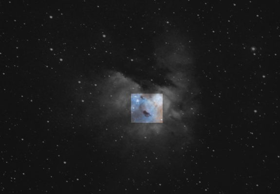
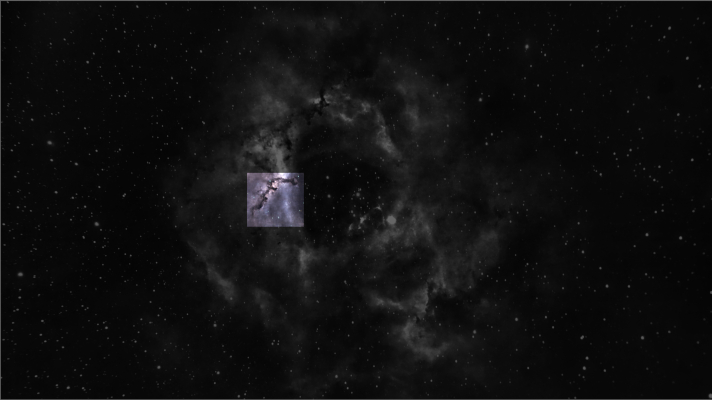

# Dark nebulae

These are cold molecular clouds of gas and stellar dust so dense that cast other glowing regions and produce a sort of shadow that hides the light behind. These clouds are usually composed of many organic, carbon-based molecules. Indeed, these dark structures are very well known for being the messy scafolding of the Milky Way arm visible during the summer nights in the northern hemisphere.
 

[Horse Head Nebula](./Horse_Head_Nebula.md)

It is one of the most popular images of our universe, located in the constellation Orion, right at the south of its belt, in a very active, complex region.

as it happens with the [Pillars of Creation](https://en.wikipedia.org/wiki/Pillars_of_Creation), these dark clouds hide many young stars in the process of being born.

[Fish Head Nebula](./Fish_Head_Nebula.md)

This nebula, located within the constellation Cassiopeia, hides a powerfull stellar nursery, not visible, behind the shadows, but the ionization of its strong stellar wind is clearly visible as a burst of light coming out of the dark.

An special case of dark nebulae are Bok Globules, a cloud of molecular Hydrogen, diferent Carbon oxydes and Helium like in the [Pacman Nebula](./Pacman_Nebula.md)

or the [Rosette Nebula](./Rosette_Nebula.md)

