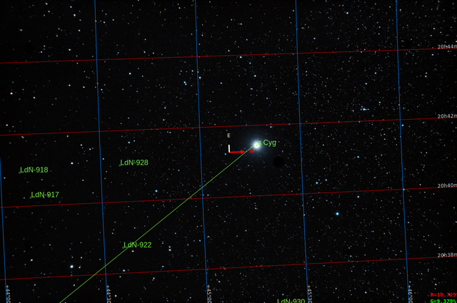
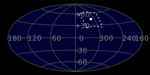
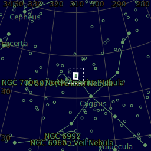
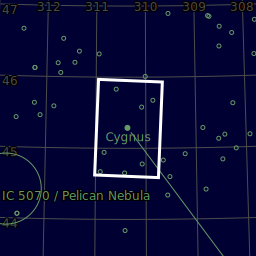

#  Deneb Star

Deneb (/ˈdɛnɛb/) is a blue supergiant star in the constellation of Cygnus. It is the brightest star in the constellation and the 19th brightest in the night sky, with an apparent magnitude slightly varying between +1.21 and +1.29. Deneb is one of the vertices of the asterism known as the Summer Triangle and the "head" of the Northern Cross. Its Bayer designation is α Cygni, which is Latinised to Alpha Cygni, abbreviated to Alpha Cyg or α Cyg. Deneb rivals Rigel, a closer blue supergiant, as the most luminous first-magnitude star. However, its distance, and hence luminosity, is poorly known; its luminosity is estimated to be between 55,000 and 196,000 times that of the Sun. Distance estimates range from 1,400 to 2,600 light-years; assuming its highest value, it is the farthest star with an apparent magnitude brighter than 2.50.

[ Read more](https://en.wikipedia.org/wiki/Deneb)
## Plate solving 

| Globe | Close | Very close |
| ----- | ----- | ----- |
| | | |

## Gallery
 

