#  Eagle Nebula
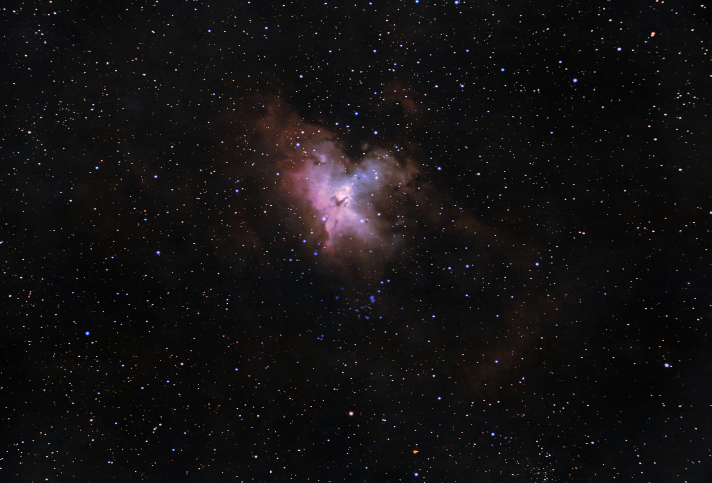

-  MAIN CAMERA: Canon EOS 600D astromod, cooled, ISO=1600, Exp. 120s, 66 subs
-  Mount/Tracker: EQ3+OnStep
-   Main tube: SVBony SV503 80mm F7 (no field flattener)
-   AUTOGUIDING: SV165+IMX335

The Eagle Nebula (catalogued as Messier 16 or M16, and as NGC 6611, and also known as the Star Queen Nebula) is a young open cluster of stars in the constellation Serpens, discovered by Jean-Philippe de Cheseaux in 1745–46. Both the "Eagle" and the "Star Queen" refer to visual impressions of the dark silhouette near the center of the nebula,[4][5] an area made famous as the "Pillars of Creation" imaged by the Hubble Space Telescope. The nebula contains several active star-forming gas and dust regions, including the aforementioned Pillars of Creation. The Eagle Nebula lies in the Sagittarius Arm of the Milky Way.

[ Read more](https://en.wikipedia.org/wiki/Eagle_Nebula)
## Plate solving 

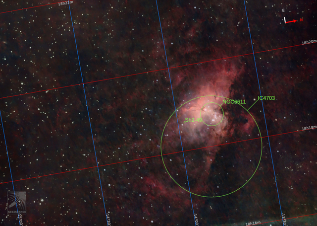

| Globe | Close | Very close |
| ----- | ----- | ----- |
|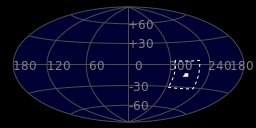 |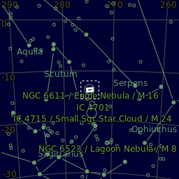 |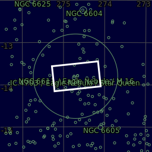 |

## Details

| | | |
| :---: | :---: | :---:|
| |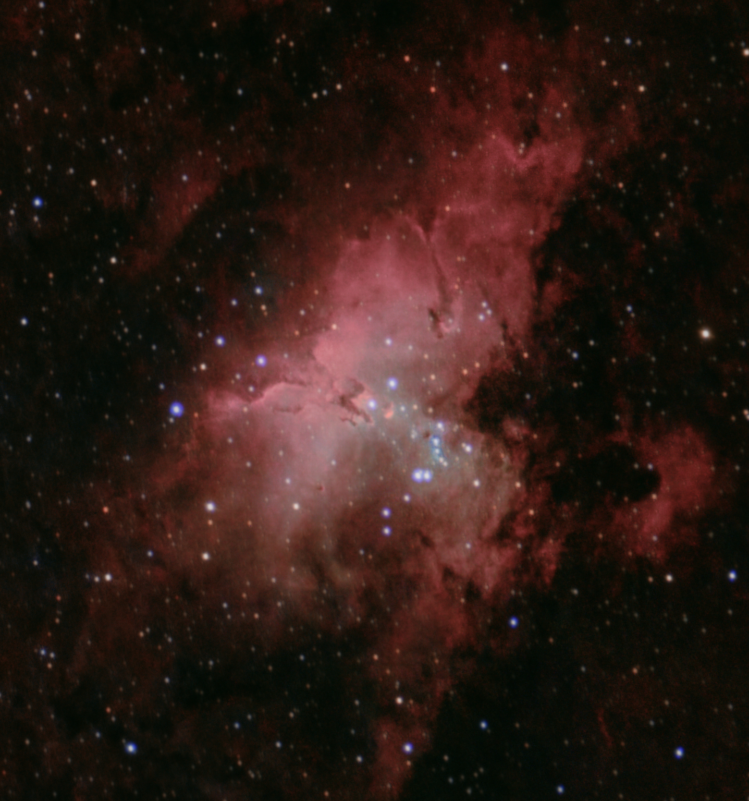 | 68 ly |
| |63 ly | |

| | | |
| :---: | :---: | :---:|
| |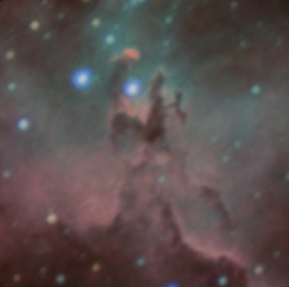 | 14 ly |
| |14 ly | |

| | | |
| :---: | :---: | :---:|
| |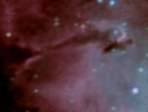 | 10 ly |
| |13 ly | |

## Gallery
 

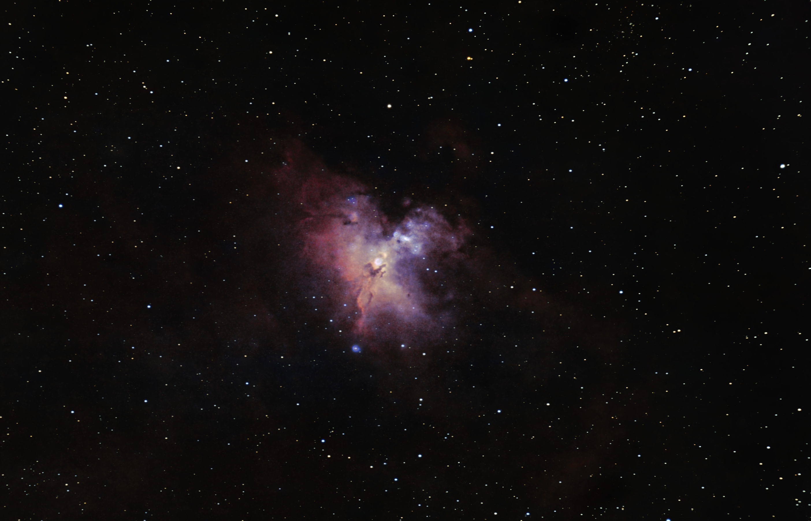 

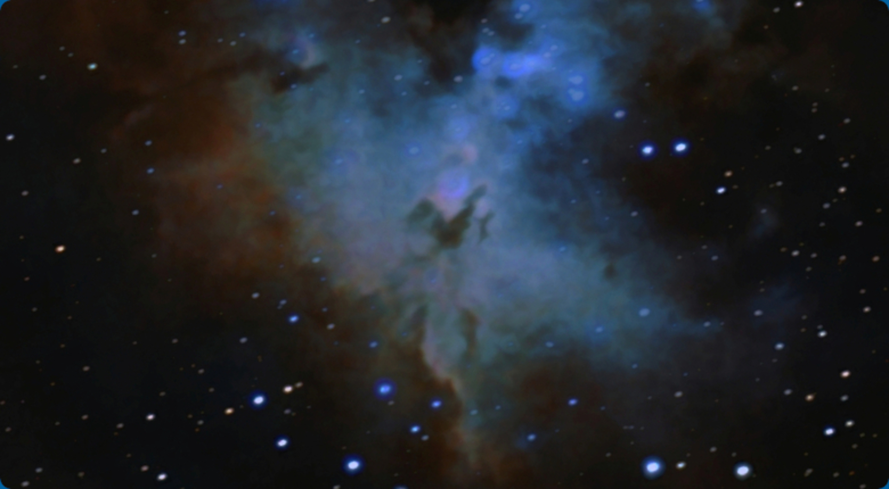 

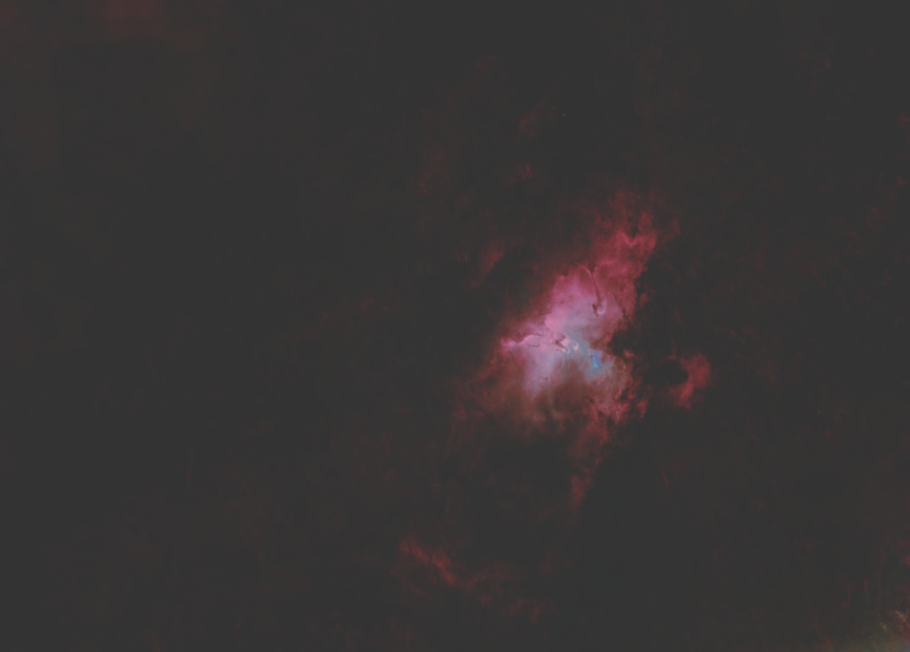
