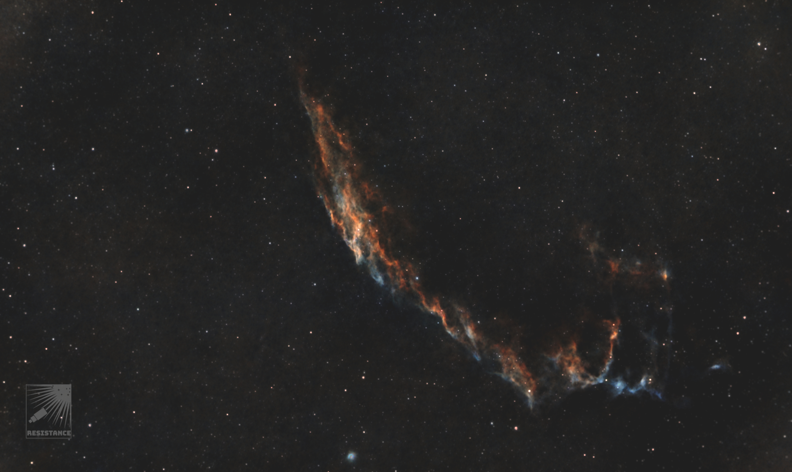
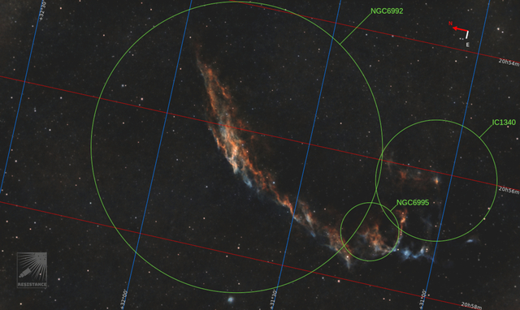
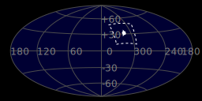
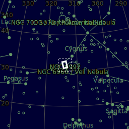
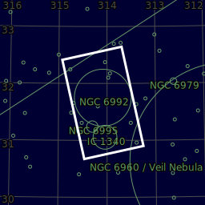
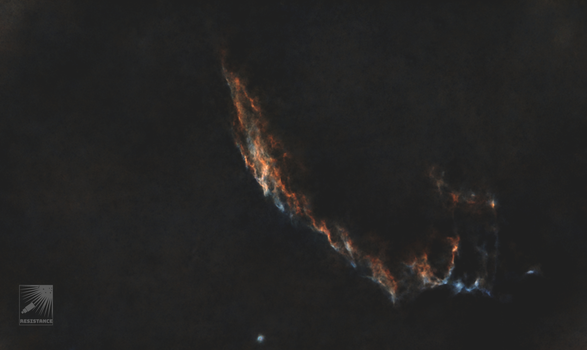
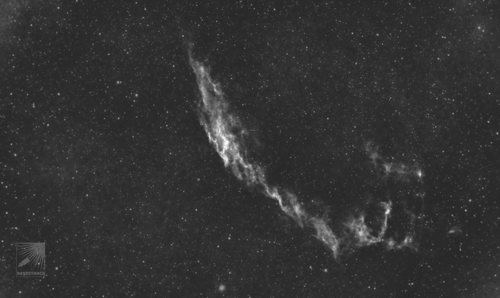

#  East Veil Nebula

The Cygnus Loop (radio source W78, or Sharpless 103) is a large supernova remnant (SNR) in the constellation Cygnus, an emission nebula measuring nearly 3° across.[1] Some arcs of the loop, known collectively as the Veil Nebula or Cirrus Nebula, emit in the visible electromagnetic range.[1] Radio, infrared, and X-ray images reveal the complete loop.

[ Read more](https://en.wikipedia.org/wiki/Veil_Nebula)
## Plate solving 

| Globe | Close | Very close |
| ----- | ----- | ----- |
| | | |

## Details

## Gallery
 

