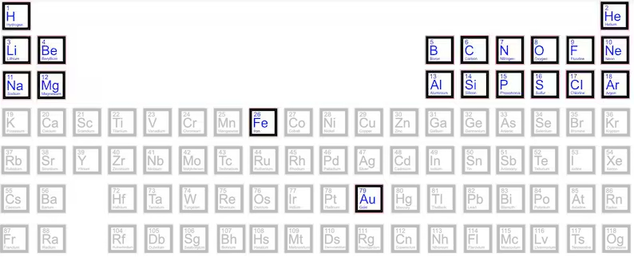

(read in [English](Stars.md))

# Acerca de las estrellas

Las estrellas siempre han desempeñado un papel romántico para la humanidad, entre amantes, aquellos que tienen sueños o aspiran a más, un escenario estrellado y tranquilo que abraza todo tipo de creaciones artísticas durante la noche... lo que se te ocurra. Y eso parece ser todo. Incluso para los astrofotógrafos aficionados, los objetivos más importantes son las nebulosas coloridas, las galaxias gigantes, pero no las estrellas individuales. Además, hay muchos programas informáticos, basados en complejos modelos matemáticos o en el bombo publicitario de los algoritmos «basados en IA», que «eliminan» las estrellas de las imágenes para centrarse en los rizos de colores de una nebulosa, como [Starnet](https://www.starnetastro.com/), del que yo, en particular, soy un gran usuario y que ocupa una parte necesaria de mi flujo de trabajo habitual para posprocesar mis capturas.

Sin embargo, las estrellas lo son *todo* en nuestro universo, cada átomo conocido en la naturaleza se ha forjado en una estrella, de una forma u otra. Son las madres de toda la materia. El carbono, el oxígeno, el nitrógeno e incluso los átomos de oro fueron producidos por las estrellas, expulsados al espacio vacío que las rodea y, con el lento paso de miles de siglos, se unieron para formar nuestros planetas y otras estrellas.

## El comienzo

Todo comienza dentro de una nube de moléculas de hidrógeno (véase [Relativity_II.md](./Relativity_II.md)) que vagan por el espacio formando enormes nubes de moléculas con algún tipo de estructura filamentosa.

De todos los elementos químicos conocidos, solo existe el hidrógeno (H). Y hoy en día, el hidrógeno sigue siendo el 75 % de la materia visible.

Luego, en un proceso de colapso gravitacional (véase [Relativity_II.md](./Relativity_II.md)), estos átomos se acercan cada vez más, se mueven cada vez más rápido, la temperatura aumenta y forman un núcleo supercaliente dentro de la nube molecular.

En este núcleo supercaliente, estos átomos comienzan a chocar entre sí en un proceso conocido como fusión, en el que los átomos de hidrógeno colisionan y se recombinan en átomos de helio en una reacción exotérmica que produce una gran cantidad de partículas de alta energía (protones y núcleos atómicos), luz y calor, transformando el núcleo supercaliente en una estrella bebé.

Por lo tanto, gracias a la reacción de fusión que se produce dentro de una estrella, ahora tenemos átomos de hidrógeno (H) y helio (He) en la nube molecular

Debido a las altas temperaturas y a las fuerzas gravitacionales, con el paso de nuevos milenios, estos átomos de hidrógeno y helio continúan chocando entre sí formando carbono (C), nitrógeno (N) y oxígeno (O) en un proceso conocido como nucleosíntesis.

Cuando estos nuevos átomos son golpeados por partículas de alta energía procedentes de su propia estrella o de otras estrellas cercanas, se transforman en litio (Li) y berilio (Be), que no forman parte del proceso de nucleosíntesis, sino que son un efecto secundario del mismo.

Las estrellas continúan «quemando» hidrógeno, helio, carbono, nitrógeno y oxígeno, produciendo principalmente neón (Ne), magnesio (Mg), silicio (Si) y azufre (S), pero también aluminio (Al).

## El final 

Y justo al final de la vida de una estrella, esta se ha convertido en una estrella roja gigante y produce hierro (Fe), que no puede fusionarse con otros elementos y se acumula como residuo de la actividad de la estrella en su propio núcleo estelar. Este núcleo colapsa rápidamente y produce una explosión de gran energía, esparciendo todos los átomos mencionados anteriormente por todas partes, creando las semillas para futuros planetas. 

Esta explosión se conoce como *supernova* y produce oro (Au) y uranio (U), además de una onda de choque que alcanza todos estos elementos y los transforma en sodio (Na), boro (B), fósforo (P) y cloro (Cl).

Esta onda de choque también alcanza toda la nube molecular y produce nuevos colapsos gravitacionales y el nacimiento de nuevas estrellas en un proceso sin fin que produce los elementos restantes presentes en la naturaleza. Este ciclo de creación, muerte y recreación de estrellas en lo que se conoce como una *guardería estelar* presente en la mayoría de las nebulosas como la [Nebulosa del Hombre Corriendo](Running_Man_Nebula.md) y [aquí](About_Chaos.md) 

## Y el comienzo de nuevo

Así pues, nuestro pequeño planeta, este [pálido punto azul](https://en.wikipedia.org/wiki/Pale_Blue_Dot) con su núcleo fundido de níquel (Ni) y hierro (Fe), es el resultado de una secuencia incontable de supernovas, mezcladas en una proporción única de elementos, colapsadas en una esfera de materia, niveladas por la gravedad y parcialmente enfriadas, solo en su corteza, donde vivimos. Y recuerden, podemos respirar porque hay oxígeno, producido en el núcleo de las estrellas activas, y nuestros glóbulos rojos contienen hemoglobina, 

(fuente de la imagen [Wikipedia](https://en.wikipedia.org/wiki/Hemoglobin))

una molécula en cuyo corazón se encuentra un átomo de hierro (Fe), que hace mucho, mucho tiempo, se produjo en una remota estrella gigante roja (como [Betelgeuse](Betelgeuse_Star.md)), tan roja como nuestros glóbulos rojos.    

Traducción realizada con la versión gratuita del traductor DeepL.com
