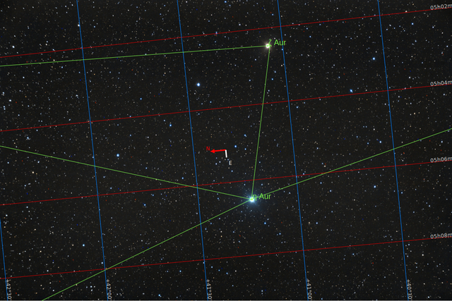

#  Eta Auriga Star

Eta Aurigae (η Aurigae, abbreviated Eta Aur, η Aur), officially named Haedus /ˈhiːdəs/,[10][11] is a star in the northern constellation of Auriga. With an apparent visual magnitude of 3.18,[2] it is visible to the naked eye. Based upon parallax measurements made during the Hipparcos mission, this star is approximately 243 light-years (75 parsecs) distant from the Sun. Along with Zeta Aurigae it represents one of the kids of the she-goat Capella, from which it derived its Latin traditional name Haedus II or Hoedus II, from the Latin haedus "kid" (Zeta Aurigae was Haedus I). It also had the less common traditional name Mahasim, from the Arabic المِعْصَم al-miʽşam "the wrist" (of the charioteer), which it shared with Theta Aurigae. In 2016, the IAU organized a Working Group on Star Names (WGSN)[12] to catalog and standardize proper names for stars. The WGSN approved the names Haedus for Eta Aurigae and Saclateni for Zeta Aurigae A on 30 June 2017 and they are both now so included in the List of IAU-approved Star Names.

[ Read more](https://en.wikipedia.org/wiki/Eta_Aurigae)
## Plate solving 

| Globe | Close | Very close |
| ----- | ----- | ----- |
| | | |

## Gallery
 

 

