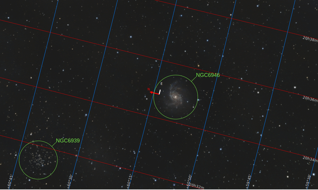
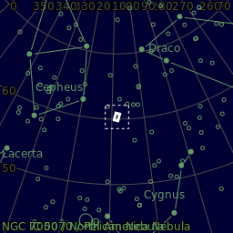
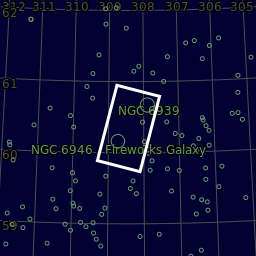
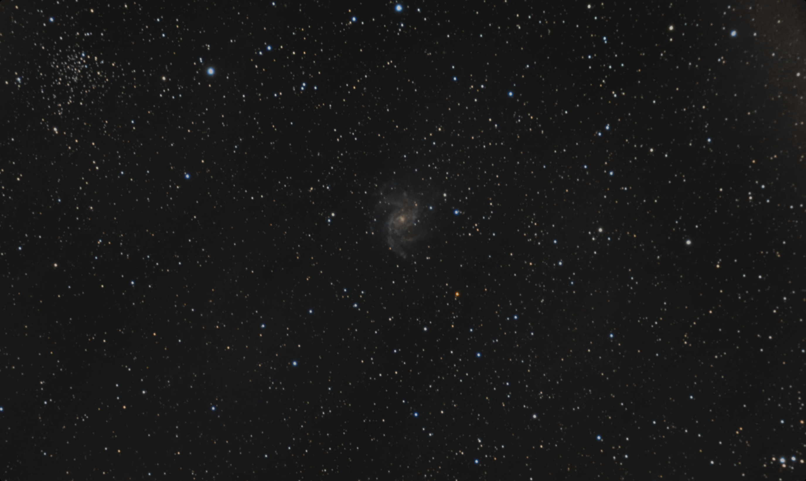

#  Fireworks Galaxy

NGC 6946, sometimes referred to as the Fireworks Galaxy, is a face-on intermediate spiral galaxy with a small bright nucleus, whose location in the sky straddles the boundary between the northern constellations of Cepheus and Cygnus. Its distance from Earth is about 25.2 million light-years or 7.72 megaparsecs,[2] similar to the distance of M101 (NGC 5457) in the constellation Ursa Major.[5] Both were once considered to be part of the Local Group,[6] but are now known to be among the dozen bright spiral galaxies near the Milky Way but beyond the confines of the Local Group.[7] NGC 6946 lies within the Virgo Supercluster.[8]

[ Read more](https://en.wikipedia.org/wiki/NGC_6946## Plate solving 

| Globe | Close | Very close |
| ----- | ----- | ----- |
| | | |

## Gallery
 

 

 

