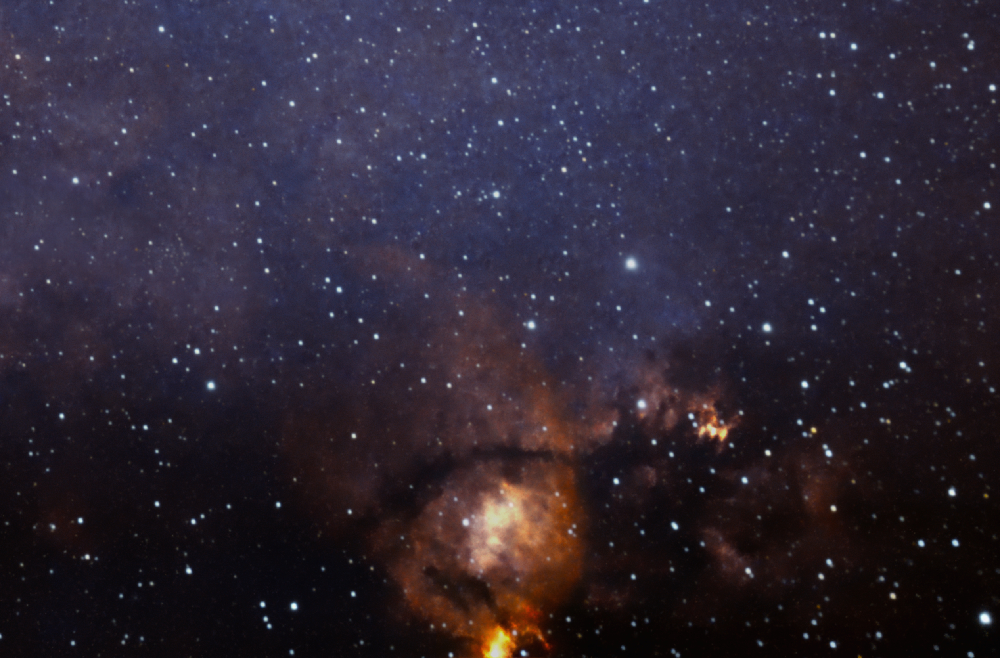

#  Fish Head Nebula

The Fish Head Nebula, or the Northern Bear Nebula, is part of a large star forming system of gas and dust located along the Perseus spiral arm of the Milky Way.[1] The nebula is located in the Constellation Cassiopeia, approximately 6,000 light-years from Earth and is adjacent to the much larger Heart Nebula.[2] The brighter region of the nebula is designated NGC 896 and is the home to many young and large stars. These stars radiate high amounts of ultraviolet light. This UV radiation excites the surrounding gas and causes it to shine at a high brightness. This mapping is known as false color and is common with many of the Hubble Space Images.[3]

[ Read more](https://en.wikipedia.org/wiki/Fish_Head_Nebula)
## Plate solving 

| Globe | Close | Very close |
| ----- | ----- | ----- |
| | | |

## Gallery
 

 

 

