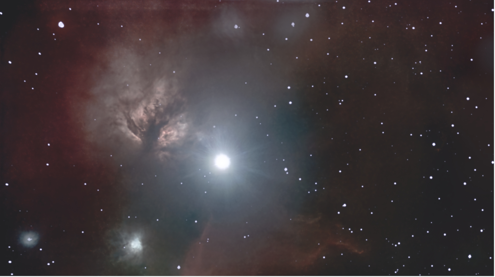
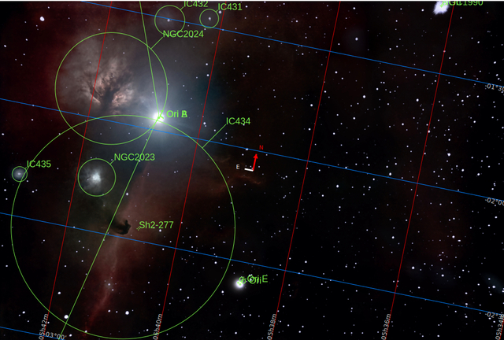
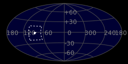
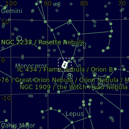
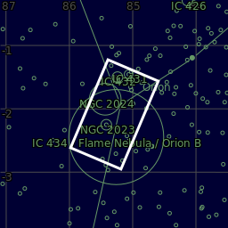
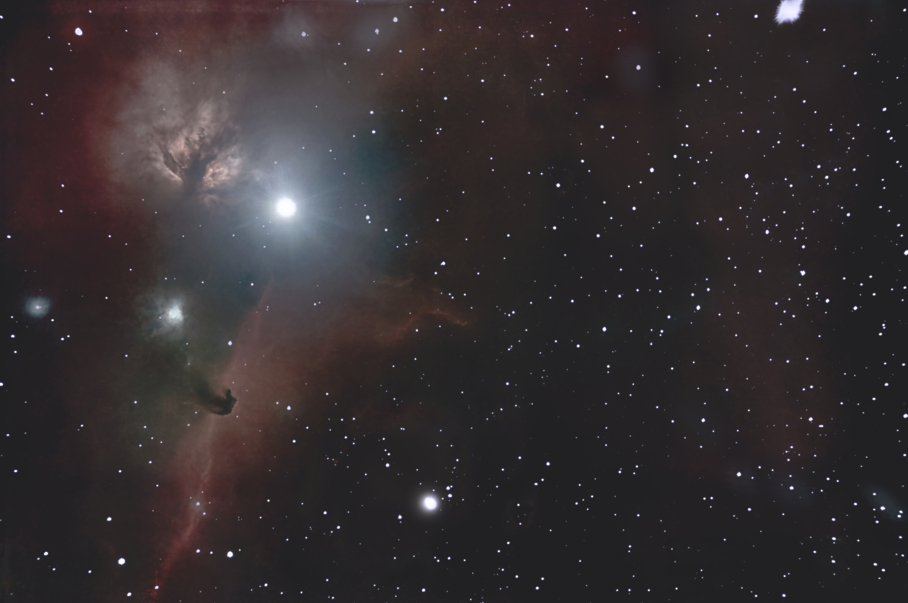

#  Flame Nebula

The Flame Nebula, designated as NGC 2024 and Sh2-277, is an emission nebula in the constellation Orion. It is about 1350 light-years away.[1] At that distance, the Flame Nebula lies within the Orion B cloud of the larger Orion Molecular Cloud Complex. The bright star Alnitak (ζ Ori), the easternmost star in the Belt of Orion, appears very close to the Flame Nebula in the sky. But the star and nebula are not physically associated with one another. The Flame Nebula contains a young cluster of stars which includes at least one hot, luminous O-type star labeled IRS 2b.[2] The dense gas and dust in the foreground of the nebula heavily obscures the star cluster inside the nebula, making studies at infrared wavelengths most useful.

[ Read more](https://en.wikipedia.org/wiki/Flame_Nebula)
## Plate solving 

| Globe | Close | Very close |
| ----- | ----- | ----- |
| | | |

## Gallery
 

 

