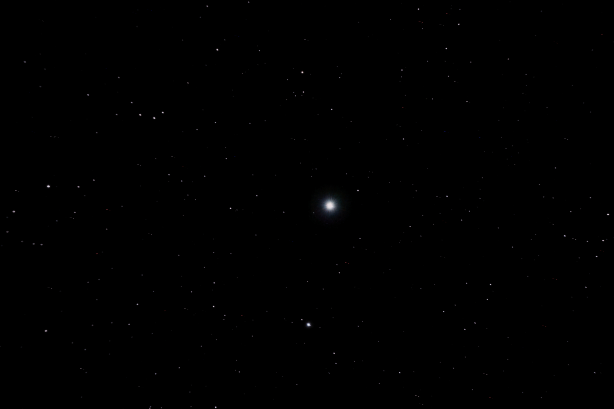
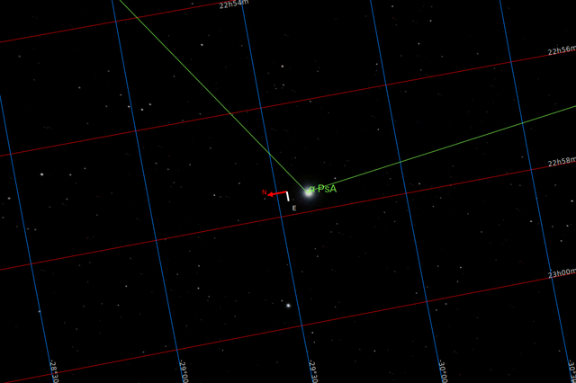

#  Fomalhaut Star

Fomalhaut (UK: /ˈfɒməloʊt/, US: /ˈfoʊməlhɔːt/[11]) is the brightest star in the southern constellation of Piscis Austrinus, the Southern Fish, and one of the brightest stars in the night sky. It has the Bayer designation Alpha Piscis Austrini, which is an alternative form of α Piscis Austrini, and is abbreviated Alpha PsA or α PsA. This is a class A star on the main sequence approximately 25 light-years (7.7 pc) from the Sun as measured by the Hipparcos astrometry satellite.[12] Since 1943, the spectrum of this star has served as one of the stable anchor points by which other stars are classified.[13] 
It is classified as a Vega-like star that emits excess infrared radiation,[14][15] indicating it is surrounded by a circumstellar disk.[16] Together with the K-type main-sequence star TW Piscis Austrini, and the red dwarf star LP 876-10, Fomalhaut constitute a triple star system, even though the companions are separated by approximately 8 degrees.[17][18]

[ Read more](https://en.wikipedia.org/wiki/Fomalhaut)
## Plate solving 

| Globe | Close | Very close |
| ----- | ----- | ----- |

## Gallery
 

 

