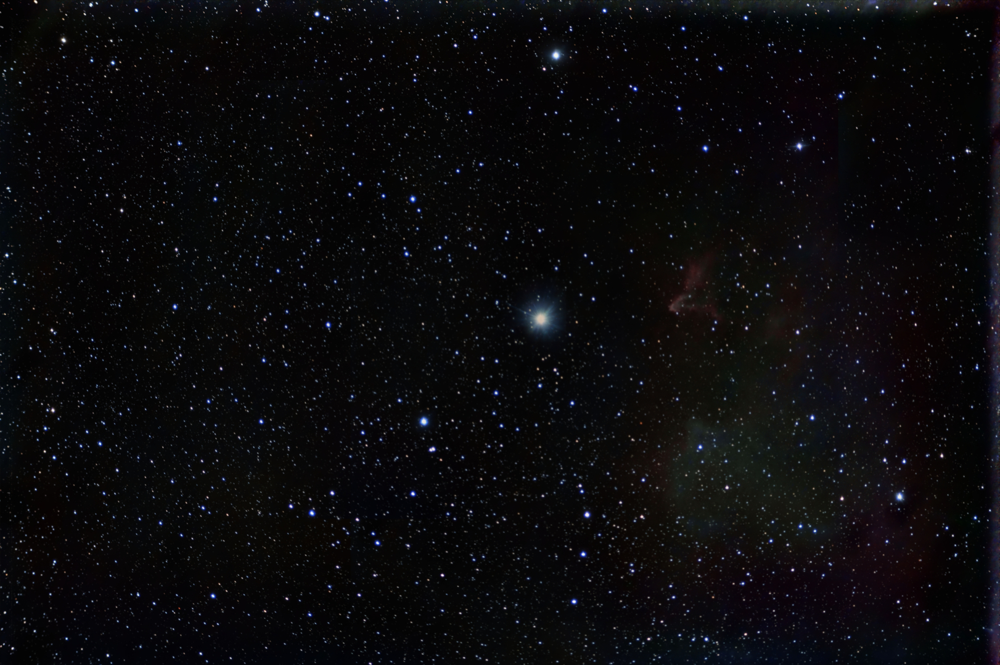
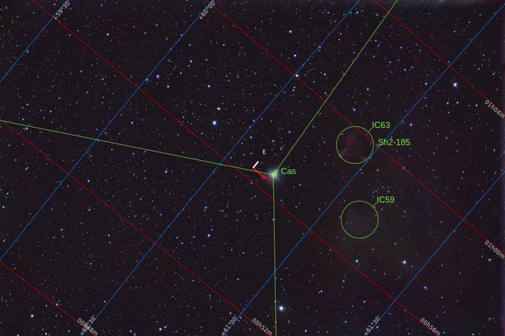
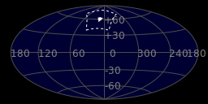
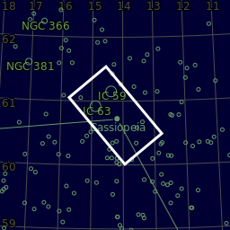
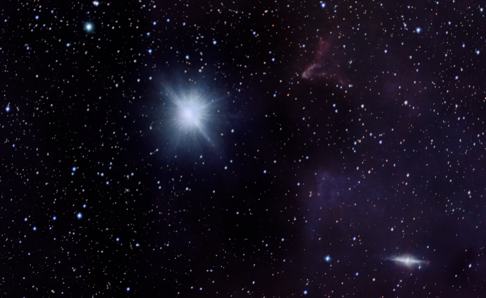
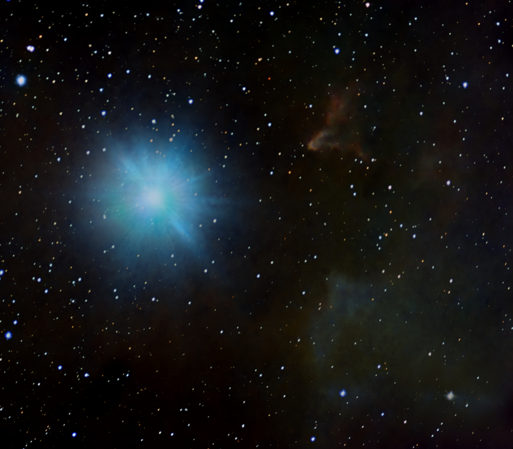
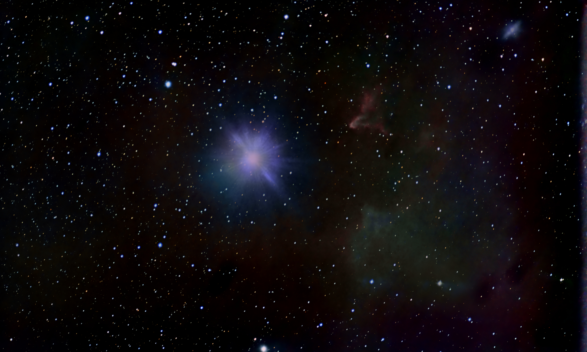

#  Ghost Of Cassiopeia

Sh 2-185 is an H II region centered on the massive star system Gamma Cassiopeiae (γ Cas) in the northern constellation of Cassiopeia. It was included in the second Catalogue of H II Regions, published in 1959 by Stewart Sharpless.[3] Sh 2-185 is located at a distance of approximately 10,500 ly (3.23 kpc) from the Sun.[2] The region is surrounded by a dust shell,[4] and displays several infrared point sources that are a characteristics of young stellar objects.[5] This H II region includes the reflection and emission nebulae IC 59 and IC 63.[4] Both nebulae have a cometary shape, with IC 63 being the brighter of the two.[6] The difference in appearance between the two nebulae is a consequence of their physical distance from γ Cas. IC 63 displays a well-defined ionization front, while this is lacking in IC 59.[5] The nebulae are the closest photodissociation regions to the Sun.[6]

[ Read more](https://en.wikipedia.org/wiki/Sh_2-185)
## Plate solving 

| Globe | Close | Very close |
| ----- | ----- | ----- |
| | | |

## Gallery
 

 

 

 

