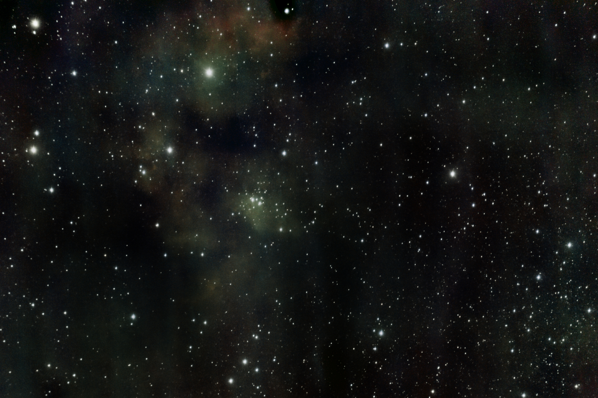
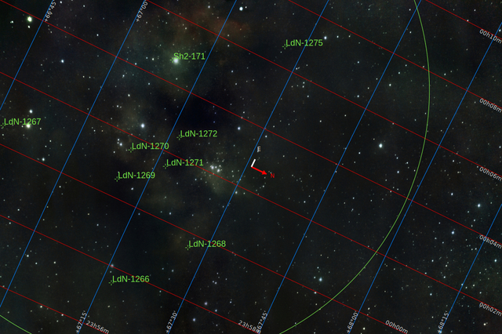
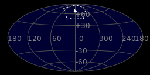
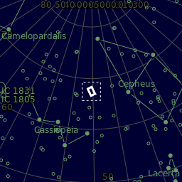
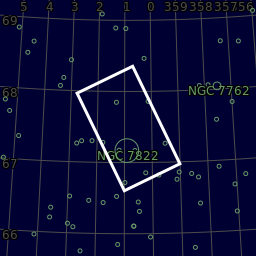
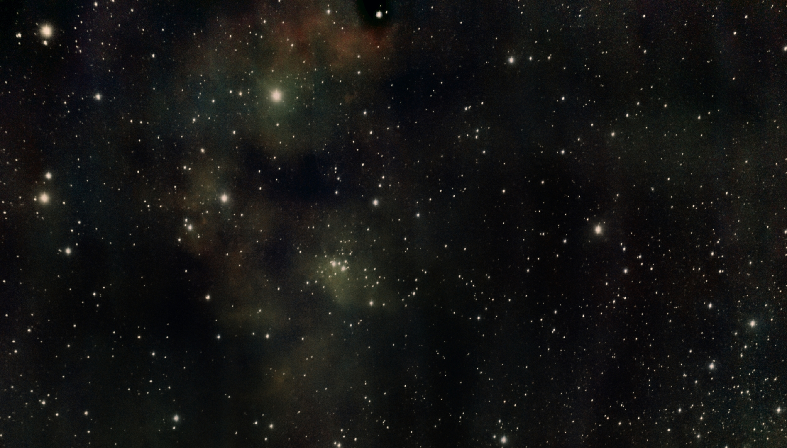

#  HD225526

This is the list of notable stars in the constellation Cepheus, sorted by decreasing brightness.

[ Read more](https://en.wikipedia.org/wiki/List_of_stars_in_Cepheus)
## Plate solving 

| Globe | Close | Very close |
| ----- | ----- | ----- |
| | | |

## Gallery
 

 

