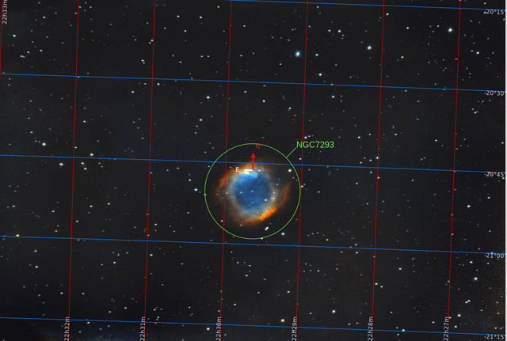
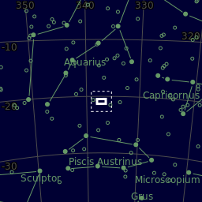
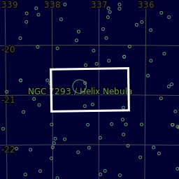

#  Helix Nebula

The Helix Nebula (also known as NGC 7293 or Caldwell 63) is a planetary nebula (PN) located in the constellation Aquarius. Discovered by Karl Ludwig Harding, most likely before 1824, this object is one of the closest of all the bright planetary nebulae to Earth.[3] The distance, measured by the Gaia mission, is 655±13 light-years.[4] It is similar in appearance to the Cat's Eye Nebula and the Ring Nebula, whose size, age, and physical characteristics are similar to the Dumbbell Nebula, varying only in its relative proximity and the appearance from the equatorial viewing angle.[5] The Helix Nebula has sometimes been referred to as the "Eye of God" in pop culture,[6] as well as the "Eye of Sauron".[7][8]

[ Read more](https://en.wikipedia.org/wiki/Helix_Nebula)
## Plate solving 

| Globe | Close | Very close |
| ----- | ----- | ----- |
| | | |

## Gallery
 

 

