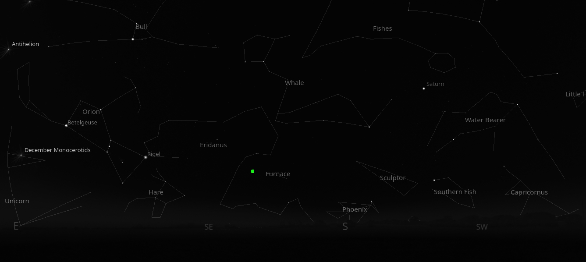
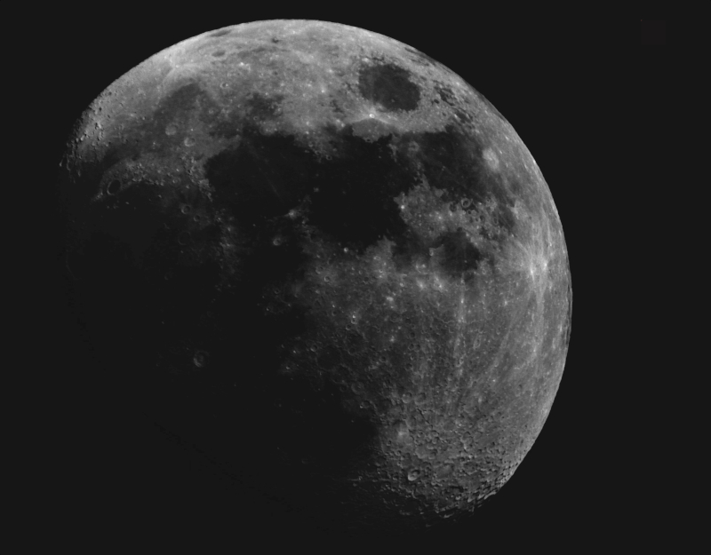
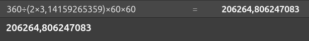
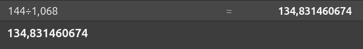
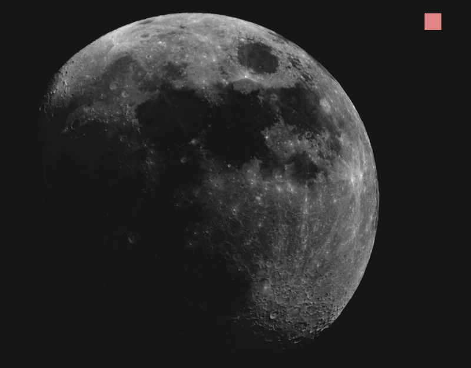
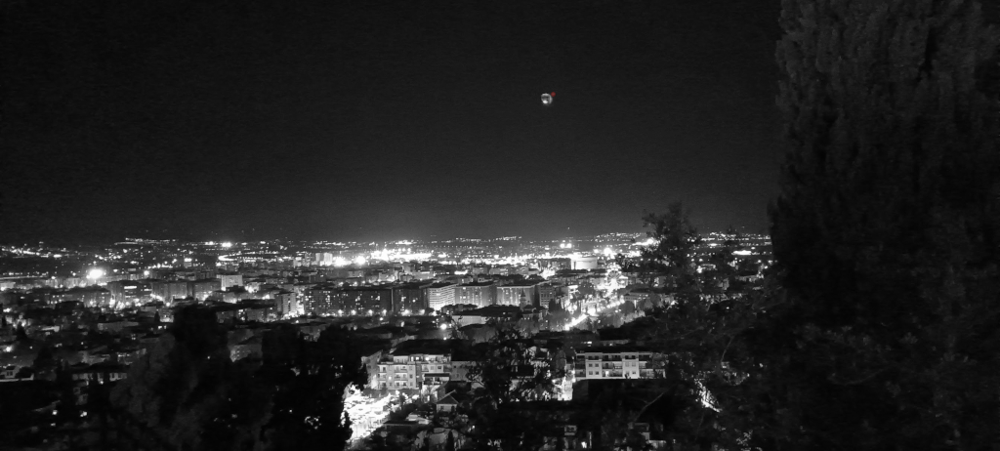
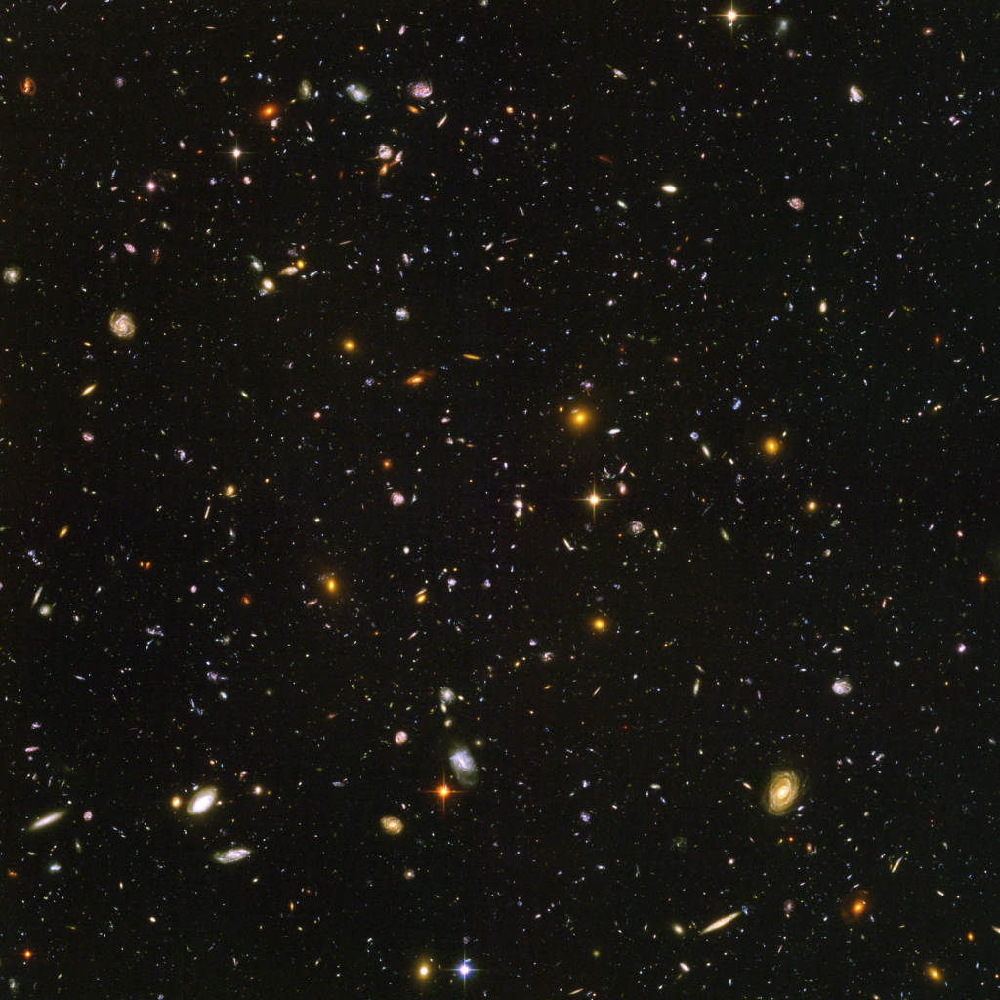

(leer en [Español](./Hubble_Campo_Ultraprofundo.md))

# Hubble Ultra Deep Field (2004)

In astrophotography we usually focus on small or faint objects and, as may be read along the stories in this site, it is a humbling experience. However, for me, one of the most striking experiments I have ever read about is the Hubble Deep Field Imaging. That is, focus our dear Hubble Space Telescope, on a tiny, dark spot of the sky, initially empty in our maps, with just nothing in there, just a black patch of the sky, take as many pictures as possible and get as much light as possible so as to zoom in this black, empty spot, and see what is in there.

The spot chosen is a dark, empty area between constellations Eridanus and Fornax, at the south of the northern sky, more or less in this location marked in green.

The size of this spot is very small to the naked eye, [literally 2.4' arcmins](https://en.wikipedia.org/wiki/Hubble_Ultra-Deep_Field), but to take this under perspective, let us consider one of my pictures of the very Moon. 

It was taken with a refractor of 560mm of focal length and 80mm of aperture, with a DIY planetary camera that I bought in AliExpress, built on top of a Sony IMX586 sensor, 12MP (3000x3840 pixels) and a pixel size of 2.9um. Playing with focal lengths, pixel sizes and all that, we find that

* 1 circle = 2xPI radians = 360 degrees

* 1º degree = 60' arcmin

* 1' arcmin = 60" arcsecs

* HUDF size is 2.4' arcmin. That is 2.4 x 60 = 144" arcsecs 

* The ratio to translate from radians to arcsecs is very simple

That is, a ratio of 206265. Ok, the resolution of my rig (2.9um pixel size/ 560mm focal length) is 

That is, my rig cannot see whatever is smaller than 1.068" arcsecs

Therefore, my rig sees the HUDF as

That is 135 pixels. Ok, in the picture of the moon above (3840x300 pixels), drawing a square of 135 pixels gives this

This is, exactly, the size of the HUDF area, as it is seen with my rig, just a bunch of pixels. Given a picture of my town, Granada (SPAIN) the size of the HUDF is this tiny red dot next to the moon as it is visible to the naked eye. Just a pinpoint in the whole sky.

Let us see what the Hubble Space Telescope can see in this tiny, black, empty pinpoint of the sky.

## Data collected

Since the HST orbites around the Earth, it took 800 pictures over 400 orbits of the HST around the earth, that is, from Sep 24, 2003, to Jan 16, 2004. These 800 pictures where, as usual, stacked and postprocessed and this was the result (this is a 1024x1024 image, the original one is 3100x3100 pixels)

## Briefly

* This pinpoint in the sky contains, just it, nearly 10,000 galaxies
* Some of them as old as just 800 million years after the very bigbang. These are the reddish, blurry galaxies in the picture.
* Others as brand new as 13,000 million years after the bigbang. These are the white, spiral-shaped galaxies in the picture.

Just 10,000 "galaxies" crowded in a pin point, as far as the Hubble certainly may see. In a pinpoint in the whole sky. It is impossible to figure out how much more galaxies are out there, in the whole sky, even further from us, closer to the very bigbang. Yes, we can do the math and get the figures, boom! That is it. But could you imagine that? I could not.

