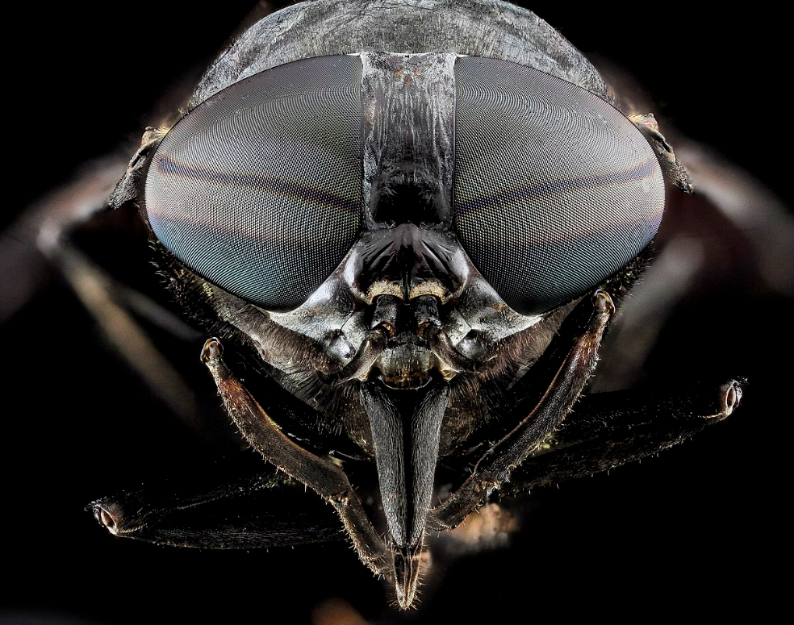
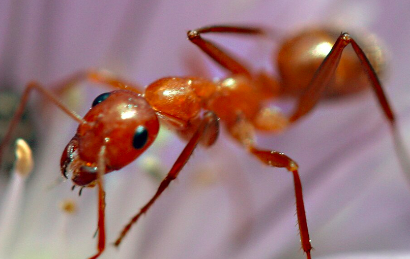
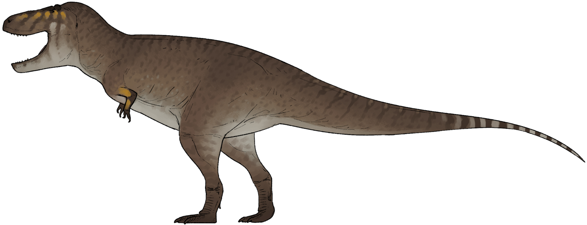
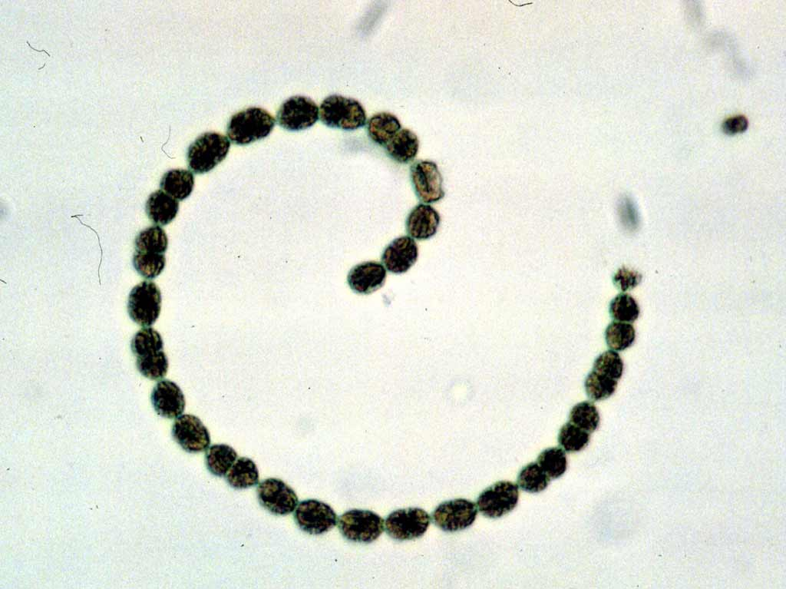
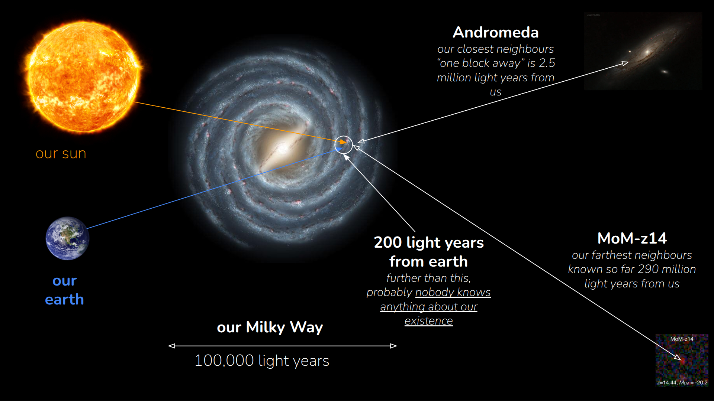

(Leer en [español](./Humildad.md)

## Let us be humble

The earth. The home for 8,100,000,000 individuals of the human race, 

in most cases, piled over each other. This is us.

[Image source](https://www.archdaily.cl/cl/906667/las-20-ciudades-mas-grandes-del-mundo-en-2018/5bfc1d1908a5e51c350004b1-the-20-largest-cities-in-the-world-of-2018-image)

We are not even, by far, the most common living being on earth. Even the world population of simple, omnipresent, flies is much higher, about, approximately, because there is no official records of the births and deaths of flies, 127,000,000,000 flies in the world.

Image source [Wikipedia](https://en.wikipedia.org/wiki/Fly)

And we are not even close to the number of those tiny ants, who amount up to
10,000,000,000,000,000 individuals

Image source [Wikipedia](https://en.wikipedia.org/wiki/Ant)

Though they are not as smart or as powerful as humans (think they) do. Yes, human kind rules this planet these days, with their brightest and darkest achievements. It is very common, among some bulying individuals of the human kind, to think that "they really rule the world". But the earth has always been changing and there are other species, other forces if you want, which also "ruled this world" before us. If these "professional bulyers" looked over their shoulders, perhaps they would not think the same.

## Who rules the earth?

Well, this planet is thought to be 4,540 million years old. This is too much time. Under the Chistian narrative of the history of earth, for example, God finished the earth in 6 days long. And these 6 days will be, thus, equivalent to the 4,540 million years. During these six days, our earth, the very earth, has been continuously changing, some times drammatically, and only the species able to adapt to these changes survived while the other species persihed. Yes, we rule the earth today, but if we compare our Kingdom with the age of the earth (that would be six days) then the time ellapsed since the appearance of the homo sapiens, technically our species, would be the last 34 seconds. If we are a little more restrictive and consider that the true dominance of earth became with the birth of agriculture and the modern homo sapiens, then is has been, approximately the last second of these six days. 1.37 seconds, to be more accurate.

Even more, if we take into account that this guy below, also ruled the earth and that the coexistence of homo sapiens with these "large lizards" would have been, let say the least, very tough, then we would be more humble

Image source [Wikipedia](https://en.wikipedia.org/wiki/Tyrannosaurus)

Because, if homo sapiens "has ruled the earth" during the last 1.37 seconds, the dinosaours "ruled the always-changing earth" during almost 5 hours and a half. Way longer than us.

But there is more. This tiny guy below is a cyanobacteria. The living being that "ruled the earth" the most, during one of the longest ice ages on this very same planet.

Image source [Wikipedia](https://es.wikipedia.org/wiki/Cyanobacteriota)

These microscopic creatures were the most abundant, actually almost the only one, on our planet during the last 9.51 hours (out of a six days period).

So, I am not so sure that human being, homo sapiens, could have ruled anything but a blink of an eye. Yes, we have much more adaptation to prove to the changes to come to be candidates to "rule the earth".

## Who care about us?

This is only taking into account the very existence of our planet, during 4,450 million years. But ther are other forces, other scenarios, other stories during the 13,800 million years of history of the universe. Yes, we are no more than a "pale blue dot" within the vast universe. To be more precise, if the whole universe could be crushed, packed, zipped, into an sphere like the earth, with barely 13,000 km of diameter, the the human kind "is ruling" an area equivalent to the size of a bacteria like E. Coli.

Not bad. But only during the last second of the life of earth. Great. Really furstrating, isn't it? Just look at this

This is our galaxy, the Milky way. The light takes 100,000 years to go from the left side to the right side. Our Sun and our Earth are located in a tiny spot in no-mans land, indeed it is not a real "arm" of the spiral, but a "pseudo-arm". The white circle is, more or less, 200 light years of radius from earth. Further than this distance, probably, nobody knows anything about us, since no radio signal has been emitted from earth 200 years ago. Just the light. Andromeda, our closest galaxy, is just 2.5 million years away from us. And the spot "MoM-z14" is, to date, the farthest known galaxy, about 290 million light years from earth. Just do the maths. We are not so important as we believe we are, not in our life time, not it the cosmic space, not from our "achievements" in this planet, not only as the dominant species nowadays, but also as human beings. I profoundly think that we sould be way more humble.

