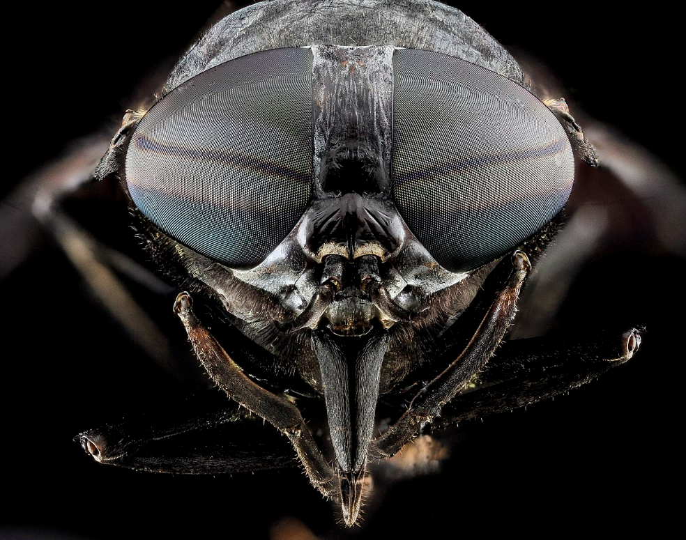
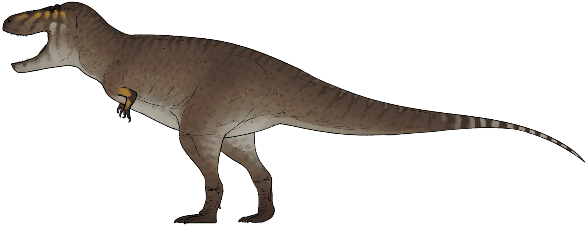

Read in [English](./Humble.md)

## Seamos humildes

La Tierra. El hogar de 8.100.000.000 de individuos de la raza humana, 

en la mayoría de los casos, apilados unos sobre otros. Estos somos nosotros.

[Fuente de la imagen] (https://www.archdaily.cl/cl/906667/las-20-ciudades-mas-grandes-del-mundo-en-2018/5bfc1d1908a5e51c350004b1-the-20-largest-cities-in-the-world-of-2018-image)

Ni siquiera somos, ni mucho menos, los seres vivos más comunes de la Tierra. Incluso la población mundial de moscas, simples y omnipresentes, es mucho mayor, aproximadamente, ya que no hay registros oficiales de los nacimientos y muertes de moscas, 127 000 000 000 de moscas en el mundo.

Fuente de la imagen [Wikipedia](https://en.wikipedia.org/wiki/Fly)

Y ni siquiera nos acercamos al número de esas diminutas hormigas, que suman hasta
10 000 000 000 000 000 de individuos

Fuente de la imagen [Wikipedia](https://en.wikipedia.org/wiki/Ant)

Aunque no son tan inteligentes ni tan poderosas como los humanos (o eso creen). Sí, la humanidad gobierna este planeta hoy en día, con sus logros más brillantes y más oscuros. Es muy común, entre algunos individuos abusivos de la especie humana, pensar que «realmente gobiernan el mundo». Pero la Tierra siempre ha estado cambiando y hay otras especies, otras fuerzas si se quiere, que también «gobernaron este mundo» antes que nosotros. Si estos «intimidadores profesionales» miraran hacia atrás, tal vez no pensarían lo mismo.

## ¿Quién gobierna la Tierra?

Bueno, se cree que este planeta tiene 4540 millones de años. Es demasiado tiempo. Según la narrativa cristiana de la historia de la Tierra, por ejemplo, Dios creó la Tierra en seis días. Y estos seis días equivaldrían, por lo tanto, a los 4540 millones de años. Durante estos seis días, nuestra Tierra, la misma Tierra, ha estado cambiando continuamente, a veces de forma drástica, y solo las especies capaces de adaptarse a estos cambios sobrevivieron, mientras que las demás especies perecieron. Sí, hoy dominamos la Tierra, pero si comparamos nuestro reino con la edad de la Tierra (que serían seis días), entonces el tiempo transcurrido desde la aparición del homo sapiens, técnicamente nuestra especie, sería los últimos 34 segundos. Si somos un poco más restrictivos y consideramos que el verdadero dominio de la Tierra se produjo con el nacimiento de la agricultura y el homo sapiens moderno, entonces ha sido, aproximadamente, el último segundo de estos seis días. 1,37 segundos, para ser más exactos.

Es más, si tenemos en cuenta que este tipo de abajo también dominó la Tierra y que la coexistencia del homo sapiens con estos «lagartos gigantes» habría sido, como mínimo, muy difícil, entonces seríamos más humildes

Fuente de la imagen [Wikipedia](https://en.wikipedia.org/wiki/Tyrannosaurus)

Porque, si el homo sapiens «ha dominado la Tierra» durante los últimos 1,37 segundos, los dinosaurios «dominaron la Tierra en constante cambio» durante casi cinco horas y media. Mucho más tiempo que nosotros.

Pero hay más. Este pequeño ser que se muestra a continuación es una cianobacteria. El ser vivo que más tiempo «gobernó la Tierra», durante una de las glaciaciones más largas de este mismo planeta.

Fuente de la imagen [Wikipedia](https://es.wikipedia.org/wiki/Cyanobacteriota)

Estas criaturas microscópicas fueron las más abundantes, de hecho casi las únicas, en nuestro planeta durante las últimas 9,51 horas (de un periodo de seis días).

Por lo tanto, no estoy tan seguro de que el ser humano, el homo sapiens, haya podido dominar nada más que un abrir y cerrar de ojos. Sí, tenemos que adaptarnos mucho más a los cambios que se avecinan para poder aspirar a «dominar la Tierra».

## ¿A quién le importamos?

Esto solo tiene en cuenta la existencia misma de nuestro planeta, durante 4450 millones de años. Pero hay otras fuerzas, otros escenarios, otras historias durante los 13 800 millones de años de historia del universo. Sí, no somos más que un «pálido punto azul» dentro del vasto universo. Para ser más precisos, si todo el universo pudiera ser aplastado, comprimido y comprimido en una esfera como la Tierra, con apenas 13 000 km de diámetro, la humanidad «gobernaría» un área equivalente al tamaño de una bacteria como la E. coli.

No está mal. Pero solo durante el último segundo de la vida de la Tierra. Genial. Es realmente frustrante, ¿verdad? ¡Solo hay que ver esto

Esta es nuestra galaxia, la Vía Láctea. La luz tarda 100 000 años en ir del lado izquierdo al derecho. Nuestro Sol y nuestra Tierra se encuentran en un pequeño punto en tierra de nadie, de hecho no es un «brazo» real de la espiral, sino un «pseudobrazo». El círculo blanco tiene, más o menos, 200 años luz de radio desde la Tierra. Más allá de esta distancia, probablemente nadie sabe nada de nosotros, ya que hace 200 años que no se emite ninguna señal de radio desde la Tierra. Solo la luz. Andrómeda, nuestra galaxia más cercana, está a solo 2,5 millones de años de distancia. Y el punto «MoM-z14» es, hasta la fecha, la galaxia más lejana que se conoce, a unos 290 millones de años luz de la Tierra. Solo hay que hacer los cálculos.  No somos tan importantes como creemos, ni en nuestra vida, ni en el espacio cósmico, ni por nuestros «logros» en este planeta, ni solo como especie dominante en la actualidad, sino también como seres humanos. Creo profundamente que deberíamos ser mucho más humildes.

Traducción realizada con la versión gratuita del traductor DeepL.com

