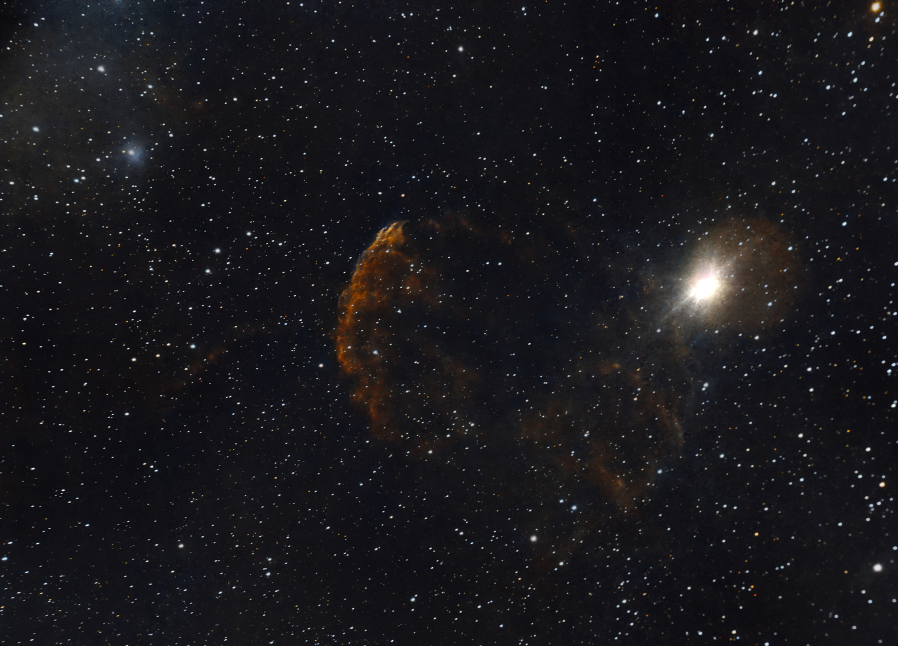

#  Jellyfish Nebula

IC 443 (also known as the Jellyfish Nebula and Sharpless 248 (Sh2-248)) is a galactic supernova remnant (SNR) in the constellation Gemini. On the plane of the sky, it is located near the star Eta Geminorum. Its distance is roughly 5,000 light years from Earth. IC 443 may be the remains of a supernova that occurred 30,000 - 35,000 years ago. The same supernova event likely created the neutron star CXOU J061705.3+222127, the collapsed remnant of the stellar core. IC 443 is one of the best-studied cases of supernova remnants interacting with surrounding molecular clouds.

[ Read more](https://en.wikipedia.org/wiki/IC_443)
## Plate solving 

| Globe | Close | Very close |
| ----- | ----- | ----- |
| | | |

## Gallery
 

 

 

