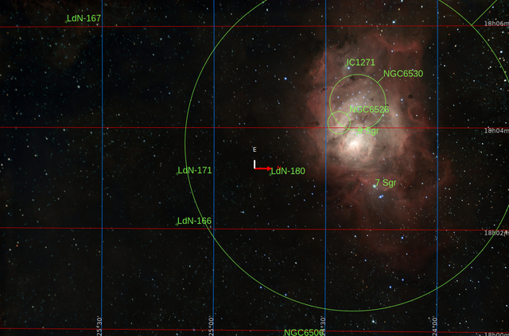
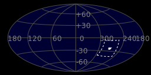
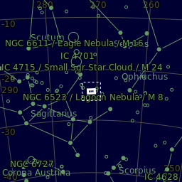
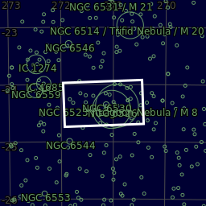
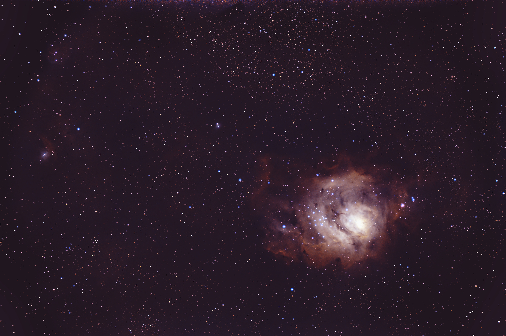

#  Lagoon Nebula

The Lagoon Nebula (catalogued as Messier 8 or M8, NGC 6523, Sharpless 25, RCW 146, and Gum 72) is a giant interstellar cloud in the constellation Sagittarius. It is classified as an emission nebula and has an H II region. The Lagoon Nebula was discovered by Giovanni Hodierna before 1654[5] and is one of only two star-forming nebulae faintly visible to the eye from mid-northern latitudes. Seen with binoculars, it appears as a distinct cloud-like patch with a definite core. Within the nebula is the open cluster NGC 6530.[6]

[ Read more](https://en.wikipedia.org/wiki/Lagoon_Nebula)
## Plate solving 

| Globe | Close | Very close |
| ----- | ----- | ----- |
| | | |

## Gallery
 

 

 

