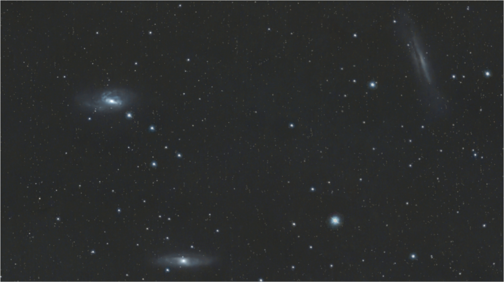
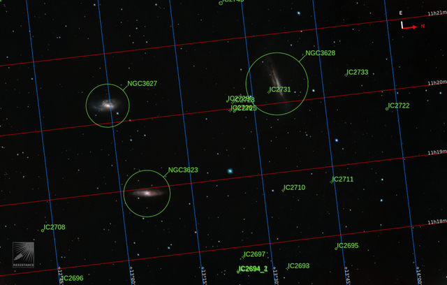
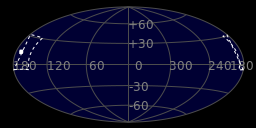
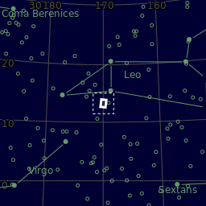
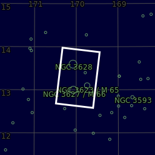
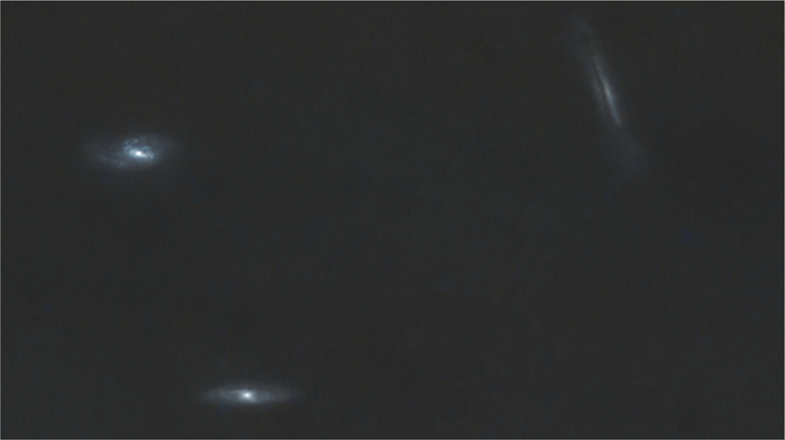

#  Leo Triplet Galaxy

The Leo Triplet (also known as the M66 Group) is a small group of galaxies about 35 million light-years away[5] in the constellation Leo. This galaxy group consists of the spiral galaxies M65, M66, and NGC 3628.

[ Read more](https://en.wikipedia.org/wiki/Leo_Triplet)
## Plate solving 

| Globe | Close | Very close |
| ----- | ----- | ----- |
| | | |

## Details

| | | |
| :---: | :---: | :---:|
| | | 192 ly |
| |192 ly | |

| | | |
| :---: | :---: | :---:|
| | | 217 ly |
| |217 ly | |

| | | |
| :---: | :---: | :---:|
| | | 217 ly |
| |217 ly | |

## Gallery
 

